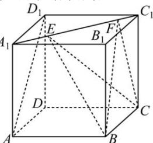

<!-- question-source:start -->
【35】如图所示, 正方体 $ABCD - A_{1}B_{1}C_{1}D_{1}$ 的棱长为 1, 线段 $A_{1}C_{1}$ 上有两个动点 E, F, 且 EF = 1, 则下列说法中错误的是（）

A. 异面直线 EF 与 $CD_{1}$ 所成的角为 $60^{\circ}$ B. 存在点 E, F, 使得 $AE \parallel BF$ C. 三棱锥 B-AEF 的体积为 $\frac{\sqrt{2}}{12}$ D. 点 C 到平面 BEF 的距离为 $\frac{\sqrt{3}}{3}$
<!-- question-source:end -->

![[Q00006163A1]]
