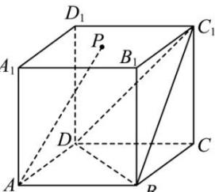

<!-- question-source:start -->
【36】(2023·四川遂宁高三开学考试)如图,在正方体 $ABCD-A_{1}B_{1}C_{1}D_{1}$ 中,点 P 是底面 $A_{1}B_{1}C_{1}D_{1}$ (含边界)内一动点,且 AP // 平面 $DBC_{1}$ ,则下列选项不正确的是()

A. $A_{1}C \perp AP$ B. 三棱锥 $P - BDC_{1}$ 的体积为定值
C. 异面直线 $AP$ 与 $BD$ 所成角取值范围为 $\left[\frac{\pi}{3}, \frac{\pi}{2}\right]$ D. $PC \perp$ 平面 $BDC_{1}$
<!-- question-source:end -->

![[Q00006164A1]]
