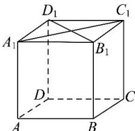
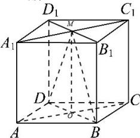
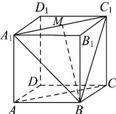

> [!faq]- 全练一本通解析
> **【答案】** ABC
>
> **【解析】**
> 解析:由题意可知, $D_{1}B_{1}\perp A_{1}C_{1}$ , $A_{1}C_{1}//AC$ , $\therefore D_{1}B_{1}\perp AC$ ,A正确;
> 
> 当 M 为 $A_{1}C_{1}$ 中点时, 二面角 M-BD-C 的平面角为 $\angle MOC=90^{\circ}$ , 所以 B 正确;
> 
> 异面直线 BM 与 AC 所成的角可转化为直线 BM 与 $A_{1}C_{1}$ 所成角，
> 
> $\triangle BA_{1}C_{1}$ 为正三角形，当 $M$ 为 $A_{1}C_{1}$ 中点时， $BM \perp A_{1}C_{1}$ ，C 正确；三棱锥 $A_{1}-ABD$ 的体积为 $V_{A_{1}-ABD}=\frac{1}{3} \times S_{\triangle ABD} \times \left|AA_{1}\right|=\frac{1}{3} \times \frac{1}{2} \times 1 \times 1 \times 1=\frac{1}{6}$ ，D 错误。
>
> 故选 **ABC**.
