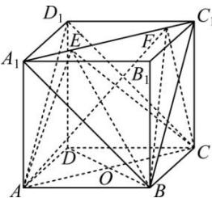

> [!faq]- 全练一本通解析
> **【答案】** B
>
> **【解析】**
> 解析: 对 A: 连接 $AC, CD_{1}$ ，则 $AA_{1} \parallel CC_{1}$ ， $AA_{1} = CC_{1}$
> 故 $AA_{1}C_{1}C$ 为平行四边形, 则 $AC \parallel A_{1}C_{1}$
> 且 $AC = AD_{1} = CD_{1}$ ，即 $\triangle ACD_{1}$ 为等边三角形，
> $$
> E F \text {与} C D _ {1}
> $$
> $$
> \angle A C D _ {1} = 6 0 ^ {\circ}, \mathrm{A}
> $$
> 对B: 反证: 若存在点 $E, F$ , 使得 $AE \parallel BF$ , 则 $A, B, F, E$ 四点共面, 故 $AB$ 与 $EF$ 为共面直线, 这与 $AB$ 与 $EF$ 为异面直线相矛盾, 故假设不成立, 即不存在点 $E, F$ , 使得 $AE \parallel BF$ , B 错误; 对C: 连接 $BD$ , 设 $AC \cap BD = O$ , 则 $AC \perp BD$ , $\because AA_{1} \perp$ 平面 $ABCD$ , $BD \subset$ 平面 $ABCD$ , 故 $AA_{1} \perp BD$ , $AC \cap AA_{1} = A$ , $AC, AA_{1} \subset$ 平面 $ACC_{1}A_{1}$ , 可得 $BD \perp$ 平面 $ACC_{1}A_{1}$ , 可知三棱锥 $B-AEF$ 的高为 $BO = \frac{\sqrt{2}}{2}$ , 故三棱锥 $B-AEF$ 的体积为 $V_{B-AEF} = \frac{1}{3} \times \frac{\sqrt{2}}{2} \times \frac{1}{2} \times 1 \times 1 = \frac{\sqrt{2}}{12}$ , C 正确; 对D: 设点 $B$ 到直线 $A_{1}C_{1}$ 的距离为 $d$ , 由 $A_{1}B = BC_{1} = A_{1}C_{1} = \sqrt{2}$ , 根据 $\triangle A_{1}BC_{1}$ 的面积可得 $\frac{1}{2} \times \sqrt{2} \times \sqrt{2} \times \frac{\sqrt{3}}{2} = \frac{1}{2} \times \sqrt{2} \times d$ , 解得 $d = \frac{\sqrt{6}}{2}$ , 设点 $C$ 到平面 $BEF$ 的距离为 $h$ , 由选项C可知三棱锥 $B-CEF$ 的高为 $BO = \frac{\sqrt{2}}{2}$ , 根据 $V_{C-BEF} = V_{B-CEF}$ , 可得 $\frac{1}{3} \times h \times \frac{1}{2} \times \frac{\sqrt{6}}{2} \times 1 = \frac{1}{3} \times \frac{\sqrt{2}}{2} \times \frac{1}{2} \times 1 \times 1$ , 解得 $h = \frac{\sqrt{3}}{3}$ , 故点 $C$ 到平面 $BEF$ 的距离为 $\frac{\sqrt{3}}{3}$ , D 正确; 故选:B.
> 
