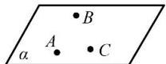
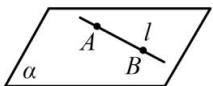
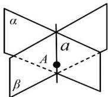

## 1. 平面的基本事实

<table><tr><td></td><td>内容</td><td>图形</td><td>符号</td><td>作用</td></tr><tr><td>基本事实1</td><td>过不在一条直线上的三点,有且只有一个平面</td><td></td><td>A,B,C三点不共线⇒有且只有一个平面α,使A,B,C∈α</td><td>给出了确定一个平面的依据</td></tr><tr><td>基本事实2</td><td>若一条直线上的两点在一个平面内,那这条直线在此平面内.</td><td></td><td>A∈α,B∈α⇒直线AB⊂α</td><td>用来判断直线是否在平面内</td></tr><tr><td>基本事实3</td><td>若两个不重合的平面有一个公共点,那么它们有且只有一条过该点的公共直线.</td><td></td><td>A∈α,且A∈β⇒α∩β=a,且A∈a</td><td>1.用来找两个平面的交线;2.用来证明点在线上</td></tr></table>
