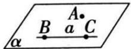
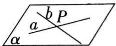
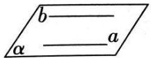

## 2. 推论

<table><tr><td></td><td>内容</td><td>图形</td><td>符号</td><td>作用</td></tr><tr><td>推论1</td><td>经过一条直线和这条直线外一点,有且只有一个平面.</td><td></td><td> $A \notin BC \Rightarrow$ 存在唯一的平面 $\alpha$ ,使 $A \in \alpha$ , $BC \subset \alpha$ .</td><td rowspan="3">用来确定一个平面</td></tr><tr><td>推论2</td><td>经过两条相交直线,有且只有一个平面.</td><td></td><td> $a \cap b = P \Rightarrow$ 存在唯一的平面 $\alpha$ ,使 $a \subset \alpha$ , $b \subset \alpha$ </td></tr><tr><td>推论3</td><td>经过两条平行直线,有且只有一个平面.</td><td></td><td> $a //b \Rightarrow$ 存在唯一的平面 $\alpha$ ,使 $a \subset \alpha$ , $b \subset \alpha$ </td></tr></table>
