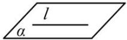
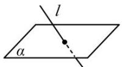
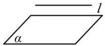

## 2. 空间中直线与平面的位置关系

<table><tr><td rowspan="4">直线与平面的关系</td><td>位置关系</td><td>直线l在平面α内</td><td>直线l与平面α相交</td><td>直线l与平面α平行</td></tr><tr><td>公共点</td><td>无数个</td><td>有且仅有一个</td><td>没有公共点</td></tr><tr><td>符号表示</td><td>l⊂α</td><td>l∩α=A</td><td>l//α</td></tr><tr><td>图形表示</td><td></td><td></td><td></td></tr></table>
