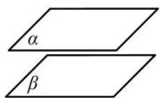
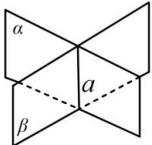

## 3. 空间中平面与平面的位置关系

<table><tr><td rowspan="4">平面与平面的关系</td><td>位置关系</td><td>两个平面平行</td><td>两个平面相交</td></tr><tr><td>公共点(直线)</td><td>没有公共点</td><td>有一条公共直线</td></tr><tr><td>符号表示</td><td>α//β</td><td>α∩β=a</td></tr><tr><td>图形表示</td><td></td><td></td></tr></table>
