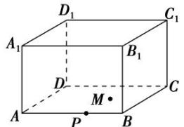

<!-- question-source:start -->
【1】(2023·全国高一专题) 根据图形用符号表示下列点、直线、平面之间的关系.

（1）点 $P$ 与直线 $AB$ ；
（2）点 $C$ 与直线 $AB$ ；
（3）点 $M$ 与平面 $AC$ ；
（4）点 $A_{1}$ 与平面 $AC$ ；
（5）直线 $AB$ 与直线 $BC$ ；
（6）直线 $AB$ 与平面 $AC$ ；
（7）平面 $A_{1}B$ 与平面 $AC$ 。
<!-- question-source:end -->

![[Q00005865A1]]
