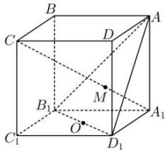

<!-- question-source:start -->
【12】如图所示. $ABCD-A_{1}B_{1}C_{1}D_{1}$ 是正方体, $O$ 是 $B_{1}D_{1}$ 的中点,直线 $A_{1}C$ 交平面 $AB_{1}D_{1}$ 于点 $M$ ,证明 $A$ 、 $M$ 、 $O$ 三点共线.</td></tr><tr><td>证明多点共线通常利用基本事实3,即两相交平面交线的唯一性,通过证明点分别在两个平面内,证明点在相交平面的交线上,也可选择其中两点确定一条直线,然后证明其他点也在其上.</td><td rowspan="2"></td></tr><tr><td>
<!-- question-source:end -->

![[Q00005872A1]]
