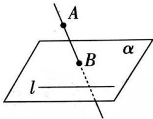

## $\triangleright$ 角度1:空间两条直线的位置关系

判定两条直线是异面直线的方法:
（1）定义法:由定义判断两条直线不可能在同一平面内
（2）重要结论:连接平面内一点与平面外一点的直线,和这个平面内不经过此点的直线是异面直线.

![[高中/课堂同步/题库/高中数学全练一本通/立体几何初步/第四节 空间点、直线、平面之间的位置关系/题目/▶基础点 5_ 点、线、面之间的位置关系/$_triangleright$ 角度1_空间两条直线的位置关系/questions/Q00005883.md]]
![[高中/课堂同步/题库/高中数学全练一本通/立体几何初步/第四节 空间点、直线、平面之间的位置关系/题目/▶基础点 5_ 点、线、面之间的位置关系/$_triangleright$ 角度1_空间两条直线的位置关系/questions/Q00005884.md]]
![[高中/课堂同步/题库/高中数学全练一本通/立体几何初步/第四节 空间点、直线、平面之间的位置关系/题目/▶基础点 5_ 点、线、面之间的位置关系/$_triangleright$ 角度1_空间两条直线的位置关系/questions/Q00005885.md]]
![[高中/课堂同步/题库/高中数学全练一本通/立体几何初步/第四节 空间点、直线、平面之间的位置关系/题目/▶基础点 5_ 点、线、面之间的位置关系/$_triangleright$ 角度1_空间两条直线的位置关系/questions/Q00005886.md]]
![[高中/课堂同步/题库/高中数学全练一本通/立体几何初步/第四节 空间点、直线、平面之间的位置关系/题目/▶基础点 5_ 点、线、面之间的位置关系/$_triangleright$ 角度1_空间两条直线的位置关系/questions/Q00005887.md]]
