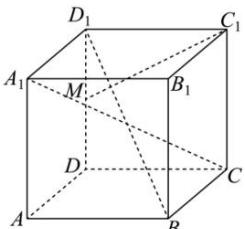

<!-- question-source:start -->
【21】（多选）已知正方体 $ABCD-A_{1}B_{1}C_{1}D_{1}$ 中，M 为 $DD_{1}$ 的中点，则下列直线中与直线 $C_{1}M$ 是异面直线的有（）

A. $DD_{1}$ B. $CC_{1}$ C. $BD_{1}$ D. $CA_{1}$
<!-- question-source:end -->

![[Q00005885A1]]
