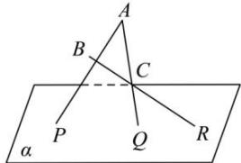

<!-- question-source:start -->
【10】(2023·全国高一专题)如图所示, $\triangle ABC$ 在平面 $\alpha$ 外,三边 $AB,AC,BC$ 所在直线分别交平面 $\alpha$ 于 $P,Q,R$ 三点.求证: $P,Q,R$ 三点在同一直线上.

<!-- question-source:end -->

![[Q00008881A1]]
