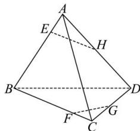

<!-- question-source:start -->
【15】（2023·全国高三专题）如图, 在空间四边形 ABCD 中, H, G 分别是 AD, CD 上的点, E, F 分别是边 AB, BC 上的点, EH 与 FG 在一个平面内, 且不平行. 求证: 直线 EH, BD, FG 相交于一点.

<!-- question-source:end -->

![[Q00005879A1]]
