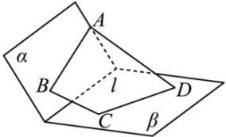

<!-- question-source:start -->
【14】(2024·全国高一专题练习)如图,已知平面 $\alpha,\beta$ ,且 $\alpha\cap\beta=l$ ,设在梯形 $ABCD$ 中, $AD//BC$ ,且 $AB\subset\alpha,CD\subset\beta$ .求证: $AB,CD,l$ 共点.

<!-- question-source:end -->

![[Q00008885A1]]
