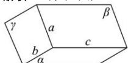

> [!faq]- 全练一本通解析
> **【答案】** 详见解析
>
> **【解析】**
> 解析:证明:如图,
> 
> $$
> \because \alpha \cap \gamma = b, \beta \cap \gamma = a, \therefore a \subset \gamma , b \subset \gamma
> $$
> ∵直线a和b不平行，∴a，b必相交.
> 设 $a \cap b = P$ ，则 $P \in a, P \in b$
> $$
> \because a \subset \beta , b \subset a, \therefore P \in \beta , P \in \alpha
> $$
> 又 $\alpha \cap \beta = c, \therefore P \in c$
> $\therefore a, b, c$ 三条直线必相交于同一点.
