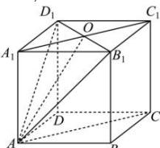

> [!faq]- 全练一本通解析
> **【答案】** 证明见解析
>
> **【解析】**
> 如图, 设 $B_{1}D_{1} \cap A_{1}C_{1} = O$ , 又 $A \in$ 平面 $ACC_{1}A_{1}$ ,
> $A \in$ 平面 $AB_{1}D_{1}$ , $O \in$ 平面 $ACC_{1}A_{1}$ , $O \in$ 平面 $AB_{1}D_{1}$ , 则 $AO \subset$ 平面 $AB_{1}D_{1}$ , $AO \subset$ 平面 $ACC_{1}A_{1}$ , 故平面 $ACC_{1}A_{1}$ 与平面 $AB_{1}D_{1}$ 的交线为 $AO$ .
> 
