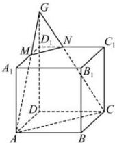
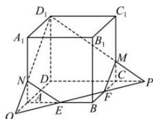

> [!faq]- 全练一本通解析
> **【答案】** 答案见解析
>
> **【解析】**
> (1) 画法: 连接 GA 交 $A_{1}D_{1}$ 于点 M, 连接 GC 交 $C_{1}D_{1}$ 于点 N; 连接 MN, AC, 则 MA, CN, MN, AC 为所求平面与正方体表面的交线. 如图①所示.
> （2）画法：连接 EF 交 DC 的延长线于点 P，交 DA 的延长线于点 Q；连接 $D_{1}P$ 交 $CC_{1}$ 于点 M，连接 $D_{1}Q$ 交 $AA_{1}$ 于点 N；
> 连接 $MF$ ，NE，则 $D_{1}M$ ，MF，FE，EN， $ND_{1}$ 为所求平面与正方体表面的交线.如图②所示.
> 
> 
> - **①**：
> - **②**：
