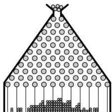

<!-- question-source:start -->
【57】如图是一块高尔顿板的示意图, 在一块木板上钉着若干排相互平行但相互错开的圆柱形小木钉, 小木钉之间留有适当的空隙作为通道, 前面挡有一块玻璃. 将小球从顶端放入, 小球下落的过程中, 每次碰到小木钉后都等可能地向左或向右落下, 最后落入底部的格子中. 记格子从左到右的编号分别为 0,1,2,…,10, 用 X 表示小球最后落入格子的号码, 若 $P(X=k) \leq P(X=k_{0})$ , 则 $k_{0} = (\quad)$

A. 4 B. 5 C. 6 D. 7
<!-- question-source:end -->

![[Q00015578A1]]
