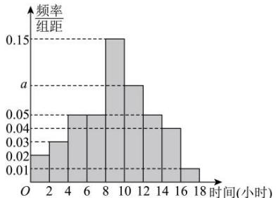

<!-- question-source:start -->
【99】（2024·广东广州·模拟预测）在某地区进行高中学生每周户外运动调查，随机调查了1000名高中学生户外运动的时间（单位：小时），得到如下样本数据的频率分布直方图.

（1）求 a 的值, 估计该地区高中学生每周户外运动的平均时间；（同一组数据用该区间的中点值作代表）

（2）为进一步了解这1000名高中学生户外运动的时间分配，在(14,16]，(16,18]两组内的学生中，采用分层抽样的方法抽取了5人，现从这5人中随机抽取3人进行访谈，记在(14,16]内的人数为 $X$ ，求 $X$ 的分布列和期望；

（3）以频率估计概率,从该地区的高中学生中随机抽取8名学生,用“ $P_{8}(k)$ ”表示这8名学生中恰有k名学生户外运动时间在 $(8,10]$ 内的概率,当 $P_{8}(k)$ 最大时,求k的值.
<!-- question-source:end -->

![[Q00015620A1]]
