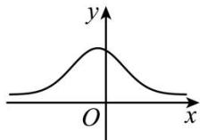
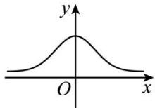
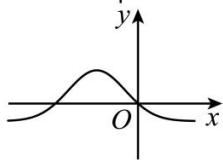
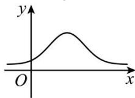

<!-- question-source:start -->
【6】（22-23 高二·江苏）函数 $f(x)=\frac{1}{\sqrt{2\pi}\sigma}\mathrm{e}^{-\frac{(x-\mu)^{2}}{2\sigma^{2}}}$ （其中 $\mu<0$ ）的图象可能为（）

A.

B.

C.

D.

<!-- question-source:end -->

![[Q00015627A1]]
