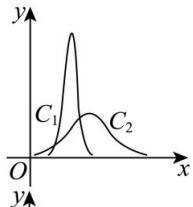
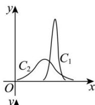
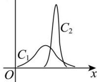
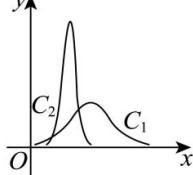

<!-- question-source:start -->
【7】（23-24 高二下·辽宁大连·月考）对甲，乙两地小学生假期一天中读书情况进行统计，已知小学生的读书时间均符合正态分布，其中甲地小学生读书的时间为 X （单位：小时）， $X \sim N(2,4)$ ，对应的曲线为 $C_{1}$ ，乙地小学生读书的时间为 Y （单位：小时）， $Y \sim N\left(3, \frac{1}{9}\right)$ ，对应的曲线为 $C_{2}$ ，则下列图象正确的是（）

A.

B.

C.

D.

<!-- question-source:end -->

![[Q00015628A1]]
