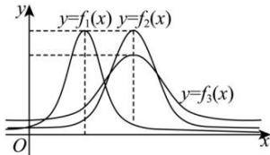

<!-- question-source:start -->
【8】（22-23 高二下·陕西期末）已知三个正态分布密度函数 $f_{i}(x)=\frac{1}{\sqrt{2\pi}\sigma_{i}}\mathrm{e}^{-\frac{(x-\mu_{i})^{2}}{2\sigma_{i}^{2}}}(x\in\mathbb{R},i=1,2,3)$ 的图象如图所示，则下列结论正确的是（）

A. $\mu_{1} = \mu_{2} > \mu_{3}$ ， $\sigma_{1} = \sigma_{2} > \sigma_{3}$ B. $\mu_{1} <   \mu_{2} = \mu_{3}$ ， $\sigma_1 = \sigma_2 <   \sigma_3$ C. $\mu_1 <   \mu_2 = \mu_3$ ， $\sigma_1 = \sigma_2 >\sigma_3$ D. $\mu_{1} = \mu_{2} > \mu_{3}$ ， $\sigma_1 = \sigma_2 <   \sigma_3$
<!-- question-source:end -->

![[Q00015629A1]]
