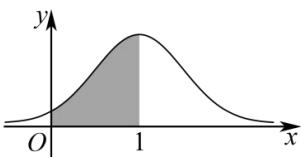

<!-- question-source:start -->
【18】（23-24 高二·全国·专题练习）已知正态分布 $N(1, \sigma^{2})$ 的正态密度曲线如图所示， $X \sim N(1, \sigma^{2})$ ，则下列选项中，不能表示图中阴影部分面积的是（）

A. $\frac{1}{2} - P(X \leq 0)$ B. $\frac{1}{2} - P(X \geq 2)$ C. $\frac{1}{2} - P(1 \leq X \leq 2)$ D. $\frac{1}{2} P(X \leq 2) - \frac{1}{2} P(X \leq 0)$
<!-- question-source:end -->

![[Q00015639A1]]
