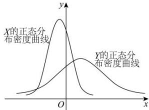

<!-- question-source:start -->
【21】（22-23 高二下·山东菏泽·月考）（多选）设 $X \sim N\left(\mu_{1}, \sigma_{1}^{2}\right)$ ， $Y \sim N\left(\mu_{2}, \sigma_{2}^{2}\right)$ ，这两个正态分布密度曲线如图所示。下列结论中错误的是（）

A. $P(Y \geq \mu_2) \geq P(Y \geq \mu_1)$ B. $P(X \leq \sigma_2) \leq P(X \leq \sigma_1)$ C. 对任意正数 $t, P(X \leq t) \leq P(Y \leq t)$ D. 对任意正数 $t, P(X \geq t) \geq P(Y \geq t)$
<!-- question-source:end -->

![[Q00015642A1]]
