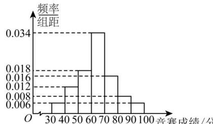

<!-- question-source:start -->
【41】（22-23 高二下·福建福州·期中）某市为了传承发展中华优秀传统文化，组织该市中学生进行了一次文化知识有奖竞赛，竞赛奖励规则如下，得分在[70,80)内的学生获三等奖，得分在[80,90)内的学生获二等奖，得分在[90,100)内的学生获一等奖，其他学生不得奖。为了解学生对相关知识的掌握情况，随机抽取100名学生的竞赛成绩，并以此为样本绘制了如下样本频率分布直方图。

（1）现从该样本中随机抽取两名学生的竞赛成绩，求这两名学生中恰有一名学生获奖的概率；
（2）若该市所有参赛学生的成绩 X 近似服从正态分布 $N(\mu, \sigma^{2})$ ，其中 $\sigma \approx 15$ ， $\mu$ 为样本平均数的估计值，利用所得正态分布模型解决以下问题：
①若该市共有10000名学生参加了竞赛，试估计参赛学生中成绩超过79分的学生数（结果四舍五入到整数）；
②若从所有参赛学生中（参赛学生数大于10000）随机抽取4名学生进行访谈，求其中竞赛成绩在64分以上的学生人数的期望与方差.
附参考数据:若随机变量X服从正态分布 $N(\mu,\sigma^{2})$ ，则 $P(\mu-\sigma\leq X\leq\mu+\sigma)\approx0.6827$ $P(\mu-2\sigma\leq X\leq\mu+2\sigma)\approx0.9545$ $P(\mu-3\sigma\leq X\leq\mu+3\sigma)\approx0.9973$
<!-- question-source:end -->

![[Q00015662A1]]
