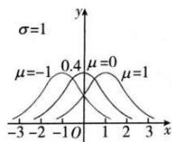
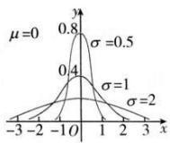

## 3. 正态曲线的特点

（1）曲线位于x轴上方，与x轴不相交；

(2) 曲线是单峰的, 它关于直线 $x = \mu$ 对称;

（3）曲线在 $x = \mu$ 处达到峰值 $\frac{1}{\sqrt{2\pi}\sigma}$

（4）当 $|x|$ 无限增大时，曲线无限接近x轴；

（5）对任意的 $\sigma > 0$ ，曲线与 x 轴围成的面积总为 1；

(6) 在参数 $\sigma$ 取固定值时, 正态曲线的位置由 $\mu$ 确定, 且随着 $\mu$ 的变化而沿 $x$ 轴平移, 如图甲所示;

（7）当 $\mu$ 取定值时，正态曲线的形状由 $\sigma$ 确定，当 $\sigma$ 较小时，峰值高，曲线 “瘦 高”，表示随机变量 X 的分布比较集中；当 $\sigma$ 较大时，峰值低，曲线 “矮胖”，表示随机变量 X 的分布比较分散，如图乙所示.

图甲

图乙
