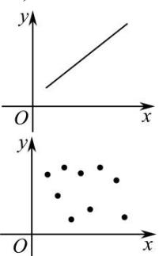
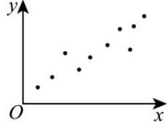

## 3. 样本相关系数

(1)样本相关系数:设由变量 x 和 y 获得的两组数据分别为 $x_{i}$ 和 $y_{i}$ ( $i=1,2,\ldots,n$ ), 其对应关系如下表所示:

<table><tr><td>变量x</td><td> $x_1$ </td><td> $x_2$ </td><td> $x_3$ </td><td> $x_4$ </td><td> $x_5$ </td><td> $x_6$ </td><td>...</td><td> $x_n$ </td></tr><tr><td>变量y</td><td> $y_1$ </td><td> $y_2$ </td><td> $y_3$ </td><td> $y_4$ </td><td> $y_5$ </td><td> $y_6$ </td><td>...</td><td> $y_n$ </td></tr></table>

两组数据 $x_{i}$ 和 $y_{i}$ 的线性相关系数是度量两个变量 x 与 y 之间线性相关程度的统计量，

其计算公式为 $r = \frac{\sum_{i=1}^{n}\left(x_i - \overline{x}\right)\left(y_i - \overline{y}\right)}{\sqrt{\sum_{i=1}^{n}\left(x_i - \overline{x}\right)^2\sum_{i=1}^{n}\left(y_i - \overline{y}\right)^2}} = \frac{\sum_{i=1}^{n}x_i y_i - n\overline{xy}}{\sqrt{\left(\sum_{i=1}^{n}x_i^2 - n\overline{x}^2\right)\left(\sum_{i=1}^{n}y_i^2 - n\overline{y}^2\right)}}$

其中， $\overline{x}=\frac{1}{n}\sum_{i=1}^{n}x_{i}$ ， $\overline{y}=\frac{1}{n}\sum_{i=1}^{n}y_{i}$ ，它们分别是这两组数据的算术平均数.

（2）相关系数 r 与相关程度

①当 r > 0 时, 称成对样本数据正相关;

当 r<0 时, 成对样本数据负相关;

当 r=0 时, 成对样本数据间没有线性相关关系;

②样本相关系数 r 的取值范围为 $[-1, 1]$ ;

当 $|r|$ 越接近1时,成对样本数据的线性相关程度越强;

当 $|r|$ 越接近0时,成对样本数据的线性相关程度越弱.

图1
