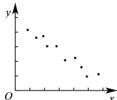
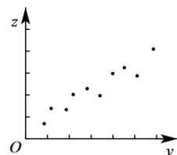

<!-- question-source:start -->
【7】对变量 x、y 由观测数据得散点图1, 对变量 y、z 由观测数据得散点图2. 由这两个散点图可以判断（）

图1

图2

A. 变量 $x$ 与 $y$ 负相关, $x$ 与 $z$ 正相关
B. 变量 $x$ 与 $y$ 负相关, $x$ 与 $z$ 负相关
C. 变量 $x$ 与 $y$ 正相关, $x$ 与 $z$ 正相关
D. 变量 $x$ 与 $y$ 正相关, $x$ 与 $z$ 负相关
<!-- question-source:end -->

![[Q00015670A1]]
