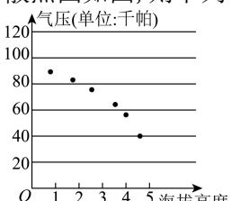
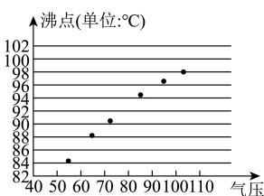

<!-- question-source:start -->
【8】（23-24 高二下·北京·期中）某校地理小组在某座山测得海拔高度、气压和沸点的六组数据绘制成散点图如图, 则下列说法不正确的是（）

(单位:千米)
(单位:千帕)
图2

A. 气压与海拔高度呈正相关
B. 沸点与气压呈正相关
C. 沸点与海拔高度呈负相关
D. 沸点与海拔高度、沸点与气压的相关性都很强 重点题型专练
<!-- question-source:end -->

![[Q00015671A1]]
