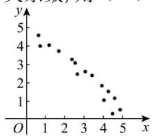
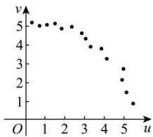

<!-- question-source:start -->
【12】(23-24 高二下·山西长治·期中)根据变量 x, y 的观测数据 $(x_{i}, y_{i})(i = 1, 2, \cdots, 15)$ ，绘制成散点图 1；根据变量 u, v 的观测数据 $(u_{i}, v_{i})(i = 1, 2, \cdots, 15)$ ，绘制成散点图 2。若用线性回归进行分析，设 $r_{1}$ 表示变量 x, y 的样本相关系数， $r_{2}$ 表示变量 u, v 的样本相关系数，则（）

A. $-1 < r_{1} < r_{2} < 0$ B. $-1 < r_{2} < r_{1} < 0$ C. $0 < r_{1} < r_{2} < 1$ D. $0 < r_{2} < r_{1} < 1$
<!-- question-source:end -->

![[Q00015675A1]]
