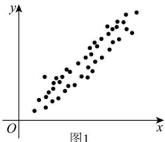
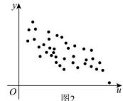

<!-- question-source:start -->
【14】（23-24 高二下·四川乐山·期末）对变量 x, y 由观测数据 $(x_{i}, y_{i})$ $(i \in \mathbf{N}^{*})$ 得散点图 1；对变量 u, v 由观测数据 $(u_{i}, v_{i})$ $(i \in \mathbf{N}^{*})$ 得散点图 2. $r_{1}$ 表示变量 x, y 之间的线性相关系数， $r_{2}$ 表示变量 u, v 之间的线性相关系数，则下列说法正确的是（）

A. 变量 $x$ 与 $y$ 呈现正相关, 且 $\left|r_1\right| > \left|r_2\right|$ B. 变量 $x$ 与 $y$ 呈现负相关, 且 $\left|r_1\right| < \left|r_2\right|$ C. 变量 $u$ 与 $v$ 呈现正相关, 且 $\left|r_1\right| > \left|r_2\right|$ D. 变量 $u$ 与 $v$ 呈现负相关, 且 $\left|r_1\right| < \left|r_2\right|$
<!-- question-source:end -->

![[Q00015677A1]]
