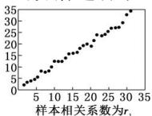
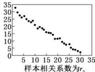
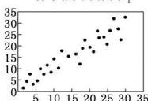
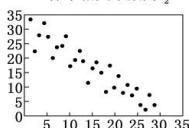

<!-- question-source:start -->
【15】(2024高三·全国·专题练习)某统计部门对四组数据进行统计分析后,获得如图所示的散点图.

样本相关系数为 $r_{3}$
样本相关系数为 $r_{4}$

下面关于样本相关系数的比较, 正确的是（）
A. $r_{4} < r_{2} < r_{1} < r_{3}$ B. $r_{2} < r_{4} < r_{1} < r_{3}$ C. $r_{2}<r_{4}<r_{3}<r_{1}$ D. $r_{4}<r_{2}<r_{3}<r_{1}$
<!-- question-source:end -->

![[Q00015678A1]]
