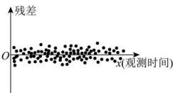
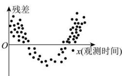
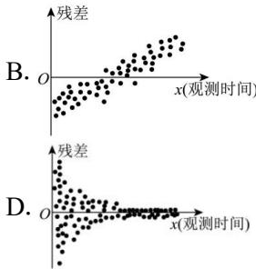

<!-- question-source:start -->
【17】根据变量 y 和 x 的成对样本数据, 由一元线性回归模型 $\left\{\begin{aligned}\gamma&=bx+a+e\\ E(e)&=0,D(e)=\sigma\end{aligned}\right.$ 得到经验回归模型 $\hat{y}=\hat{b}x+\hat{a}$ , 求得残差图. 对于以下四幅残差图, 满足一元线性回归模型中对随机误差假设的是（）

A.

C.

B.

<!-- question-source:end -->

![[Q00015703A1]]
