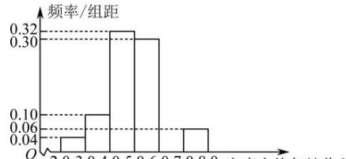

<!-- question-source:start -->
【27】（2024·内蒙古包头·二模）某企业拟对某产品进行科技升级，根据市场调研与模拟，得到科技升级投入 m （万元）与科技升级直接收益 y （万元）的数据统计如下：

<table><tr><td>序号</td><td>1</td><td>2</td><td>3</td><td>4</td><td>5</td><td>6</td><td>7</td></tr><tr><td>m</td><td>2</td><td>3</td><td>4</td><td>6</td><td>8</td><td>10</td><td>13</td></tr><tr><td>y</td><td>13</td><td>22</td><td>31</td><td>42</td><td>50</td><td>56</td><td>58</td></tr></table>

根据表格中的数据,建立了 y 与 m 的两个回归模型: 模型①: $\hat{y}=4.1m+11.8$ ; 模型②: $\hat{y}=21.3\sqrt{m}-14.4$ .

（1）根据下列表格中的数据, 比较模型①、②的相关指数的大小, 并选择拟合精度更高、更可靠的模型;

（2）根据（1）选择的模型, 预测对该产品科技升级的投入为 100 万元时的直接收益.

<table><tr><td>回归模型</td><td>模型1</td><td>模型2</td></tr><tr><td>回归方程</td><td> $\hat{y} = 4.1m + 11.8$ </td><td> $\hat{y} = 21.3\sqrt{m} - 14.4$ </td></tr><tr><td> $\sum_{i=1}^{7}\left(y_i - \hat{y}_i\right)^2$ </td><td>182.4</td><td>79.2</td></tr></table>

(附:刻画回归效果的相关指数

$R^2 = 1 - \frac{\sum_{i=1}^{n}\left(y_i - \hat{y}_i\right)^2}{\sum_{i=1}^{n}\left(y_i - \overline{y}\right)^2}, R^2$ 越大, 模型的拟合效果越好)

<!-- question-source:end -->

![[Q00015713A1]]
