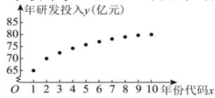
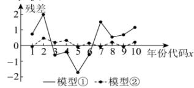

<!-- question-source:start -->
【40】下图 1 是某公司 2013 年至 2022 年的年份代码 x 和年研发投入 y（单位:亿元）的散点图, 其中年份代码 1\~10 分别对应年份 2013\~2022.

图1

图2
根据散点图, 分别用模型

① $y = bx + a$ , ② $y = c + d\sqrt{x}$ 作为年研发投入 y （单位: 亿元）关于年份代码 x 的经验回归方程模型, 并进行残差分析, 得到图 2 所示的残差图. 结合数据, 计算得到如下表所示的一些统计量的值:

<table><tr><td> $\overline{y}$ </td><td> $\overline{t}$ </td><td> $\sum_{i=1}^{10}\left(x_i - \overline{x}\right)^2$ </td></tr><tr><td>75</td><td>2.25</td><td>82.5</td></tr><tr><td> $\sum_{i=1}^{10}\left(t_i - \overline{t}\right)^2$ </td><td> $\sum_{i=1}^{10}\left(y_i - \overline{y}\right)\left(x_i - \overline{x}\right)$ </td><td> $\sum_{i=1}^{10}\left(y_i - \overline{y}\right)\left(t_i - \overline{t}\right)$ </td></tr><tr><td>4.5</td><td>120</td><td>28.35</td></tr></table>

表中 $t_i = \sqrt{x_i}$ ， $\bar{t} = \frac{1}{10}\sum_{i = 1}^{10}t_i$

（1）根据残差图, 判断模型①和模型②哪一个更适宜作为年研发投入 y （单位: 亿元）关于年份代码 x 的经验回归方程模型? 并说明理由;

(2) (i) 根据 (1) 中所选模型, 求出 $y$ 关于 $x$ 的经验回归方程;

（ii）设该科技公司的年利润 L （单位:亿元）和年研发投入 y （单位:亿元）满足 $L = (111.225 - y)\sqrt{x}$ （ $x \in N^{*}$ 且 $x \in [1, 20]$ ），问该科技公司哪一年的年利润最大？

附:对于一组数据 $\left(x_{1},y_{1}\right),\left(x_{2},y_{2}\right),\ldots,\left(x_{n},y_{n}\right)$ ，其经验回归直线 $\hat{y}=\hat{a}+\hat{b}x$ 的斜率和截距的最小二乘

估计分别为 $\hat{b} = \frac{\sum_{i=1}^{n}\left(x_i - \overline{x}\right)\left(y_i - \overline{y}\right)}{\sum_{i=1}^{n}\left(x_i - \overline{x}\right)^2},\hat{a} = \overline{y} -\hat{b}\overline{x}.$
<!-- question-source:end -->

![[Q00015726A1]]
