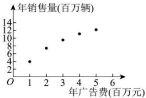

<!-- question-source:start -->
【44】（24-25 高三上·四川眉山·阶段练习）台州是全国三大电动车生产基地之一，拥有完整的产业链和突出的设计优势。某电动车公司为了抢占更多的市场份额，计划加大广告投入、该公司近 5 年的年广告费 $x_{i}$ （单位：百万元）和年销售量 $y_{i}$ （单位：百万辆）关系如图所示：令 $v_{i} = \ln x_{i} (i = 1, 2, \cdots, 5)$ ，数据经过初步处理得：

↑年销售量(百万辆)

<table><tr><td> $\sum_{i=1}^{5}y_i$ </td><td> $\sum_{i=1}^{5}v_i$ </td><td> $\sum_{i=1}^{5}(x_i - \overline{x})^2$ </td><td> $\sum_{i=1}^{5}(y_i - \overline{y})^2$ </td></tr><tr><td>44</td><td>4.8</td><td>10</td><td>40.3</td></tr><tr><td colspan="2"> $\sum_{i=1}^{5}(v_i - \overline{v})^2$ </td><td> $\sum_{i=1}^{5}(x_i - \overline{x})(y_i - \overline{y})$ </td><td> $\sum_{i=1}^{5}(y_i - \overline{y})(v_i - \overline{v})$ </td></tr><tr><td colspan="2">1.612</td><td>19.5</td><td>8.06</td></tr></table>

现有① $y = bx + a$ 和② $y = n \ln x + m$ 两种方案作为年销售量 y 关于年广告费 x 的回归分析模型, 其中 a, b, m, n 均为常数.

（1）请从相关系数的角度, 分析哪一个模型拟合程度更好?

（2）根据（1）的分析选取拟合程度更好的回归分析模型及表中数据, 求出 y 关于 x 的回归方程, 并预测年广告费为 6（百万元）时, 产品的年销售量是多少?
<!-- question-source:end -->

![[Q00015730A1]]
