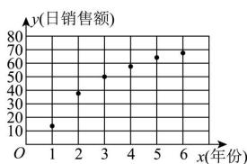
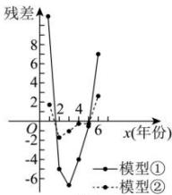

<!-- question-source:start -->
【46】（24-25高三·重庆·阶段练习）一年一度的“双11”促销活动落下帷幕。经过调研，得到2019年到2024年“双11”活动当天某电商平台线上日销售额y（单位：百亿元）与年份（第x年）的6组数据（时间变量x的取值依次为1,2,…,6），对数据进行处理，得到如下散点图（图1）及一些统计量的值。其中 $t_{i}=\ln x_{i},\bar{t}=\frac{1}{6}\sum_{i=1}^{6}t_{i}$ 。

<table><tr><td> $\overline{y}$ </td><td> $\overline{x}$ </td><td> $\sum_{i=1}^{6} x_i^2$ </td><td> $\sum_{i=1}^{6} x_i y_i$ </td><td> $\overline{t}$ </td><td> $\sum_{i=1}^{6} t_i^2$ </td><td> $\sum_{i=1}^{n} t_i y_i$ </td></tr><tr><td>48.7</td><td>3.5</td><td>91</td><td>1204</td><td>1.1</td><td>9.4</td><td>388.1</td></tr></table>

分别用两种模型:① $y = bx + a$ ; ② $y = b \ln x + a$ 进行拟合, 得到相应的回归方程, 并进行残差分析, 得到如图所示的残差图（图 2）（残差值 = 真实值 - 预测值）.

图1

图2

（1）根据题中信息,通过残差图比较模型①,②的拟合效果,应选择哪一个模型进行拟合？请说明理由;

(2) 根据 (1) 中所选模型,

（i）求出 y 关于 x 的经验回归方程（系数精确到 0.1）；

（ii）若该电商平台每年活动当天线上日销售额 y 与当日营销成本 u 及年份 x 存在线性关系：

$y=3u+2.6x$ ，则在第几年活动当日营销成本的预测值最大？

参考公式： $\hat{b}=\frac{\sum_{i=1}^{n}x_{i}y_{i}-nx\cdot\bar{y}}{\sum_{i=1}^{n}x_{i}^{2}-nx^{-2}},\hat{a}=\bar{y}-\hat{b}\bar{x}$ ；参考数据： $\ln7\approx1.95$ .
<!-- question-source:end -->

![[Q00015732A1]]
