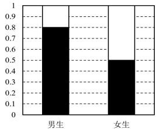

<!-- question-source:start -->
【10】（22-23 高二下·青海·期末）某校为研究该校学生性别与体育锻炼的经常性之间的联系，随机抽取 100 名学生（其中男生 60 名，女生 40 名），并绘制得到如图所示的等高堆积条形图，则这 100 名学生中经常锻炼的人数为\_\_\_\_。

■经常 □不经常
<!-- question-source:end -->

![[Q00015742A1]]
