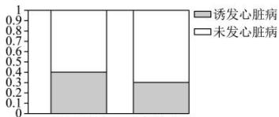

<!-- question-source:start -->
【11】（23-24 高二下·全国·专题练习）下面的等高条形图可以说明的问题是（）

心脏搭桥术 血管清障术

A.“心脏搭桥”手术和“血管清障”手术对“诱发心脏病”的影响是绝对不同的B.“心脏搭桥”手术和“血管清障”手术对“诱发心脏病”的影响没有什么不同C.此等高条形图看不出两种手术有不同的地方D.“心脏搭桥”手术和“血管清障”手术对“诱发心脏病”的影响在某种程度上是不同的,但是没有100%的把握
<!-- question-source:end -->

![[Q00015743A1]]
