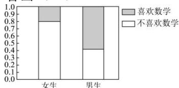

<!-- question-source:start -->
【12】（22-23 高二下·福建泉州·期中）（多选）如图是调查某地区男、女中学生喜欢数学的等高堆积条形图，阴影部分表示喜欢数学的百分比，从图可以看出（）

A.性别与喜欢数学无关
B.女生中喜欢数学的百分比为 $80\%$ C.男生比女生喜欢数学的可能性大些
D.男生不喜欢数学的百分比为 $40\%$
<!-- question-source:end -->

![[Q00015744A1]]
