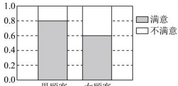

<!-- question-source:start -->
【22】（20-21 高二·全国·课后作业）某商场为提高服务质量，随机调查了 50 名男顾客和 50 名女顾客，每位顾客对该商场的服务给出满意或不满意的评价，通过汇总数据得到如等高堆积条形图.

(1) 根据所给等高堆积条形图, 完成下面的 $2 \times 2$ 列联表;

单位:人

<table><tr><td rowspan="2">性别</td><td colspan="2">评价</td><td rowspan="2">合计</td></tr><tr><td>满意</td><td>不满意</td></tr><tr><td>男</td><td></td><td></td><td></td></tr><tr><td>女</td><td></td><td></td><td></td></tr><tr><td>合计</td><td></td><td></td><td></td></tr></table>

（2）依据 $\alpha=0.01$ 的独立性检验, 结合（1）中 $2\times2$ 列联表中的数据, 能否据此推断顾客对该商场服务的评价与性别有关?
<!-- question-source:end -->

![[Q00015754A1]]
