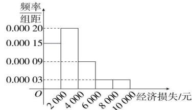

<!-- question-source:start -->
【27】台风“烟花”导致多地受灾, 某调查小组调查了某受灾小区的 100 户居民由于台风造成的经济损失（单位: 元），将数据分成 [0,2000]，(2000,4000]，(4000,6000]，(6000,8000]，(8000,10000] 五组，并作出如图所示的频率分布直方图.

（1）遭受台风后居委会号召小区居民为台风重灾区捐款，小张调查的100户居民捐款情况如下表所示，在表格空白处填写正确数字，并判断能否在小概率值 $\alpha=0.05$ 的独立性检验下，认为捐款数额超过或不超过500元和自家经济损失是否超过4000元有关；

<table><tr><td>项目</td><td>经济损失不超过4 000元</td><td>经济损失超过4 000元</td><td>总计</td></tr><tr><td>捐款超过500元</td><td>60</td><td></td><td></td></tr><tr><td>捐款不超过500元</td><td></td><td>10</td><td></td></tr><tr><td>总计</td><td></td><td></td><td>100</td></tr></table>

（2）将上述调查所得的频率视为概率, 现从该地区大量受灾居民中, 采用随机抽样的方法每次抽取 1 户居民, 抽取 3 次, 记被抽取的 3 户居民中自家经济损失超过 4000 元的户数为 $\xi$ , 若每次抽取的结果是相互独立的, 求 $\xi$ 的分布列, 期望 $E(\xi)$ 和方差 $D(\xi)$

附： $\chi^2 = \frac{n(ad - bc)^2}{(a + b)(c + d)(a + c)(b + d)}$ ， $n = a + b + c + d$

<table><tr><td> $\alpha$ </td><td>0.050</td><td>0.010</td><td>0.001</td></tr><tr><td> $x_{\alpha}$ </td><td>3.841</td><td>6.635</td><td>10.828</td></tr></table>
<!-- question-source:end -->

![[Q00015759A1]]
