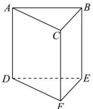

<!-- question-source:start -->
【5】如图, 一颗棋子从三棱柱的一个顶点沿棱移到相邻的另一个顶点的概率均为 $\frac{1}{3}$ , 刚开始时, 棋子在上底面点 $A$ 处, 若移了 $n$ 次后, 棋子落在上底面顶点的概率记为 $p_n$ . 则 $p_5 = (\quad)$

A. $\frac{1}{4} \times \left( \frac{1}{3} \right)^{5} + \frac{1}{2}$ B. $\left( \frac{1}{3} \right)^{6} + \frac{1}{2}$ C. $\left( \frac{1}{3} \right)^{6} - \frac{1}{2}$ D. $\frac{1}{2} \times \left( \frac{1}{3} \right)^{5} + \frac{1}{2}$
<!-- question-source:end -->

![[Q00015764A1]]
