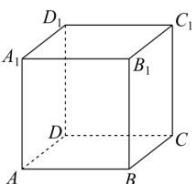

<!-- question-source:start -->
【6】如图, 正方体 $ABCD - A_{1}B_{1}C_{1}D_{1}$ 顶点处有一质点 Q, 点 Q 每次会随机地沿一条棱向相邻的某个顶点移动, 且向每个顶点移动的概率相同. 从一个顶点沿一条棱移动到相邻顶点称为移动一次. 若质点 Q 的初始位置位于点 A 处, 记点 Q 移动 n 次后仍在底面 ABCD 上的概率为 $P_{n}$ , 则下列说法错误的是 (

A. $P_{2} = \frac{5}{9}$ B. $P_{n + 1} = \frac{2}{3} P_n + \frac{1}{3}$ C.点 $Q$ 移动4次后恰好位于点 $C_1$ 的概率为0
D.点 $Q$ 移动10次后仍在底面ABCD上的概率为 $\frac{1}{2} (\frac{1}{3})^{10} + \frac{1}{2}$

第四节 专题: 概率的递推—马尔科夫链问题
<!-- question-source:end -->

![[Q00015765A1]]
