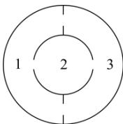

<!-- question-source:start -->
【7】“布朗运动”是指悬浮在液体或气体中的微小颗粒所做的永不停息的无规则运动, 在如图所示的试验容器中, 容器由三个仓组成, 某粒子做布朗运动时每次会从所在仓的通道口中随机选择一个到达相邻仓, 已知该粒子的初始位置在 2 号仓. 则粒子经过 n 次随机选择后到达 2 号仓的概率 $P_{n}=$ \_\_\_\_

<!-- question-source:end -->

![[Q00015766A1]]
