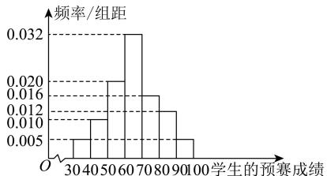

<!-- question-source:start -->
【5】（2024·四川内江·一模）某市为全面提高青少年健康素养水平，举办了一次“健康素养知识竞赛”，分预赛和复赛两个环节，预赛成绩采用百分制，排名前三百名的学生参加复赛。已知共有10000名学生参加了预赛，现从参加预赛的全体学生中随机地抽取100人的预赛成绩作为样本，得到如下频率分布直方图：

(1) 规定预赛成绩不低于 80 分为优良, 若从上述样本中预赛成绩不低于 70 分的学生中随机地抽取 2 人, 求至少有 1 人预赛成绩优良的概率;

（2）由频率分布直方图, 可认为该市全体参加预赛学生的预赛成绩 Z 近似服从正态分布 $N(\mu, \sigma^{2})$ , 其中 $\mu$ 可近似为样本中的 100 名学生预赛成绩的平均值（同一组数据用该组区间的中点值代替），且 $\sigma^{2} = 214$ ，已知小明的预赛成绩为 95 分，利用该正态分布，估计小明是否有资格参加复赛？

（3）复赛规则如下：①复赛题目由 $A$ 、 $B$ 两类问题组成，答对 $A$ 类问题得30分，不答或答错得0分；答对 $B$ 类问题得70分，不答或答错得0分；② $A$ 、 $B$ 两类问题的答题顺序可由参赛学生选择，但只有在答对第一类问题的情况下，才有资格答第二类问题．已知参加复赛的学生甲答对 $A$ 类问题的概率为0.8，答对 $B$ 类问题的概率为0.6，答对每类问题相互独立，且与答题顺序无关．为使累计得分的期望最大，学生甲应选择先回答哪类问题？并说明理由.附：若 $Z\sim N(\mu ,\sigma^2)$ ，则 $P(\mu -\sigma < Z < \mu +\sigma)\approx 0.6827$ ， $P(\mu -2\sigma < Z < \mu +2\sigma)\approx 0.9545,$ $P(\mu -3\sigma < Z < \mu +3\sigma)\approx 0.9973;\sqrt{214}\approx 15.$
<!-- question-source:end -->

![[Q00015792A1]]
