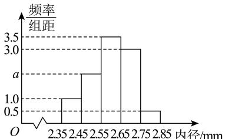

<!-- question-source:start -->
【7】（2024·辽宁·模拟预测）某工厂为了提高精度，采购了一批新型机器，现对这批机器的生产效能进行测试，对其生产的第一批零件的内径进行测量，统计绘制了如下图所示的频率分布直方图.

（1）求 a 的值以及这批零件内径的平均值 $\bar{x}$ 和方差 $s^{2}$ （同一组中的数据用该组区间的中点值作代表）；

（2）以频率估计概率, 若在这批零件中随机抽取 4 个, 记内径在区间 $[2.45, 2.55)$ 内的零件个数为 Z, 求 Z 的分布列以及数学期望;

（3）已知这批零件的内径 X （单位: mm）服从正态分布 $N(\mu, \sigma^{2})$ ，现以频率分布直方图中的平均数 $\bar{x}$ 作为 $\mu$ 的估计值，频率分布直方图中的标准差 s 作为 $\sigma$ 的估计值，则在这批零件中随机抽取 200 个，记内径在区间 [2.285, 2.705] 上的零件个数为 Y，求 Y 的方差.

参考数据： $\sqrt{0.011} \approx 0.105$ ，若 $X \sim N\left(\mu, \sigma^2\right)$ ，则 $P\left(\mu - \sigma \leq X \leq \mu + \sigma\right) \approx 0.6827$ ， $P\left(\mu - 2\sigma \leq X \leq \mu + 2\sigma\right) \approx 0.9545$ ， $P\left(\mu - 3\sigma \leq X \leq \mu + 3\sigma\right) \approx 0.9973$ ：
<!-- question-source:end -->

![[Q00015794A1]]
