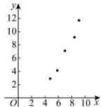
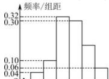

> [!faq]- 全练一本通解析
>
> > [!success]- **【答案】** ACD
>
> > [!note]- **【分析】**
> > 本题未单列分析。
>
> > [!note]- **【解析】**
> > 【详解】由于 X 服从正态分布 $N(4, \sigma^{2})$ ， $P(X > 5) = 0.3$ ，则 $P(4 < X < 5) = 0.5 - 0.3 = 0.2$ ，故 $P(3 < X < 4) = P(4 < X < 5) = 0.2$ 。故选：B
> > 【13】A
> > 【详解】 $D(X) = \mu^{2}$ ， $D(Y) = 16 \times \frac{1}{2} \times \left(1 - \frac{1}{2}\right) = 4$ ，∵ $D(X) = D(Y)$ ，
> > ∴ $\mu^{2} = 4, \mu = 2$ ，由对称性： $P(X \leq 2) = 0.5$ ，
> > 故 $P(X \leq 4) = P(X \leq 2) + P(2 \leq X \leq 4) = 0.5 + 0.3 = 0.8$ 。故选：A。
> > 【14】D
> > 【详解】随机变量 X 服从正态分布 $N(0, \sigma^{2})$ ，
> > 则曲线的对称轴为 X = 0，
> > 由 $P(X \geq 3) = 0.1$ ，可得 $P(0 \leq X \leq 3) = 0.5 - P(X \geq 3) = 0.4$ ，
> > 则 $P(-3 \leq X \leq 3) = 2P(0 \leq X \leq 3) = 2 \times 0.4 = 0.8$ 。故选：D
> > 【15】A
> > 【详解】已知随机变量 $X \sim N(2, \sigma^{2})$ ， $P(X \leq 4) = 0.8$ ，
> > 则 $P(X < 2) = 0.5$ ， $P(X \geq 4) = 0.2$ ，根据正态密度曲线的对称性得出 $P(X \leq 0) = P(X \geq 4) = 0.2$ 。故选：A。
> > 【16】A
> > 【详解】因为 $P(X \geq -1) + P(X \geq 3) = 1$ ，则 $P(X \geq 3) = P(X \leq -1)$ ，可知 $\mu = 1$ ，又因为 $P(X \leq -2) = 0.2$ ，
> > 所以 $P(-2 \leq x \leq 4) = 1 - 2P(X \leq -2) = 1 - 2 \times 0.2 = 0.6$ 。故选：A。
> > 【17】A
> > 【详解】因为随机变量 X 服从正态分布 $N(1, \sigma^{2})$ ，
> > 所以随机变量 X 的均值 $\mu = 1$ ，
> > 所以随机变量 X 的密度曲线关于 x = 1 对称，
> > 所以 $P(X < 0) = P(X > 2)$ ，
> > 又 $P(X < 0) + P(X < 3) = \frac{11}{10}$ ，
> > 所以 $P(X > 2) + P(X \leq 2) + P(2 < X < 3) = \frac{11}{10}$ ，
> > 因为 $P(X > 2) + P(X \leq 2) = 1$ ，所以 $P(2 < X < 3) = 0.1$ ，故选：A。
> > 【18】C
> > 【详解】正态分布 $N(1, \sigma^{2})$ 的正态密度曲线关于直线 x = 1 对称，
> > 可得图中阴影部分可表示为 $P(0 \leq X \leq 1) = P(X \leq 1) - P(X \leq 0) = \frac{1}{2} - P(X \leq 0) = \frac{1}{2} - P(X \geq 2),$ 故选项 A, B 正确；
> > 对 C:由对称性可得 $\frac{1}{2} - P(1 \leq X \leq 2) = P(X \geq 2) = P(X \leq 0),$ 故选项 C 错误；
> > 对 D:由对称性可得 $P(0 \leq X \leq 1) = P(1 \leq X \leq 2),$ 所以图中阴影部分面积可表示为 $P(0 \leq X \leq 1) = \frac{1}{2} [P(X \leq 2) - P(X \leq 0)]$ ，故选项 D 正确。故选：C。
> > 【19】C
> > 【详解】因为 $\frac{P(X < 3)}{P(X < 1)} = 4,$ 所以 $P(X < 3) = 4P(X < 1), P(X < 3) + P(X \geq 3) = 1,$ 又因为正态分布的对称轴为 2，所以 $P(X \geq 3) = P(X < 1),$ 所以 $4P(X < 1) + P(X < 1) = 1, P(X < 1) = \frac{1}{5},$ 所以 $P(2 < X < 3) = P(1 < X < 2) = \frac{1}{2} - P(X < 1) = \frac{1}{2} - \frac{1}{5} = \frac{3}{10} .$ 故选：C。
> > 【20】C
> > 【详解】因为 $X \sim N\left(0,2^{2}\right)$ ，则 $\mu = 0, \sigma_{1} = 2, Y \sim N\left(0,3^{2}\right)$ ，
> > 则 $\mu = 0, \sigma_{2} = 3$ ,
> > 对于 A: $P(X \leq -2) = P(X \leq \mu - \alpha_{1})$ , $P(Y \leq -2) > P(Y \leq -3) = P(Y \leq \mu - \sigma_{2})$ ,
> > 所以 $P(X \leq -2) < P(Y \leq -2)$ ，故 A 错误；
> > 对于 B: $P(X \geq 3) < P(X \geq 2) = P(X \geq \mu + \alpha_{1})$ , $P(Y \leq -3) = P(Y \leq \mu - \sigma_{2}) = P(Y \geq \mu + \sigma_{2})$ ,
> > 所以 $P(X \geq 3) < P(Y \leq -3)$ ，故 B 错误；
> > 对于
> > C: $P(X \leq -2) = P(X \leq \mu - \alpha_{1})$ , $P(Y \geq 3) = P(Y \geq \mu + \sigma_{2}) = P(Y \leq \mu - \sigma_{2})$ ,
> > 所以 $P(X \leq -2) = P(Y \geq 3)$ ，故 C 正确；
> > 对于 D: 因为 $\sigma_{1} < \sigma_{2}$ ，所以随机变量 X 所对应的正态曲线更瘦高，数据更集中，所以 $P\left(\left|X\right| \leq 1\right) > P\left(\left|Y\right| \leq 1\right)$ ，故 D 错误. 故选：C
> > 【21】ABCD
> > 【详解】对于 A:
> > ∵由图可知， $\mu_{1}<0<\mu_{2},0<\sigma_{1}<\sigma_{2},\therefore P(Y\geq\mu_{2})<P(Y\geq\mu_{1})$ ，故 A 错误；
> > 对于 B: 由图可得， $P(X\leqslant\sigma_{2})>P(X\leqslant\sigma_{1})$ ，故 B 错误；
> > 对于 C: 由图可得，对任意正数 t， $P(X \leq t) \geq P(Y \leq t)$ ，
> > 而 $P(X \leq t) = 1 - P(X \geq t), P(Y \leq t) = 1 - P(Y \geq t)$ ，故 $P(X \geq t) \leq P(Y \geq t)$ ，故 C、D 错误. 故选：ABCD.
> > 【22】B
> > 【详解】因为随机变量ξ服从正态分布 $N(6,\sigma^{2})$ 若 $P(\xi < 3a - 4) = P(\xi > -a + 2)$ ，所以 $3a - 4 + (-a) + 2 = 6 \times 2 = 12$ ，
> > 解得 a=7. 故选：B.
> > 【23】D
> > 【详解】因为 $P(X \leq 1 + 2a) + P(X \leq 1 - a) = 1$ ，
> > 所以 $P(X \leq 1 + 2a) = 1 - P(X \leq 1 - a) = P(X > 1 - a)$ ，
> > 因为随机变量服从正态分布 $X \sim N(4,\sigma^{2})$ ，所以 $1 + 2a + 1 - a = 2 \times 4$ ，解得：a=6. 故选：D.
> > 【24】B
> > 【详解】
> > ∵ $\xi\sim N(2,\sigma^{2})$ ，∴ $P(0\leqslant\xi\leqslant2)+P(\xi<0)=0.5$ ，∴ $P(\xi<0)=P(\xi>m)$ ，
> > ∴ $\frac{0+m}{2}=2$ ，解得：m=4. 故选：B.
> > 【25】B
> > 【详解】∵ $P(\xi < 2)=0.2, P(2\leqslant\xi\leqslant6)=0.6,$ ∴ $P(\xi >6)=1-0.2-0.6=0.2,$ 即 $P(\xi < 2)=P(\xi >6),$ ∴ $\mu=\frac{2+6}{2}=4.$ 故选：B.
> > 【26】B
> > 【详解】根据正态曲线的对称性，由 $P(X > 3+t)=P(X < 3-t)$ ，
> > 得 $\mu=\frac{3+t+3-t}{2}=3,$ 再由总体密度曲线，数形结合知： $P(3-t<X<3)=0.3.$ 故选：B.
> > 【27】C
> > 【详解】因为 $\xi\sim B\left(9,\frac{1}{3}\right),\eta\sim N(\mu,\sigma^{2})$ 则 $E(\eta)=\mu,D(\xi)=9\times\frac{1}{3}\times\left(1-\frac{1}{3}\right)=2,$ 且 $E(\eta)=D(\xi), 即 μ=2, 可得 η~N(2,\sigma^{2}),$ 若 $P(\eta\leqslant2a+1)+P(\eta\leqslant2-a)=1,$ 则 $(2a+1)+(2-a)=2\mu, 即 a+3=4, 解得 a=1. 故选：C.$
> > 【28】（1）0.6827（2）0.1359
> > 【详解】（1）∵ $\xi\sim N(1,2^{2})$ ,
> > ∴ $\mu=1,\sigma=2,$ $P(-1\leqslant\xi\leqslant3)=P(1-2\leqslant\xi\leqslant1+2)=P(\mu-\sigma\leqslant\xi\leqslant\mu+\sigma)\approx0.6827.$ （2）∵ $P(3<\xi\leqslant5)=P(-3\leqslant\xi<-1),$ ∴ $P(3<\xi\leqslant5)=\frac{1}{2}\left[P(-3\leqslant\xi\leqslant5)-P(-1\leqslant\xi\leqslant3)\right]$ $=\frac{1}{2}\left[P(1-4\leqslant\xi\leqslant1+4)-P(1-2\leqslant\xi\leqslant1+2)\right]$
> > $= \frac{1}{2}\left[P(\mu - 2\sigma \leq \xi \leq \mu + 2\sigma) - P(\mu - \sigma \leq \xi \leq \mu + \sigma)\right]$ $= \frac{1}{2} \times (0.9545 - 0.6827) = 0.1359$ 。
> > 【29】A
> > 【详解】 $P(\mu - 3\sigma < X < \mu + 3\sigma) \approx 0.9973$ 为定值,与 $\sigma$ 的变化无关.故选:A.
> > 【30】AD
> > 【详解】由 $X \sim N(\mu, \sigma^2)$ 可得 $E(X) = \mu = 2, D(X) = \sigma^2 = 9$ ,故 A 正确;B 错误;
> > 对于 C,利用正态曲线的对称性可知, $P(X \leq \mu - \sigma) = P(X \geq \mu + \sigma)$ ,
> > 且 $P(X \geq \mu + \sigma) > P(X \geq \mu + 2\sigma)$ ,则 $P(X \geq \mu + 2\sigma) < P(X \leq \mu - \sigma)$ ,
> > 所以 $P(X \geq 8) < P(X \leq -1)$ ,故 C 错误;
> > 对于 D,利用正态曲线的对称性可知, $P(X \leq \mu - \sigma) = P(X \geq \mu + \sigma)$ ,
> > 可得 $P(X \leq \mu + \sigma) + P(X \leq \mu - \sigma) = P(X \leq \mu + \sigma) + P(X \geq \mu + \sigma) = 1$ ,
> > 所以 $P(X \leq -1) + P(X \leq 5) = 1$ ,故 D 正确.故选:AD.
> > 【31】C
> > 【解析】因为 $X \sim N(1,4)$ ,即 $\mu = 1$ , $\sigma = 2$ ,
> > 所以 $P(1 < X < 3) = \frac{P(\mu - \sigma < X \leq \mu + \sigma)}{2} \approx \frac{0.6826}{2} = 0.3413$ , $P(1 < X \leq 5) = \frac{P(\mu - 2\sigma < X \leq \mu + 2\sigma)}{2} \approx \frac{0.9544}{2} = 0.472$ ,
> > 所以 $P(3 < X \leq 5) = P(1 < X \leq 5) - P(1 < X < 3) \approx 0.472 - 0.3413 = 0.1359$ .故选:C.
> > 【32】D
> > 【解析】由 $X \sim N(80,5^2)$ 知 $\mu = 80$ , $\sigma = 5$ ,
> > 所以 $P(75 < X \leq 90) = P(\mu - \sigma < X \leq \mu + 2\sigma)$ $= P(\mu + \sigma < X \leq \mu + 2\sigma) + P(\mu - \sigma < X \leq \mu + \sigma)$ $= \frac{1}{2}[P(\mu - 2\sigma < X \leq \mu + 2\sigma) - P(\mu - \sigma < X \leq \mu + \sigma)] + P(\mu - \sigma < X \leq \mu + \sigma)$ $= \frac{1}{2}(0.9545 - 0.6827) + 0.6827 = 0.8186$ .故选:D
> > 【33】B
> > 【解析】由题知, $\mu = 100, \sigma = 4$ ,
> > 所以 $P(96 \leq X \leq 108) = P(\mu - \sigma \leq X \leq \mu + 2\sigma)$ $= \frac{1}{2}\left[P(\mu - \sigma \leq X \leq \mu + \sigma) + P(\mu - 2\sigma \leq X \leq \mu + 2\sigma)\right]$ $= \frac{1}{2} \times (0.6827 + 0.9545) = 0.8186$ .故选:B
> > 【34】D
> > 【详解】学生的抽测成绩 $X$ 服从正态分布 $N(70,10^2)$ ,则 $P(80 \leq X \leq 90) = \frac{1}{2}\left[P(50 \leq X \leq 90) - P(60 \leq X \leq 80)\right]$ $= \frac{1}{2} \times (0.9545 - 0.6827) = 0.1359$ ,
> > 由于总人数为 20000,
> > 则抽测成绩在 [80,90] 内的学生人数大约为 $20000 × 0.1359 = 2718$ ，
> > 故选:D.
> > 【35】D
> > 【解析】因为 $X \sim N\left(172, \frac{96}{n}\right)$ ,所以 $\mu = 172$ , $\sigma = \sqrt{\frac{96}{n}}$ ,
> > 因为 $P(160 < x < 176) = P(172 - 12 < x ≤ 172 + 4) = 0.84$ ①,
> > 而 $P(\mu - \sigma < X ≤ \mu + \sigma) = 0.6827$ , $P(\mu - 3\sigma < X ≤ \mu + 3\sigma) = 0.9973$ ,
> > 所以 $P(172 - 3\sigma < x ≤ 172 + \sigma) = \frac{1}{2} × (0.6827 + 0.9973) = 0.84$ ②,
> > 对比①②两式可知 $3\sigma = 12$ 且 $\sigma = 4$ ,则 $\sigma = 4$ ,
> > 所以 $√\frac{96}{n} = 4$ ,解得 $n = 6$ .故选:D.
> > 【36】B
> > 【详解】由正态密度函数的对称性,数学成绩高于 110 分的人数与低于70 分的人数相同,
> > 所以 $μ = \frac{70 + 110}{2} = 90$ .故选:B.
> > 【37】B
> > 【详解】∵小区居民网上购物的消费金额(单位:元)近似服从正态分布 $N(600,10000)$ ,
> > ∴ $P(X>800)=\frac{1-P(400 \leq X \leq 800)}{2} \approx \frac{1-0.9545}{2}=0.02275$ ,
> > ∴该小区800名居民中,网购金额超过800元的人数大约为 $0.02275 \times 800 \approx 18$ , 故选:B
> > 【38】B
> > 【详解】射击命中次数 X 服从二项分布 $X \sim B\left(400, \frac{4}{5}\right)$ ,
> > 均值 $E(X) = 400 \times \frac{4}{5} = 320$ ，方差 $D(X) = 400 \times \frac{4}{5} \times \left(1 - \frac{4}{5}\right) = 64$ ，
> > 所以 $\mu = 320, \sigma = 8$ , $P(X < 336) = P(X < \mu + 2\sigma) = 1 - P(X \geq \mu + 2\sigma) = 1 - \frac{1 - P(\mu - 2\sigma \leq \eta \leq \mu + 2\sigma)}{2} = 1 - \frac{1 - 0.9545}{2} = 0.97725 \approx 0.9773$ . 故选：B.
> > 【39】C
> > 【解析】∵ $X \sim N(15, \sigma^{2})$ ,
> > 又 $P(X \leq 10) + P(X \geq 20) = 1 - P(10 < X < 20) = 1 - \frac{19}{25} = \frac{6}{25}$ ,
> > ∴ $P(X \leq 10) = P(X \geq 20) = \frac{1}{2} \times \frac{6}{25} = \frac{3}{25}$ ,
> > ∴ $P(X \leq 20) = P(X \leq 10) + P(10 < X < 20) = \frac{3}{25} + \frac{19}{25} = \frac{22}{25}$ ,
> > ∴ 这些志愿者中免疫反应蛋白 M 的数值 X 不高于 20 的人数大约为 $1000 \times \frac{22}{25} = 880$ , 故选：C.
> > 【40】（1）分布列见解析 数学期望：2.1
> > （2）这批零件是合格的，将顺利被该公司签收
> > 【详解】（1）从这批零件中随机选取1件，长度在 $(1.4,1.6]$ 的概率 $P=\frac{42+42}{120}=0.7$ 随机变量 X 的可能取值为 0,1,2,3，
> > 则 $P(X=0)=C_{3}^{0}\times(1-0.7)^{3}=0.027, P(X=1)=C_{3}^{1}\times(1-0.7)^{2}\times0.7=0.189$ $P(X=2)=C_{3}^{2}\times(1-0.7)\times0.7^{2}=0.441, P(X=3)=C_{3}^{3}\times0.7^{3}=0.343$
> > <table><tr><td>X</td><td>0</td><td>1</td><td>2</td><td>3</td></tr><tr><td>P</td><td>0.027</td><td>0.189</td><td>0.441</td><td>0.343</td></tr></table>
> > 所以 $E(X)=0\times0.027+1\times0.189+2\times0.441+3\times0.343=2.1$
> > （2）由题意知 $\mu=1.5,\sigma=0.1,P(1.3<Y\leq1.4)=P(1.6<Y\leq1.7)=\frac{15}{120}=0.125$ $P(\mu-\sigma<Y\leq\mu+\sigma)=P(1.4<Y\leq1.6)=\frac{84}{120}=0.7$ $P(\mu-2\sigma<Y\leq\mu+2\sigma)=P(1.3<Y\leq1.7)=0.125+0.7+0.125=0.95$ 因为 $\left|0.7-0.6827\right|=0.0173\leq0.05,\left|0.95-0.9545\right|=0.0045\leq0.05$
> > 【41】（1） $\frac{14}{33}$ （2）①1587人；
> > - **②**：期望为2，方差为1.
> > 【详解】(1)解:由样本的频率分布直方图得,样本中获一等奖的有6人,获二等奖的有8人,获三等奖的有16人,共有30人获奖,70人没有获奖,从该样本中随机抽取2名学生的竞赛成绩,基本事件的总数为 $C_{100}^{2}$ 种不同抽法,
> > 设“抽取的两名学生中恰有一名学生获奖”为事件A,
> > 则事件A包含的基本事件的个数为 $C_{70}^{1}C_{30}^{1}$ 种不同的抽法,
> > 所以这两名学生中恰有一名学生获奖的概率为 $P(A)=\frac{C_{70}^{1}C_{30}^{1}}{C_{100}^{2}}=\frac{14}{33}$ .
> > （2）解：由样本频率分布直方图的平均数的估计值为 $\mu=(35\times0.006+45\times0.012+55\times0.018+65\times0.034+75\times0.016+85\times0.008+95\times0.006)\times10=64$ ,
> > 则所有参赛学生的成绩X近似服从正态分布 $N(64,15^{2})$ ,
> > - **①**：因为 $\mu+\sigma=79$ ，所以 $P(X>79)\approx\frac{1-0.6827}{2}=0.15865$ 故参赛学生中成绩超过79分的学生数约为 $0.15865\times10000=1587$ 人.
> > - **②**：由 $\mu=64$ ，可得 $P(X>64)=\frac{1}{2}$ ，即从所有参赛学生中随机抽取1名学生, 该生竞赛成绩在 64 分以上的概率为 $\frac{1}{2}$ , 所以随机变量 $\xi$ 服从二项分布 $B(4, \frac{1}{2})$ , 所以 $P(\xi = 0) = C_4^0 \cdot (1 - \frac{1}{2})^4 = \frac{1}{16}$ , $P(\xi = 1) = C_4^1 \cdot \frac{1}{2} \times (1 - \frac{1}{2})^3 = \frac{1}{4}$ , $P(\xi = 2) = C_4^2 \cdot (\frac{1}{2})^2 \times (1 - \frac{1}{2})^2 = \frac{3}{8}$ , $P(\xi = 3) = C_4^1 \cdot (\frac{1}{2})^3 \times (1 - \frac{1}{2})^1 = \frac{1}{4}$ , $P(\xi = 4) = C_4^4 \cdot (\frac{1}{2})^3 = \frac{1}{16}$ ,
> > 所以随机变量 $\xi$ 的分布列为
> > <table><tr><td>ξ</td><td>0</td><td>1</td><td>2</td><td>3</td><td>4</td></tr><tr><td>P</td><td> $\frac{1}{16}$ </td><td> $\frac{1}{4}$ </td><td> $\frac{3}{8}$ </td><td> $\frac{1}{4}$ </td><td> $\frac{1}{16}$ </td></tr></table>
> > 所以期望为 $E(\xi)=0\times\frac{1}{16}+1\times\frac{1}{4}+2\times\frac{3}{8}+3\times\frac{1}{4}+4\times\frac{1}{16}=2$ 方差为 $D(\xi)=4\times\frac{1}{2}\times(1-\frac{1}{2})=1$ .
> > 【42】（1）266（2）能被录取为高薪职位，理由见解析
> > 【详解】（1）解：设考生的成绩为 X，则由题意可得 X 应服从正态分布，即 $X \sim N(180, \sigma^{2})$ ，
> > 令 $Y=\frac{X-180}{\sigma}$ ，则 $Y \sim N(0,1)$ ，
> > 由360分及以上高分考生30名可得 $P(X \geq 360) = \frac{30}{2000}$ ，
> > 即 $P(X < 360) = 1 - \frac{30}{2000} = 0.985$ ，即有 $P\left(Y < \frac{360 - 180}{\sigma}\right) = 0.985$ ，
> > 则 $\frac{360-180}{\sigma} \approx 2.17$ ，可得 $\sigma \approx 83$ ，可得 $X \sim N(180, 83^{2})$ ，
> > 设最低录取分数线为 $x_{0}$ ，则 $P(X \geq x_{0}) = P\left(Y \geq \frac{x_{0}-180}{83}\right) = \frac{300}{2000}$ ，
> > 即有 $P\left(Y<\frac{x_{0}-180}{83}\right)=1-\frac{300}{2000}=0.85$ ，即有 $\frac{x_{0}-180}{83}=1.04$ ，
> > 可得 $x_{0}=266.32$ ，即最低录取分数线为266。
> > （2）解：考生甲的成绩 $286 > 267$ ，所以能被录取 $P(X < 286) = P\left(Y < \frac{286 - 180}{83}\right) = P(Y < 1.28) \approx 0.90$ ，表明不低于考生甲的成绩的人数大约为总人数的 $1 - 0.90 = 0.10$ 又由 $2000 \times 0.10 = 200$ 即考生甲大约排在第200名，排在前275名之前，所以能被录取为高薪职位.
> > # 第八章 成对数据的统计分析 第一节 成对数据的统计相关性
> > ## 核心基础达标
> > ##
> > 【1】D
> > 【详解】选项 AB 中两个变量间是一种函数关系, 选项 C 中两个变量之间没有什么关系,
> > 选项 D 中, 学习成绩与平均学习时间有关, 但不仅与时间有关,
> > 还与其他变量有关如学习时专注性,个人的学习习惯等有关,
> > 因此 D 是相关关系. 故选: D.
> > ##
> > 【2】D
> > 【详解】对于 A: 当两个变量之间具有确定的关系时,
> > 两个变量之间是函数关系,而不是相关关系,故 A 错误;
> > 对于 B: 球的体积与该球的半径之间是函数关系, 故 B 错误;
> > 对于 C: 农作物的产量与施肥量之间的关系是相关关系, 是非确定性关系, 故 C 错误;
> > 学生的数学成绩与物理成绩之间的关系是相关关系,是非确定性关系,故 D 正确.故选:D.
> > ##
> > 【3】ACD
> > 【详解】对于 A, 人的年龄与他（她）拥有的财富之间的关系是客观存在的相互依存的非确定性关系, 具有相关关系, A 正确;
> > 对于 B, 曲线上的点与该点的坐标之间的关系满足函数关系, 为确定性关系, B 错误;
> > 对于 C, 苹果的产量与气候之间的关系是客观存在的相互依存的非确定性关系, 具有相关关系, C 正确;
> > 对于 D, 森林中的同一种树木, 其截面直径与高度之间的关系是客观存在的相互依存的非确定性关系, 具有相关关系, D 正确. 故选: ACD.
> > ##
> > 【4】ABD
> > 【详解】闯红灯与发生交通事故之间不是因果关系,但具有相关性,是相关关系,所以 A 正确;
> > 物体的加速度与作用力的关系是函数关系, B 正确;
> > 产品的成本与产量之间是相关关系，C 错误；
> > 广告费用与销售量之间是相关关系, D 正确. 故选: ABD
> > ##
> > 【5】B
> > 【详解】对于 A, 由图象可知, 两个变量是确定的函数关系, 不是相关关系, 故 A 不正确;
> > 对于 B, 由散点图可知, 散点呈带状分布,
> > 所以两个变量具有线性相关关系, 故 B 正确;
> > 对于 CD, 由散点图可知, 散点不呈带状分布,
> > 所以两个变量不具有线性相关关系, 故 CD 不正确; 故选: B
> > ##
> > 【6】D
> > 【详解】A. 散点图中, 样本点不成带状分布, 则这两个变量不具有线性相关关系, 故错误;
> > B. 是相关关系, 但不是正相关关系, 故错误;
> > C. 是相关关系, 是负相关关系, 故错误;
> > D. 是相关关系, 是正相关关系, 故正确; 故选: D
> > ##
> > 【7】B
> > 【详解】由散点图可知, 变量 x 与 y 负相关, 变量 y 与 z 正相关, 所以 x 与 z 负相关. 故选: B.
> > ##
> > 【8】A
> > 【详解】由图 1 知气压随海拔高度的增加而减小, 由图 2 知沸点随气压的升高而升高, 所以气压与海拔高度呈负相关, 沸点与气压呈正相关, 沸点与海拔高度呈负相关. 由于两个散点图中的点都呈线性分布, 所以沸点与海拔高度、沸点与气压的相关性都很强, 故 B, C, D 正确, A 错误. 故选: A.
> > ## 重点题型专练
> > ##
> > 【9】ABD
> > 【详解】对于 A 选项, 样本相关系数可以用来判断成对样本数据相关的正负性, A 对;
> > 对于 B 选项, 样本相关系数可以是正的, 也可以是负的, B 对;
> > 对于 C 选项, 样本相关系数的绝对值越大, 成对样本数据的线性相关程度也越强, C 错.
> > 对于 D 选项, 样本相关系数 $r \in [-1,1]$ , D 对; 故选: ABD
> > ##
> > 【10】AC
> > 【详解】对于 AB, 样本相关系数 r 的取值范围是 $[-1,1]$ , A 正确, B 错误; 对于 CD, $|r|$ 越大, 越接近于 1, 两变量的线性相关程度越强,
> > $|r|$ 越小, 越接近于 0, 两变量的线性相关程度越弱, C 正确, D 错误.
> > 故选:AC
> > 【11】④
> > 【详解】 $|r|\leq1$ 且 $|r|$ 越接近于1,相关程度越大, $|r|$ 越接近0,相关程度越小,①②③错误,④正确.故答案为:④
> > ##
> > 【12】A
> > 【详解】由图可得 y 随 x 增大而减小, v 随 $\mu$ 增大而减小,
> > 所以 $y$ 与 $x$ 增呈负相关关系， $\nu$ 与 $\mu$ 呈负相关关系，故
> > $-1<r_{1}<0,-1<r_{2}<0$ ，又由图可知图1相关性更强，故 $r_{1}$ 更接近-1，所以 $-1<r_{1}<r_{2}<0$ 。故选：A.
> > ##
> > 【13】BD
> > 【详解】相关系数的绝对值 $|r|$ 越小, 变量间的线性相关性越弱,
> > 因为 $\left|r_{2}\right|=\left|r_{4}\right|<\left|r_{3}\right|<\left|r_{1}\right|$ ，所以与x线性相关关系最弱的是n,p。
> > ## 故选:BD.
> > ##
> > 【14】A
> > 【详解】观察散点图, 得变量 x 与 y 呈现正相关, 变量 u 与 v 呈现负相关, BC 错误; 图 1 中各点比图 2 中各点更加集中, 相关性更好, 因此 $\left|r_{1}\right| > \left|r_{2}\right|$ , A 正确, D 错误. 故选: A
> > 【15】C
> > 【详解】由题图可知， $r_{1}, r_{3}$ 所对应的图中的散点呈现正相关，
> > 而且 $r_1$ 对应的散点图更接近直线，相关性比 $r_3$ 对应的相关性要强，故 $0 < r_3 < r_1$
> > $r_{2}, r_{4}$ 所对应的图中的散点呈现负相关，
> > 而且 $r_2$ 对应的散点图更接近直线，相关性比 $r_4$ 对应的相关性要强，故 $r_2 < r_4 < 0$ ，因此 $r_2 < r_4 < r_3 < r_1$ .故选：C.
> > 【详解】由变量 X 与 Y 相对应的一组数据, 可得变量 X 与 Y 之间正相关, $\therefore r_{1} > 0$ ;
> > 由变量 U 与 V 相对应的一组数据, 可知变量 U 与 V 之间负相关, $\therefore r_{2}<0$ ;
> > 综上所述： $r_1$ 与 $r_2$ 的大小关系是 $r_2 < 0 < r_1$ .故选：C.
> > 【详解】因为所有的样本点都在直线 $y = -2x + 1$ 上, 所以相关系数 r 满足 $|r| = 1$ . 又因为 -2 < 0, 所以 r < 0, 所以 r = -1. 故选: C.
> > 【18】 $\frac{3}{4}$
> > 【详解】
> > 解： $r = \frac{\sum_{i = 1}^{n}(x_i - \overline{x})(y_i - \overline{y})}{\sqrt{\sum_{i = 1}^{n}(y_i - \overline{y})^2}\cdot\sqrt{\sum_{i = 1}^{n}(x_i - \overline{x})^2}} = \frac{\frac{3}{2}\sum_{i = 1}^{n}(x_i - \overline{x})^2}{\sqrt{4\sum_{i = 1}^{n}(x_i - \overline{x})^2}\sqrt{\sum_{i = 1}^{n}(x_i - \overline{x})^2}} = \frac{3}{4}.$
> > 故答案为: $\frac{3}{4}$ .
> > 【19】 $r \approx 0.9953$ ，可以认为研发投入 x 与经济收益 y 具有较高的线性相关程度.
> > 【详解】依题意
> > $$
> > \overline {{x}} = \frac {1}{5} (1 + 2 + 3 + 4 + 5) = 3, \overline {{y}} = \frac {1}{5} (2. 5 + 4 + 6. 5 + 9 + 1 0. 5) = 6. 5,
> > $$
> > $$
> > \sum_ {i = 1} ^ {5} x _ {i} y _ {i} = 1 \times 2. 5 + 2 \times 4 + 3 \times 6. 5 + 4 \times 9 + 5 \times 1 0. 5 = 1 1 8. 5,
> > $$
> > 所以 $\sum_{i=1}^{5}\left(x_i - \overline{x}\right)\left(y_i - \overline{y}\right) = \sum_{i=1}^{5}x_iy_i - 5\overline{xy} = 118.5 - 5\times 3\times 6.5 = 21$
> > 所以 $r = \frac{\sum_{i=1}^{5}\left(x_i - \overline{x}\right)\left(y_i - \overline{y}\right)}{\sqrt{\sum_{i=1}^{5}\left(x_i - \overline{x}\right)^2}\sqrt{\sum_{i=1}^{5}\left(y_i - \overline{y}\right)^2}} = \frac{21}{\sqrt{10} \times \sqrt{44.5}} = \frac{21}{\sqrt{445}} \approx \frac{21}{21.1} \approx 0.9953$
> > 因为 $|r|>0.75$ ，所以可以认为研发投入x与经济收益y具有较高的线性相关程度.
> > 【20】（1） $\overline{x}=4,\overline{y}=5$ （2）具有很强的正线性相关关系
> > 【详解】（1）依题意可得 $\overline{x}=\frac{2+3+4+5+6}{5}=4$ ，
> > $$
> > \overline {{y}} = \frac {2 . 2 + 3 . 8 + 5 . 5 + 6 . 5 + 7 . 0}{5} = 5. 0.
> > $$
> > (2) 又 $\sum_{i=1}^{5}x_{i}y_{i}-5\overline{xy}=112.3-5\times4\times5=12.3$
> > $\sum_{i=1}^{5} x_i^2 - 5x^{-2} = 90 - 5 \times 4^2 = 10$ ， $\sum_{i=1}^{5} y_i^2 - 5y^{-2} = 140.8 - 5 \times 5^2 = 15.8$
> > $$
> > \text {故} r = \frac {\sum_ {i = 1} ^ {5} x _ {i} y _ {i} - 5 \overline {{{x}}} \overline {{{y}}}}{\sqrt {\sum_ {i = 1} ^ {5} x _ {i} ^ {2} - 5 x ^ {- 2}} \sqrt {\sum_ {i = 1} ^ {5} y _ {i} ^ {2} - 5 \overline {{{y}}} ^ {- 2}}} = \frac {1 2 . 3}{\sqrt {1 0 \times 1 5 . 8}} = \frac {1 2 . 3}{\sqrt {2} \times \sqrt {7 9}} \approx \frac {1 2 . 3}{1 . 4 \times 8 . 9} = 0. 9 8 7.
> > $$
> > 所以有把握认为 x 与 y 之间具有很强的正线性相关关系.
> > 【21】0.98, y 与 x 高度正相关.
> > 【详解】解： $\overline{x}=\frac{1+2+3+4+5}{5}=3$
> > $$
> > \overline {{{y}}} = \frac {3 + 7 + 8 + 1 0 + 1 2}{5} = 8,
> > $$
> > $$
> > \sqrt {\sum_ {i = 1} ^ {5} \left(x _ {i} - \bar {x}\right) ^ {2}} = \sqrt {(1 - 3) ^ {2} + (2 - 3) ^ {2} + (3 - 3) ^ {2} + (4 - 3) ^ {2} + (5 - 3) ^ {2}} = \sqrt {1 0},
> > $$
> > $$
> > \sqrt {\sum_ {i = 1} ^ {5} \left(y _ {i} - \bar {y}\right) ^ {2}} = \sqrt {(3 - 8) ^ {2} + (7 - 8) ^ {2} + (8 - 8) ^ {2} + (1 0 - 8) ^ {2} + (1 2 - 8) ^ {2}} = \sqrt {4 6},
> > $$
> > $$
> > \sum_ {i = 1} ^ {5} \left(x _ {i} - \bar {x}\right) \left(y _ {i} - \bar {y}\right) = (1 - 3) \times (3 - 8) + (2 - 3) \times (7 - 8) + (3 - 3) \times (8 - 8)
> > $$
> > $$
> > + (4 - 3) \times (1 0 - 8) + (5 - 3) \times (1 2 - 8) = 2 1
> > $$
> > 故相关系数 $r_{xy} = \frac{21}{\sqrt{10}\times\sqrt{46}}\approx 0.98$
> > $$
> > \because r _ {x y} \approx 0. 9 8 > 0. 8
> > $$
> > $\therefore y$ 与 x 高度正相关.
> > 【22】说明见解析
> > 【详解】由表中的数据和附注中的参考数据得 $\sum_{i=1}^{5}x_{i}=850,\quad\overline{x}=170,\quad\sum_{i=1}^{5}y_{i}=365,\quad\overline{y}=73,$ $\sum_{i=1}^{5}\left(x_{i}-\overline{x}\right)^{2}=11^{2}+5^{2}+0^{2}+6^{2}+10^{2}=282,$ $\sqrt{\sum_{i=1}^{5}\left(y_{i}-\overline{y}\right)^{2}}=8.6,$ $\sum_{i=1}^{5}\left(x_{i}-\overline{x}\right)\left(y_{i}-\overline{y}\right)=\sum_{i=1}^{5}x_{i}y_{i}-\overline{x}\sum_{i=1}^{5}y_{i}=62194-170\times73\times5=144,$ ∴ $r=\frac{\sum_{i=1}^{5}\left(x_{i}-\overline{x}\right)\left(y_{i}-\overline{y}\right)}{\sqrt{\sum_{i=1}^{5}\left(x_{i}-\overline{x}\right)^{2}\sum_{i=1}^{5}\left(y_{i}-\overline{y}\right)^{2}}}}=\frac{144}{16.8\times8.6}\approx0.997.$
> > 因为 y 与 x 的相关系数近似为 0.997，说明 y 与 x 的线性相关程度高.
> > 【23】（1）平均每袋出厂价格为11.4（元），平均月销售量为1.8（万袋），平均月销售收入为 $\frac{61}{3}$ （万元）；（2）-0.98；（3）该食品加工厂制定的每袋食品的出厂价格与月销售量有较强的相关性
> > 【详解】（1）该食品加工厂这六个月内这种袋装食品的平均每袋出厂价格为： $\overline{x}=\frac{1}{6}\times\left(10.5+10.9+11+11.5+12+12.5\right)=11.4$ （元），
> > 平均月销售量为 $\overline{y}=\frac{1}{6}\times\left(2.2+2+1.9+1.8+1.5+1.4\right)=1.8$ （万袋），
> > 平均月销售收入为 $\frac{1}{6}\sum_{i=1}^{6}x_{i}y_{i}=\frac{1}{6}\times122=\frac{61}{3}$ （万元）.
> > （2）由已知，每袋出厂价格与月销售量的样本相关系数为：
> > $$
> > \begin{array}{l} r = \frac {\sum_ {i = 1} ^ {6} \left(x _ {i} - \bar {x}\right) \left(y _ {i} - \bar {y}\right)}{\sqrt {\sum_ {i = 1} ^ {6} \left(x _ {i} - \bar {x}\right) ^ {2} \sum_ {i = 1} ^ {6} \left(y _ {i} - \bar {y}\right) ^ {2}}} = \frac {\sum_ {i = 1} ^ {6} x _ {i} y _ {i} - 6 \overline {{x}} \overline {{y}}}{\sqrt {\left(\sum_ {i = 1} ^ {6} x _ {i} ^ {2} - 6 \overline {{x}} ^ {- 2}\right) \left(\sum_ {i = 1} ^ {6} y _ {i} ^ {2} - 6 \overline {{y}} ^ {- 2}\right)}} \\ = \frac {1 2 2 - 6 \times 1 1 . 4 \times 1 . 8}{\sqrt {(7 8 2 . 5 6 - 6 \times 1 1 . 4 ^ {2}) (1 9 . 9 - 6 \times 1 . 8 ^ {2})}} = \frac {- 1 . 1 2}{\sqrt {2 . 8 \times 0 . 4 6}} \\ = - \frac {1 . 1 2}{2 \sqrt {0 . 7 \times 0 . 4 6}} = - \frac {1 . 1 2}{2 \sqrt {0 . 3 2 2}} \approx - \frac {1 . 1 2}{2 \times 0 . 5 7} \approx - 0. 9 8. \end{array}
> > $$
> > （3）由于每袋出厂价格与月销售量的样本相关系数 $|r|\approx 0.98 > 0.75$ ，所以该食品加工厂制定的每袋食品的出厂价格与月销售量有较强的相关性.
> > # 第二节 一元线性回归模型及其应用
> > # 核心基础达标
> > 【1】D 【详解】画出散点图如下：
> > 
> > 从而可以看出 $\hat{y} = \hat{b} x + \hat{a}$ 中， $\hat{b} > 0, \hat{a} < 0$ 。故选：D
> > 【详解】由知识点:两变量的相关性就越强,则相关系数 r 越接近1或-1可知 A 不正确;
> > 由回归直线是基于样本数据使残差平方和最小的拟合直线可判断 B 不正确;
> > 由回归直线方程一定过样本中心点 $(\overline{x},\overline{y})$ 可知 C 不正确;
> > $$
> > (\overline {{x}}, \overline {{y}})
> > $$
> > $$
> > r <   0
> > $$
> > 【详解】对于 A, 线性回归方程 $y = a + bx$ 中的 b 为回归直线的斜率, A 正确;
> > 对于 B, b > 0 , 表示随 x 增加, y 值增加, b < 0 , 表示随 x 增加, y 值减少, B 正确;
> > 对于 C, b 是由总体的一个样本利用一定的方法计算得到的, 选择不同的样本
> > 或不同的计算方法得到的 b 。一般是不同的 C 错误
> > $y$ 平均改变 $b$ 不单位，D 正确. 故选：C
> > 【4】C
> > 【详解】当 $x = 37$ 时， $\hat{y} = 0.577 \times 37 - 0.448 = 20.90 \approx 20.90$ ，由此估计，年龄为37岁的人群中的体内脂肪含量平均为20.90. 故选：C.
> > 【5】B
> > 【详解】回归直线必过样本数据中心点，但样本点可能全部不在回归直线上故A正确；
> > 所有样本点都在回归直线 $\hat{y}=\hat{b}x+\hat{a}$ 上，则变量间的相关系数可能为 $\pm1$ ，故B错误；
> > 若所有的样本点都在回归直线 $\hat{y}=\hat{b}x+\hat{a}$ 上，则 $\hat{b}x+\hat{a}$ 的值与 $y_{i}$ 相等，故C正确；
> > 相关系数 r 与 $\hat{b}$ 符号相同，若回归直线 $\hat{y}=\hat{b}x+\hat{a}$ 的斜率 $\hat{b}<0$ ，则 r<0，则变量 x 与 y 呈负相关，故 D 正确。故选：B.
> > 【6】（1） $\hat{y}=0.5x+0.4$ ；（2）5.9万元。
> > 【详解】解（1）设所求的线性回归方程为 $\hat{y}=\hat{b}x+\hat{a}$ ， $\overline{x}=\frac{1}{5}(3+5+6+7+9)=6,\quad\overline{y}=\frac{1}{5}(2+3+3+4+5)=3.4,$ 所以 $\hat{b}=\frac{\sum_{i=1}^{5}\left(x_{i}-\bar{x}\right)\left(y_{i}-\bar{y}\right)}{\sum_{i=1}^{5}\left(x_{i}-\bar{x}\right)^{2}}=\frac{10}{20}=0.5,$ $\hat{a}=\overline{y}-\hat{b}\overline{x}=0.4$ 所以年推销金额 y 关于工作年限 x 的线性回归方程为 $\hat{y}=0.5x+0.4$ .
> > （2）当 x=11 时， $\hat{y}=0.5x+0.4=0.5\times11+0.4=5.9$ （万元）.
> > 所以可以估计第6名推销员的年推销金额为5.9万元
> > 【7】（1）y=0.7x-0.9；（2）判断力为5.4.
> > 【详解】解：（1）由表中数据可得 $\overline{x}=\frac{1}{4}(4+6+8+10)=7,\overline{y}=\frac{1}{4}(2+3+5+6)=4,$ $\sum_{i=1}^{4}x_{i}y_{i}-4\overline{xy}=4\times2+6\times3+8\times5+10\times6-4\times7\times4=14,$ $\sum_{i=1}^{4}x_{i}^{2}-4\overline{x}^{2}=4^{2}+6^{2}+8^{2}+10^{2}-4\times7^{2}=20,$ 所以 $\hat{b}=\frac{\sum_{i=1}^{4}x_{i}y_{i}-n\overline{xy}}{\sum_{i=1}^{4}x_{i}^{2}-n\overline{x}^{2}}=\frac{14}{20}=0.7,$
> > 所以 $\hat{a}=\hat{y}-\hat{b}x=4-0.7\times7=-0.9$ 所以 y 关于 x 的线性回归方程为 y=0.7x-0.9，
> > （2）当 x=9 时， $y=0.7\times9-0.9=5.4$ 所以记忆力为 9 的学生的判断力约为 5.4
> > 【8】（1）138（2） $\hat{y}=1.44x+0.8$ 【详解】（1） $\sum_{i=1}^{n}\left(x_{i}-\bar{x}\right)^{2}=\left(x_{1}-\bar{x}\right)^{2}+\left(x_{2}-\bar{x}\right)^{2}+\cdots+\left(x_{n}-\bar{x}\right)^{2}$ $=x_{1}^{2}+x_{2}^{2}+\cdots+x_{n}^{2}-2\bar{x}\left(x_{1}+x_{2}+\cdots+x_{n}\right)+n\bar{x}^{2}$ $=\sum_{i=1}^{n}x_{i}^{2}-2nx^{-2}+nx^{-2}=\sum_{i=1}^{n}x_{i}^{2}-nx^{-2}$ 代入数据可得 $\sum_{i=1}^{n}x_{i}^{2}-nx^{-2}=138$ .
> > （2）由已知得 $\bar{x}=25,\quad\bar{y}=36.8,\because\frac{\hat{b}}{r}=\frac{\sqrt{\sum_{i=1}^{n}\left(y_{i}-\bar{y}\right)^{2}}}{\sqrt{\sum_{i=1}^{n}\left(x_{i}-\bar{x}\right)^{2}}}=\sqrt{2.25}=1.5$ $\therefore\hat{b}=0.96\times1.5=1.44$ $\hat{a}=\overline{y}-\hat{b}\overline{x}=36.8-1.44\times25=0.8$ $\therefore y$ 关于 x 的经验回归方程为 $\hat{y}=1.44x+0.8$ .
> > 【9】（1）0.95，答案见解析；（2）700 千克.
> > 【详解】解：（1）由已知数据可得 $\overline{x}=\frac{2+4+5+6+8}{5}=5$ $\overline{y}=\frac{300+400+400+400+500}{5}=400$ 所以 $\sum_{i=1}^{5}\left(x_{i}-\bar{x}\right)\left(y_{i}-\bar{y}\right)=(-3)\times(-100)+(-1)\times0+0\times0+1\times0+3\times100=600$ $\sqrt{\sum_{i=1}^{5}\left(x_{i}-\bar{x}\right)^{2}}=\sqrt{\left(-3\right)^{2}+\left(-1\right)^{2}+0^{2}+1^{2}+3^{2}}=2\sqrt{5}$ $\sqrt{\sum_{i=1}^{5}\left(y_{i}-\bar{y}\right)^{2}}=\sqrt{\left(-100\right)^{2}+0^{2}+0^{2}+0^{2}+100^{2}}=100\sqrt{2}$ 所以相关系数 $r=\frac{\sum_{i=1}^{5}\left(x_{i}-\bar{x}\right)\left(y_{i}-\bar{y}\right)}{\sqrt{\sum_{i=1}^{5}\left(x_{i}-\bar{x}\right)^{2}\sum_{i=1}^{5}\left(y_{i}-\bar{y}\right)^{2}}}}=\frac{600}{2\sqrt{5}\times100\sqrt{2}}=\frac{3}{\sqrt{10}}\approx0.95$ 因为 r>0.75，所以可用线性回归模型拟合 y 与 x 的关系.
> > （2） $\hat{b}=\frac{\sum_{i=1}^{5}\left(x_{i}-\bar{x}\right)\left(y_{i}-\bar{y}\right)}{\sum_{i=1}^{5}\left(x_{i}-\bar{x}\right)^{2}}=\frac{600}{20}=30,\quad\hat{a}=400-5\times30=250,$ 所以回归方程为 $\hat{y}=30x+250$ .
> > 当 x=15 时， $\hat{y}=30\times15+250=700$ 即当液体肥料每亩使用量为 15 千克时，西红柿由产量的增加量约为 700 千克.
> > 【10】（1）0.99，可以认为发布的视频个数与收到的点赞数之和的相关性很强
> > （2） $y=6.5x+25.5$ 【详解】（1）因为 $\overline{x}=\frac{3+4+5+6+7}{5}=5,\quad\overline{y}=\frac{45+50+60+65+70}{5}=58$ 所以 $\sum_{i=1}^{5}\left(x_{i}-\bar{x}\right)\left(y_{i}-\bar{y}\right)=65,\quad\sum_{i=1}^{5}\left(x_{i}-\bar{x}\right)^{2}=10$ .
> > 因为 $\sum_{i=1}^{5}\left(y_{i}-\bar{y}\right)^{2}=430$ ，所以 $\sum_{i=1}^{5}\left(x_{i}-\bar{x}\right)^{2}\sum_{i=1}^{5}\left(y_{i}-\bar{y}\right)^{2}=4300$ 所以 $r=\frac{\sum_{i=1}^{5}\left(x_{i}-\bar{x}\right)\left(y_{i}-\bar{y}\right)}{\sqrt{\sum_{i=1}^{5}\left(x_{i}-\bar{x}\right)^{2}\sum_{i=1}^{5}\left(y_{i}-\bar{y}\right)^{2}}}\approx\frac{65}{65.6}\approx0.99$ 由此可以认为发布的视频个数与收到的点赞数之和的相关性很强.
> > （2）由（1）知 $\sum_{i=1}^{5}\left(x_{i}-\bar{x}\right)\left(y_{i}-\bar{y}\right)=65,\quad\sum_{i=1}^{5}\left(x_{i}-\bar{x}\right)^{2}=10$ 所以 $\hat{b}=\frac{\sum_{i=1}^{5}\left(x_{i}-\bar{x}\right)\left(y_{i}-\bar{y}\right)}{\sum_{i=1}^{5}\left(x_{i}-\bar{x}\right)^{2}}=\frac{65}{10}=6.5$ .
> > 因为 $\hat{a}=\overline{y}-b\overline{x}=58-6.5\times5=25.5$ 所以 y 关于 x 的线性回归方程为 $y=6.5x+25.5$ .
> > ## 重点题型专练
> > 【11】D
> > 【详解】因为 $\overline{x}=\frac{0+1+2+3}{4}=1.5,\quad\overline{y}=\frac{2+3+5+6}{4}=4$ ，所以 y 与 x 的线性回归方程 $y=\hat{b}x+\hat{a}$ 必过 (1.5,4). 故选：D
> > 【12】A
> > 【详解】由已知，得 $\overline{x}=3,\quad\overline{y}=\frac{23+m}{3}$ ，又 $\hat{y}=2.25x+4.25$ 经过点 $\left(3,\frac{23+m}{3}\right)$ ，所以 $\frac{23+m}{3}=2.25\times3+4.25$ ，解得 m=10. 故选：A.
> > 【13】B
> > 【详解】由题中数据可
> > 得： $\overline{x}=\frac{1}{4}(3+4+5+6)=4.5,\quad\overline{y}=\frac{1}{4}(2.5+3+4+4.5)=3.5$ 因为回归直线必过样本中心，
> > 所以 $\hat{a}=\overline{y}-0.7\overline{x}=3.5-0.7\times4.5=0.35$ ，所以 $\hat{y}=0.7x+0.35$ 所以当 x=7 时， $\hat{y}=0.7\times7+0.35=5.25$ ，故选：B
> > 【14】A
> > 【详解】 $\overline{x}=\frac{1+2+3+4+5}{5}=3,\overline{y}=\frac{10+11+m+13+15}{5}=\frac{49+m}{5}$ ，因为经验回归方程经过样本中心 $(\overline{x},\overline{y})$ ，所以 $\frac{49+m}{5}=1.2\times3+8.4$ ，解得 m=11。故选：A.
> > 【15】A
> > 【详解】因为 $\sum_{i=1}^{6}x_{i}=12$ ，所以 $\overline{x}=\frac{12}{6}=2$ ，所以 $\overline{y}=6+2=8$ ，
> > 所以 $\sum_{i=1}^{5}y_{i}=6\times8=48$ . 故选：A.
> > 【16】D
> > 【详解】由题意可得 $m=3\times2+2=8$ ，假设甲输入的 $(x_{1},y_{1})$ 为 $(6,4)$ ，则 $6+x_{2}+x_{3}+\cdots+x_{7}=2\times7=14$ ，则 $x_{2}+x_{3}+\cdots+x_{7}=8$ ，且 $4+y_{2}+y_{3}+\cdots+y_{7}=7\times8=56$ ，则 $y_{2}+y_{3}+\cdots+y_{7}=52$ ，则改为正确数据时， $4+x_{2}+x_{3}+\cdots+x_{7}=12$ ，即 $\overline{x}=\frac{12}{7}$ ， $6+y_{2}+y_{3}+\cdots+y_{7}=58$ ，即 $\overline{y}=\frac{58}{7}$ ，所以样本中心点为 $\left(\frac{12}{7},\frac{58}{7}\right)$ ，将点 $\left(\frac{12}{7},\frac{58}{7}\right)$ 代入回归直线方程 $\hat{y}=kx+4$ ，得 $k=\frac{5}{2}$ 。故选：D
> > 【17】A
> > 【详解】对于A,残差比较均匀地分布在以取值为0的横轴为对称轴的水平带状区域内,故A正确;
> > 对于 C, 残差的方差不是一个常数, 随着观测时间变大而变小再变大, 故 C 错误;
> > $$
> > \hat {y} = 0. 8 \times 3 0 - 1. 8 = 2 2. 2
> > $$
> > $$
> > 2 2. 8 - 2 2. 2 = 0. 6
> > $$
> > $$
> > \hat {y} = \hat {b} x + \hat {a}
> > $$
> > $$
> > R ^ {2}
> > $$
> > 残差图中残差点所在的水平带状区域越窄, 则回归方程的预报精确度越高, ④对. 故选: B.
> > 【20】D
> > 样本中心点在回归直线上, 故①正确;
> > $R^{2}$ 越大拟合效果越好, 故②不正确;
> > 残差平方和越小的模型,拟合效果越好,故③正确;
> > 【详解】对于 A: 因为 r 的符号反映相关关系的正负性, 故 A 正确;
> > 对于 B: 根据相关系数 $\left|r\right|$ 越接近 1, 变量相关性越强, 故 B 错误;
> > 对于 C: 决定系数 $R^{2}$ 越大, 残差平方和越小, 效果越好, 故 C 正确, D 错误.
> > 故选: AC.
> > 【22】AD
> > 【详解】因为经验回归直线 $\hat{y}=\hat{b}x+\hat{a}$ 经过点 $(10,m)$ ,
> > 所以 $m=10\hat{b}+\hat{a}$ ， $5m=11+10+m+6+5$ 因为相对于点(11,5)的残差为0.2，
> > 所以 $5-\left(11\hat{b}+\hat{a}\right)=0.2$ 所以 m=8， $\hat{b}=-3.2$ ， $\hat{a}=40$ ，A 正确，B 错误，C 错误，
> > 所以 $\hat{y}=-3.2x+40$ 当 x=9 时， $\hat{y}=-3.2\times9+40=11.2$ 当 x=9.5 时， $\hat{y}=-3.2\times9.5+40=9.6$ 当 x=10 时， $\hat{y}=-3.2\times10+40=8$ 当 x=10.5 时， $\hat{y}=-3.2\times10.5+40=6.4$ 当 x=11 时， $\hat{y}=-3.2\times11+40=4.8$ 所以残差和为 $11-11.2+10-9.6+8-8+6-6.4+5-4.8=0$ ，D 正确.
> > 故选:AD.
> > 【详解】由题
> > 意， $\overline{x}=\frac{1+3+4+6+11}{5}=5,\overline{y}=\frac{1.9+3.2+4.4+6.3+12.7}{5}=5.7$ 而样本点的中心点 $(\overline{x},\overline{y})$ 在经验回归直线上，
> > 代入得 $5.7=0.83\times5+\hat{a}$ ，解得 $\hat{a}=1.55$ 。
> > 所以 $\hat{y}=0.83x+1.55$ ，当 x=11 时，解得 $\hat{y}=10.68$ ，
> > 所以残差为 $12.7-10.68=2.02$ 。故答案为：2.02。
> > 【24】A
> > 【详解】当拟合直线为 $y=\frac{1}{4}x+\frac{13}{4}$ 时，预报值与实际值的差的平方和 $S_{1}=\left(\frac{7}{2}-3\right)^{2}+\left(4-5\right)^{2}+\left(\frac{9}{2}-4\right)^{2}=\frac{3}{2}$ 当拟合直线为 $y=\frac{1}{4}x+\frac{9}{4}$ 时，预报值与实际值的差的平方和 $S_{2}=\left(\frac{5}{2}-3\right)^{2}+\left(3-5\right)^{2}+\left(\frac{7}{2}-4\right)^{2}=\frac{9}{2}$ 当拟合直线为 $y=\frac{1}{3}x+3$ 时，预报值与实际值的差的平方和 $S_{3}=\left(\frac{10}{3}-3\right)^{2}+\left(4-5\right)^{2}+\left(\frac{14}{3}-4\right)^{2}=\frac{14}{9}$ 当拟合直线为 $y=\frac{1}{2}x+\frac{5}{2}$ 时，预报值与实际值的差的平方和 $S_{4}=(3-3)^{2}+(4-5)^{2}+(5-4)^{2}=2$ 故 $S_{1}$ 最小，即效果最好的是 $y=\frac{1}{4}x+\frac{13}{4}$ 。故选：A.
> > 【25】（1） $R_{2}^{2}>R_{1}^{2}$ （2）模型②拟合精度更高、更可靠,72.93亿元
> > 【详解】（1）对于模型①，
> > 对应的 $\overline{y}=\frac{15+22+27+40+48+54+60}{7}=38$ 故对应的 $\sum_{i=1}^{7}\left(y_{i}-\overline{y}\right)^{2}=\sum_{i=1}^{7}y_{i}^{2}-7\overline{y}^{2}=1750$ 故对应的相关指数 $R_{1}^{2}=1-\frac{79.13}{1750}\approx0.955$ ，对于模型②，
> > 同理对应的相关指数 $R_{2}^{2}=1-\frac{20.2}{1750}\approx0.988$ ， $R_{2}^{2}>R_{1}^{2}$
> > （2）模型②拟合精度更高、更可靠.故对 $A$ 型材料进行应用改造的投入为17亿元时的直接收益为 $\hat{y} = 21.3\sqrt{17} -14.4\approx 72.93$ （亿元）.
> > 【26】（1） $m = 80$ （2） $r\approx 0.98$ ，线性相关较强（3） $\hat{e}_3 = -4$ ， $R^2\approx 0.96$ 【详解】（1） $\overline{x} = \frac{1}{5}\big(2 + 3 + 4 + 5 + 6\big) = 4$ ， $\overline{y} = \frac{1}{5}\big(42 + 53 + 66 + m + 109\big) = \frac{270 + m}{5}$ 将 $\left(4,\frac{270 + m}{5}\right)$ 代入 $\hat{y} = 16.1x + 5.6$ ，得 $\frac{270 + m}{5} = 16.1\times 4 + 5.6$ ，解得 $m = 80$ （2）由 $\overline{x} = 4$ ，得 $\sum_{i = 1}^{5}\left(x_i - \overline{x}\right)^2 = (-2)^2 +(-1)^2 +0^2 +1^2 +2^2 = 10$
> > 由 $s_y^2 = \frac{1}{5}\sum_{i=1}^{5}\left(y_i - \overline{y}\right)^2 = 542$ ，得 $\sum_{i=1}^{5}\left(y_i - \overline{y}\right)^2 = 2710$ 所以， $r = \frac{\sum_{i=1}^{5}\left(x_i - \overline{x}\right)\left(y_i - \overline{y}\right)}{\sqrt{\sum_{i=1}^{5}\left(x_i - \overline{x}\right)^2}\sqrt{\sum_{i=1}^{5}\left(y_i - \overline{y}\right)^2}} = \frac{\sum_{i=1}^{5}\left(x_i - \overline{x}\right)\left(y_i - \overline{y}\right)}{\sum_{i=1}^{5}\left(x_i - \overline{x}\right)^2}\cdot\frac{\sqrt{\sum_{i=1}^{5}\left(x_i - \overline{x}\right)^2}}{\sqrt{\sum_{i=1}^{5}\left(y_i - \overline{y}\right)^2}}$ $= 16.1\times \frac{\sqrt{10}}{\sqrt{2710}} = \frac{16.1}{\sqrt{271}}\approx 0.98 > 0.9.$ 所以，手机销量 $y$ 与月份 $x$ 的线性相关较强.
> > （3） $\hat{e}_3 = y_3 - \hat{y}_3 = 66 - (16.1\times 4 + 5.6) = -4$ 所以 $\sum_{i=1}^{5}\left(y_i - \hat{y}_i\right)^2 = 101.9 + (-4)^2 = 117.9,R^2 = 1 - \frac{\sum_{i=1}^{5}\left(y_i - \hat{y}_i\right)^2}{\sum_{i=1}^{5}\left(y_i - \overline{y}\right)^2} = 1 - \frac{117.9}{2710}\approx 0.96.$
> > 【27】（1）模型①的相关指数小于模型②的相关指数，即模型②的拟合效果精度更高、更可靠。（2）198.6
> > 【详解】（1）由表格中的数据， $182.4 > 79.2$ $\therefore \frac{182.4}{\sum_{i=1}^{7}\left(y_i - \overline{y}_i\right)^2} >\frac{79.2}{\sum_{i=1}^{7}\left(y_i - \overline{y}_i\right)^2},1 - \frac{182.4}{\sum_{i=1}^{7}\left(y_i - \overline{y}_i\right)^2} < 1 - \frac{79.2}{\sum_{i=1}^{7}\left(y_i - \overline{y}_i\right)^2}$ 所以，模型①的相关指数小于模型②的相关指数，即模型②的拟合效果精度更高、更可靠.
> > （2）当 $m = 100$ 万元时，科技升级直接收益的预测值为： $y = 21.3\sqrt{100} -14.4 = 213 - 14.4 = 198.6$ （万元）
> > 【28】（1）图象见解析；中位数为5.133（千元）；平均数5.16（千元）；
> > (2） $\hat{y} = 40x + 270$ 【详解】（1）中频率之和为1可得：家庭人均年纯收入在[6.7]的频率为【详解】（1）由频率之和为1可得：家庭人均年纯收入在[6,7)的频率为0.18,所以频率分布直方图如下：
> > 
> > O 2.0 3.0 4.0 5.0 6.0 7.0 8.0 家庭人均年纯收入(千元)
> > 中位数为： $5+\frac{0.5-0.04-0.10-0.32}{0.30}=5+\frac{2}{15}=5.133$ （千元）（或：设中位数为 x，则 $\frac{0.04}{0.26}=\frac{x-5}{6-x}$ ，解得：x=5.133）
> > 平均数
> > $\overline{x}=2.5\times0.04+3.5\times0.10+4.5\times0.32+5.5\times0.30+6.5\times0.18+7.5\times0.06=5.16$ （千元）.
> > （2）解：由题意得： $x=\frac{1+2+3+4+5+6}{6}=3.5$ , $\overline{y}=\frac{275+365+415+450+470+485}{6}=\frac{2460}{6}=410$ , $\sum_{i=1}^{6}x_{i}^{2}=1+4+9+16+25+36=91,\quad6\times\overline{x}^{2}=6\times3.5^{2}=73.5$ ,
> > 所以： $\hat{b}=\frac{\sum_{i=1}^{6}x_{i}y_{i}-6\overline{xy}}{\sum_{i=1}^{6}x_{i}^{2}-6\overline{x}^{2}}=\frac{9310-6\times3.5\times410}{91-73.5}=\frac{9310-8610}{91-73.5}=\frac{700}{17.5}=40$ . $\hat{a}=\overline{y}-\hat{b}\overline{x}=410-40\times3.5=270$ . 所以回归直线方程为： $\hat{y}=40x+270$ .
> > 【29】（1） $\hat{y}=0.5x+2.3$ ;
> > （2）该公司应该投入5万元宣传费，才能使得年利润z最大，最大为230万元
> > 【详解】（1）由题意可得， $\overline{x}=\frac{1}{7}(1+2+3+4+5+6+7)=4$ , $\overline{y}=\frac{1}{7}(2.9+3.3+3.6+4.4+4.8+5.2+5.9)=4.3$ ,
> > 所以 $\hat{b}=\frac{\sum_{i=1}^{7}x_{i}y_{i}-7\overline{xy}}{\sum_{i=1}^{7}x_{i}^{2}-7\overline{x}^{2}}=\frac{134.4-7\times4\times4.3}{140-7\times4^{2}}=0.5$ ,
> > 则 $\hat{a}=\overline{y}-\hat{b}\overline{x}=4.3-0.5\times4=2.3$ ,
> > 所以 y 关于 x 的经验回归方程 $\hat{y}=0.5x+2.3$ .
> > （2）由（1）可知， $z=0.5x+2.3-0.05x^{2}-1.25=-0.05x^{2}+0.5x+1.05$ ,
> > 所以当 $x=-\frac{0.5}{-0.05\times2}=5$ 时年利润取得最大, 最大为 230 万元.
> > 故该公司应该投入 5 万元宣传费, 才能使得年利润 z 最大, 最大为 230 万元.
> > 【30】(1) $\hat{y}=-4x+82$ ; (2) $\frac{14}{15}$ .
> > 【详解】(1)依题
> > 意， $\overline{x}=\frac{3+4+5+6+7+8}{6}=5.5,\quad\overline{y}=\frac{70+65+62+59+56+48}{6}=60$ 而 $\sum_{i=1}^{6}x_{i}y_{i}=1910,\sum_{i=1}^{6}x_{i}^{2}=199$ 于是 $\hat{b}=\frac{\sum_{i=1}^{6}x_{i}y_{i}-6\overline{xy}}{\sum_{i=1}^{6}x_{i}^{2}-6\overline{x}^{2}}=\frac{1910-6\times5.5\times60}{199-6\times5.5^{2}}=\frac{-70}{17.5}=-4$ $\hat{a}=\overline{y}-\hat{b}\overline{x}=60+4\times5.5=82$ , 所以所求线性回归方程为 $\hat{y}=-4x+82$ .
> > （2）利用（1）中所求的线性回归方程 $\hat{y}=-4x+82$ 得：
> > 当 $x_{1}=3$ 时， $\hat{y}_{1}=70$ ; 当 $x_{2}=4$ 时， $\hat{y}_{2}=66$ ;
> > 当 $x_{3}=5$ 时， $\hat{y}_{3}=62$ ; 当 $x_{4}=6$ 时， $\hat{y}_{4}=58$ ;
> > 当 $x_{5}=7$ 时， $\hat{y}_{5}=54$ ; 当 $x_{6}=8$ 时， $\hat{y}_{6}=50$ 与销售数据对比知满足 $|\hat{y}_{i}-y_{i}| \leq 1 (i=1,2,\cdots,6)$ 的共有 4 个“好数据”：(3,70),(4,65),(5,62),(6,59),
> > 记 6 个销售数据中的 4 个“好数据”分别为 a,b,c,d，另两个数据为 1,2，
> > 从 6 个销售数据中任取 2 个的试验的样本空间： $\Omega=\{ab,ac,ad,a1,a2,bc,bd,b1,b2,cd,c1,c2,d1,d2,12\}$ ，共 15 个样本点，“好数据”至少有 1 个的事件 A，其对立事件 $\overline{A}=\{12\}$ ，
> > 故 $P(A)=1-P(\overline{A})=1-\frac{1}{15}=\frac{14}{15}$ 所以“好数据”至少有 1 个的概率为 $\frac{14}{15}$ .
> > 【31】(1) $\hat{y}=-20x+250$ ; (2) 8.25 元.
> > 【详解】解：(1) $\because \overline{x}=\frac{8+8.2+8.4+8.6+8.8+9}{6}=8.5,\quad\overline{y}=\frac{90+84+83+80+75+68}{6}=80,$
> > ∴可列表如下:
> > <table><tr><td>i</td><td>1</td><td>2</td><td>3</td><td>4</td><td>5</td><td>6</td></tr><tr><td> $x_{i}-\overline{x}$ </td><td>-0.5</td><td>-0.3</td><td>-0.1</td><td>0.1</td><td>0.3</td><td>0.5</td></tr><tr><td> $y_{i}-\overline{y}$ </td><td>10</td><td>4</td><td>3</td><td>0</td><td>-5</td><td>-12</td></tr></table>
> > $$
> > \sum_ {i = 1} ^ {n} \left(x _ {i} - \bar {x}\right) \left(y _ {i} - \bar {y}\right) = (- 0. 5) \times 1 0 + (- 0. 3) \times 4 + (- 0. 1) \times 3 + 0. 1 \times 0
> > $$
> > $$
> > + 0. 3 \times (- 5) + 0. 5 \times (- 1 2) = - 1 4
> > $$
> > $$
> > \sum_ {i = 1} ^ {n} \left(x _ {i} - \bar {x}\right) ^ {2} = (- 0. 5) ^ {2} + (- 0. 3) ^ {2} + (- 0. 1) ^ {2} + 0. 1 \times 0 + 0. 3 ^ {2} + 0. 5 ^ {2} = 0. 7
> > $$
> > $$
> > \therefore b = \frac {\sum_ {i = 1} ^ {n} \left(x _ {i} - \bar {x}\right) \left(y _ {i} - \bar {y}\right)}{\sum_ {i = 1} ^ {n} \left(x _ {i} - \bar {x}\right) ^ {2}} = - 2 0
> > $$
> > $$
> > a = \overline {{{y}}} - b \overline {{{x}}} = 8 0 - (- 2 0) \times 8. 5 = 2 5 0
> > $$
> > $$
> > \hat {y} = - 2 0 x + 2 5 0
> > $$
> > （2）由于工厂获得的利润 $z = (x - 4)\hat{y} = -20x^{2} + 330x - 1000$ ，所以当 $x = \frac{330}{40} = 8.25$ ，工厂获得利润 $z$ 最大，综上，该产品的单价应定为8.25元.
> > 【32】B 【详解】 $\because y = ce^{kx}(c > 0),$ ∴两边取对数，可得 $\ln y = \ln (ce^{kx}) = \ln c + \ln e^{kx} = \ln c + kx$ ，令 $z = \ln y$ ，可得 $z = \ln c + kx$ ，∵线性回归方程 $z = 2x - 1,$ ∴ $\ln c = -1,k = 2$ ，解得 $c = \frac{1}{\mathrm{e}},k = 2$ .故选：B.
> > 【33】C 【详解】由 $\hat{y} = b\ln x + 0.24$ ，令 $t = \ln x$ ，则 $\hat{y} = bt + 0.24$ ，由题意， $\bar{t} = \frac{1 + 3 + 4 + 6 + 7}{5} = 4.2$ ， $\overline{y} = \frac{1 + 2 + 3 + 4 + 5}{5} = 3$ ，所以 $3 = b\times 4.2 + 0.24$ 解得 $b = \frac{23}{35}$ ，所以 $\hat{y} = \frac{23}{35}\ln x + 0.24$ ，所以 $x = \mathrm{e}^{10}$ ，解得 $\hat{y}\approx 6.81$ .故选：C
> > 【34】D
> > 【详解】由表格中数据, 得 $\overline{x}=\frac{2+2.5+3+3.5+4}{5}=3,\overline{z}=\frac{4.04+4.01+3.98+3.96+3.91}{5}=3.98$ 则 $3.98=-0.06\times3+a$ ，解得 a=4.16，因此 z=-0.06x+4.16，
> > 由 $y=c_{1}e^{c_{2}x}$ 两边取对数，得 $\ln y=c_{2}x+\ln c_{1}$ ，又 $z=\ln y$ ，
> > 所以 $c_{2}=-0.06,\ln c_{1}=4.16$ ，即 $c_{2}=-0.06,c_{1}=e^{4.16}$ 。故选：D
> > 【35】(6.25,4)
> > 【详解】由已知 $\hat{y}=\hat{b}\sqrt{x}+\hat{a}$ ，
> > 设 $t=\sqrt{x}$ ，则 $\hat{y}=\hat{b}t+\hat{a}$ ，
> > 由回归直线性质可得 $(\overline{t},\overline{y})$ 在直线 $\hat{y}=\hat{b}t+\hat{a}$ 上，
> > 又 $\overline{t}=\frac{1+2+3+4}{4}=2.5,\overline{y}=\frac{1+2.98+5.01+7.01}{4}=4$ ，
> > 所以点 (2.5,4) 在直线 $\hat{y}=\hat{b}t+\hat{a}$ 上，故点 (6.25,4) 在曲线 $\hat{y}=\hat{b}\sqrt{x}+\hat{a}$ 上。
> > 故答案为：(6.25,4).
> > 【36】0.1e³
> > 【详解】因为 $y=a\cdot e^{kx}$ ，两边取自然对数可得 $\ln y=\ln(a\cdot e^{kx})=kx+\ln a$ ，
> > 令 $z=\ln y$ ，可得 $z=kx+\ln a$ ，又 $z=0.1x+3$ ，
> > 所以 k=0.1， $\ln a=3$ ，所以 $a=e^{3}$ ，所以 $a\cdot k=0.1e^{3}$ 。故答案为：0.1e³
> > 【37】e⁵
> > 【详解】因为 $Y=ce^{kX}$ ，
> > 所以 $\ln Y=\ln(ce^{kX})=\ln c+\ln e^{kX}=\ln c+kX$ ，
> > 令 $Z=\ln Y$ ，则 $Z=\ln c+kX$ ，
> > 又因为 $Z=3X+5$ ，所以 $\ln c=5,k=3$ ，
> > 所以 $c=e^{5}$ 。故答案为：e⁵。
> > 【38】（1） $y=3.5x+54.5,y=0.6x^{2}+58.4$ （2） $y=0.6x^{2}+58.4$ 拟合效果更好，2023年农户种植药材的平均收入8万元。
> > 【详解】（1）根据农户近5年种植药材的平均收入情况的统计数据可得： $\overline{x}=\frac{1}{5}(1+2+3+4+5)=3,\overline{y}=\frac{1}{5}(59+61+64+68+73)=65$ 所以 $\sum_{i=1}^{5}\left(x_{i}-\overline{x}\right)\left(y_{i}-\overline{y}\right)=35,\sum_{i=1}^{5}\left(x_{i}-\overline{x}\right)^{2}=10$ 则 $\hat{b}=\frac{\sum_{i=1}^{5}\left(x_{i}-\overline{x}\right)\left(y_{i}-\overline{y}\right)}{\sum_{i=1}^{5}\left(x_{i}-\overline{x}\right)^{2}}=\frac{35}{10}=3.5,\hat{a}=\overline{y}-\hat{b}\overline{x}=65-3.5\times3=54.5$ 设 $t=x^{2}$ ，则 $y=c+dx^{2}=c+dt$ ，所以 $\overline{t}=\frac{1}{5}\left(1^{2}+2^{2}+3^{2}+4^{2}+5^{2}\right)=11$ 则 $\hat{d}=\frac{\sum_{i=1}^{5}\left(t_{i}-\overline{t}\right)\left(y_{i}-\overline{y}\right)}{\sum_{i=1}^{5}\left(t_{i}-\overline{t}\right)^{2}}=\frac{217}{374}\approx0.6,\hat{c}=\overline{y}-\hat{d}\overline{t}=65-0.6\times11=58.4$ 所以，两种模型的回归方程分别为 $y=3.5x+54.5,y=0.6x^{2}+58.4$ （2）回归方程为 $y=0.6x^{2}+58.4$ 时，将 x 值代入可得估计值分别为 59, 60, 8, 63, 8, 68, 73, 4,
> > 则残差平方和为 $(59-59)^{2}+(61-60.8)^{2}+(64-63.8)^{2}+(68-68)^{2}+(73-73.4)^{2}=0.24$ 而 y=a+bx 的残差平方和是 3.5，则 0.24<3.5，
> > 所以回归方程 $y=0.6x^{2}+58.4$ 拟合效果更好，应选择该方程进行拟合.
> > 当 x=6 时 $y=0.6\times6^{2}+58.4=80$ 故预测2023年该农户种植药材的平均收入为80千元，即8万元。
> > 【39】（1） $y=ce^{dx}$ ; （2） $y=e^{1.40+0.42x}$ ; （3）分布列见解析， $\frac{3}{2}$ 【详解】（1）根据数据判断知 $y=ce^{dx}$ 适宜作为该公司月经济收人 y 关于月份 x 的回归方程类型。
> > （2）由 $y=ce^{dx}$ ，得到 $\ln y=\ln c+dx$ ，令 u=ln y，则 u=ln c+dx，
> > 所以 $d=\frac{\sum_{i=1}^{n}\left(x_{i}-\overline{x}\right)\left(u_{i}-\overline{u}\right)}{\sum_{i=1}^{n}\left(x_{i}-\overline{x}\right)^{2}}=\frac{7.29}{17.50}\approx0.42$ 又 $\overline{x}=\frac{1+2+3+4+5+6}{6}=3.50$ 所以 $\ln c = \overline{u} - \frac{7.29}{17.50} \times \overline{x} = 2.86 - \frac{7.29}{17.50} \times 3.50 \approx 1.40$
> > 故 $\ln y=1.40+0.42x$ ，即 $y=e^{1.40+0.42x}$
> > （3）易知在前6个月的收入中，月收入超过16佰万的有3个，
> > 故X服从N=6,M=3,n=3的超几何分布，
> > 又X的所有取值为0,1,2,3，
> > 又 $P(X=0)=\frac{C_{3}^{3}C_{3}^{0}}{C_{6}^{3}}=\frac{1}{20}$ ， $P(X=1)=\frac{C_{3}^{2}C_{3}^{1}}{C_{6}^{3}}=\frac{9}{20}$ ， $P(X=2)=\frac{C_{3}^{1}C_{3}^{2}}{C_{6}^{3}}=\frac{9}{20}$ ， $P(X=3)=\frac{C_{3}^{3}C_{3}^{0}}{C_{6}^{3}}=\frac{1}{20}$ ，
> > 所以X的分布列为
> > X  0  1  2  3
> > P $\frac{1}{20}$ $\frac{9}{20}$ $\frac{9}{20}$ $\frac{1}{20}$ 则 $E(X)=0\times\frac{1}{20}+1\times\frac{9}{20}+2\times\frac{9}{20}+3\times\frac{1}{20}=\frac{3}{2}$ （或 $E(X)=\frac{3}{6}\times3=\frac{3}{2}$ ）.
> > 【40】（1）选择模型②更适宜，理由见解析
> > （2）（i） $y=60.825+6.3\sqrt{x}$ ；（ii）该公司2028年的年利润最大
> > 【详解】（1）根据图2可知，模型①的残差波动性很大，说明拟合关系较差；
> > 模型②的残差波动性很小，基本分布在0的附近，说明拟合关系很好，
> > 所以选择模型②更适宜。
> > （2）（i）设 $t=\sqrt{x}$ ，所以 $y=c+dt$ ，
> > 所以 $\hat{d}=\frac{\sum_{i=1}^{10}\left(y_{i}-\overline{y}\right)\left(t_{i}-\overline{t}\right)}{\sum_{i=1}^{10}\left(t_{i}-\overline{t}\right)^{2}}=\frac{28.35}{4.5}=6.3$ ， $\hat{c}=\overline{y}-\hat{d}\overline{t}=75-6.3\times2.25=60.825$ 所以y关于x的经验回归方程为 $y=60.825+6.3\sqrt{x}$ （ii）由题设可得 $L=(111.225-y)\sqrt{x}=(111.225-6.3\sqrt{x}-60.825)\sqrt{x}=-6.3x+50.4\sqrt{x}$ 当取对称轴即 $\sqrt{x}=\frac{50.4}{2\times6.3}=4$ ，即x=16时，年利润L有最大值，
> > 故该公司2028年的年利润最大.
> > 【41】（1） $\hat{y}=17.25\times1.16^{x}$ ；（2）是理想的
> > 【详解】（1）将 $y=a\cdot b^{x}$ 的等号左右两边同时取自然对数得 $\ln y=\ln(a\cdot b^{x})=\ln a+x\ln b$ 所以 $v=\ln a+x\ln b.\quad\overline{x}=\frac{1+2+3+4+5+6}{6}=3.5$ 而 $\sum_{i=1}^{6}x_{i}^{2}=1^{2}+2^{2}+3^{2}+4^{2}+5^{2}+6^{2}=91$ 所以 $\ln\hat{b}=\frac{\sum_{i=1}^{6}\left(x_{i}-\overline{x}\right)\left(v_{i}-\overline{v}\right)}{\sum_{i=1}^{6}\left(x_{i}-\overline{x}\right)^{2}}=\frac{\sum_{i=1}^{6}x_{i}v_{i}-6\overline{x}\overline{v}}{\sum_{i=1}^{6}x_{i}^{2}-6\overline{x}^{2}}=$ $\frac{73.282-6\times3.5\times3.366}{91-6\times3.5^{2}}=\frac{2.596}{17.5}\approx0.148$ $\ln\hat{a}\approx3.366-0.148\times3.5=2.848$ 所以 $\hat{v}=2.848+0.148x$ ，即 $\ln\hat{y}=2.848+0.148x$ 所以 $\hat{y}=e^{2.848+0.148x}=17.25\times1.16^{x}$ （2）2023年对应的年份代码为7，
> > 当x=7时， $\hat{y}=17.25\times1.16^{7}=17.25\times2.83\approx48.82$ ，48.82-48.1=0.72<1，
> > 所以（1）中求得的回归方程 $\hat{y}=17.25\times1.16^{x}$ 是理想的.
> > 【42】（1）模型 $y=e^{\lambda x+t}$ 的拟合程度更好；（2） $\hat{y}=e^{0.02x+3.84}$ ，8亿元
> > 【详解】（1）由题意可知 $r_{1}=\frac{\sum_{i=1}^{10}\left(u_{i}-\overline{u}\right)\left(y_{i}-\overline{y}\right)}{\sqrt{\sum_{i=1}^{10}\left(u_{i}-\overline{u}\right)^{2}\sum_{i=1}^{10}\left(y_{i}-\overline{y}\right)^{2}}}=\frac{21500}{\sqrt{3125000\times200}}=\frac{21500}{25000}=\frac{43}{50}=0.86$ $r_{2}=\frac{\sum_{i=1}^{10}\left(x_{i}-\overline{x}\right)\left(v_{i}-\overline{v}\right)}{\sqrt{\sum_{i=1}^{10}\left(x_{i}-\overline{x}\right)^{2}\sum_{i=1}^{10}\left(v_{i}-\overline{v}\right)^{2}}}=\frac{14}{\sqrt{770\times0.308}}=\frac{14}{77\times0.2}=\frac{10}{11}\approx0.91$ 因为 $|r|<|r|$ ，所以从相关系数的角度，模型 $y=e^{\lambda x+t}$ 的拟合程度更好因为 $\left|r_{1}\right|<\left|r_{2}\right|$ ，所以从相关系数的角度，模型 $y=e^{\lambda x+t}$ 的拟合程度更好.
> > （2）因为 $y=e^{\lambda x+t}$ ，所以 $\ln y=t+\lambda x$ ，即 $v=t+\lambda x$ 。
> > 由题中数据可得 $\lambda=\frac{\sum_{i=1}^{10}\left(x_{i}-\overline{x}\right)\left(v_{i}-\overline{v}\right)}{\sum_{i=1}^{10}\left(x_{i}-\overline{x}\right)^{2}}=\frac{14}{770}=\frac{1}{55}\approx0.02$ 则 $t=\overline{v}-\lambda\overline{x}=4.20-\frac{1}{55}\times20=3.84$ 从而 v 关于 x 的线性回归方程为 $\hat{v}=0.02x+3.84$ 故 $\ln\hat{y}=0.02x+3.84$ ，即 $\hat{y}=e^{0.02x+3.84}$ .
> > 将年销售额 $y=e^{4}$ 亿元，代入 $\hat{y}=e^{0.02x+3.84}$ ，得 $e^{4}=e^{0.02x+3.84}$ ，解得 x=8，
> > 故估计当年的研发资金投入量为8亿元.
> > 【43】（1） $y=0.6x^{2}+58.4$ （2）拟合效果符合要求，理由见解析
> > 【详解】（1）根据农户近5年种植药材的收入情况的统计数据可得： $\overline{x}=\frac{1}{5}(1+2+3+4+5)=3,\quad\overline{y}=\frac{1}{5}(59+61+64+68+73)=65,$ 设 $t=x^{2}$ ，则 $y=bx^{2}+a=bt+a$ ，所以 $\overline{t}=\frac{1}{5}\left(1^{2}+2^{2}+3^{2}+4^{2}+5^{2}\right)=11$ 则 $b=\frac{\sum_{i=1}^{5}\left(t_{i}-\overline{t}\right)\left(y_{i}-\overline{y}\right)}{\sum_{i=1}^{5}\left(t_{i}-\overline{t}\right)^{2}}=\frac{217}{374}\approx0.6,\quad a=\overline{y}-b\overline{t}=65-0.6\times11=58.4$ 所以，回归方程为 $y=0.6x^{2}+58.4$
> > $$
> > 5 9, 6 0. 8, 6 3. 8, 6 8, 7 3. 4,
> > $$
> > $$
> > \left(5 9 - 5 9\right) ^ {2} + (6 1 - 6 0. 8) ^ {2} + (6 4 - 6 3. 8) ^ {2} + (6 8 - 6 8) ^ {2} + (7 3 - 7 3. 4) ^ {2} = 0. 2 4.
> > $$
> > $$
> > 0. 2 4 <   0. 5
> > $$
> > $$
> > y = 0. 6 x ^ {2} +
> > $$
> > 因为 0.24 < 0.5，所以回归方程 $y = 0.6x^{2} + 58.4$ 拟合效果符合要求.
> > 【44】（1）模型②的拟合程度更好
> > （2） $y = 5\ln x + 4$ ，13（百万辆）
> > 【详解】（1）设模型①和②的相关系数分别为 $r_{1}$ ， $r_{2}$ ，
> > 由题意可得： $r_{1}=\frac{\sum_{i=1}^{5}\left(x_{i}-\overline{x}\right)\left(y_{i}-\overline{y}\right)}{\sqrt{\sum_{i=1}^{5}\left(x_{i}-\overline{x}\right)^{2}}\sqrt{\sum_{i=1}^{5}\left(y_{i}-\overline{y}\right)^{2}}}=\frac{19.5}{\sqrt{403}}=\frac{19.5}{20.1}\approx0.97$ $r_{2}=\frac{\sum_{i=1}^{5}\left(y_{i}-\overline{y}\right)\left(v_{i}-\overline{v}\right)}{\sqrt{\sum_{i=1}^{5}\left(y_{i}-\overline{y}\right)^{2}}\sqrt{\sum_{i=1}^{5}\left(v_{i}-\overline{v}\right)^{2}}}=\frac{8.06}{\sqrt{40.3\times1.612}}=\frac{8.06}{8.06}=1$ 所以 $\left|r_{1}\right|<\left|r_{2}\right|$ ，由相关系数的相关性质可得，模型②的拟合程度更好；
> > （2）因为 $\hat{n}=\frac{\sum_{i=1}^{5}\left(v_{i}-\overline{v}\right)\left(y_{i}-\overline{y}\right)}{\sum_{i=1}^{5}\left(v_{i}-\overline{v}\right)^{2}}=\frac{8.06}{1.612}=5$ 又由 $\bar{v}=\frac{1}{5}\sum_{i=1}^{5}v_{i}=0.96,\quad\bar{y}=\frac{1}{5}\sum_{i=1}^{5}y_{i}=8.8$ 得 $m=\bar{y}-5\bar{v}=8.8-0.96\times5=4$ 所以 $y=5v+4$ ，即回归方程为 $y=5\ln x+4$ .
> > 当 x=6 时， $y=5\ln6+4\approx13$ 因此当年广告费为6（百万元）时，产品的销售量大概是13（百万辆）.
> > 【45】（1） $y=c+\frac{d}{x}$ ;（2）① $y=100-\frac{10}{x}$ ;
> > - **②**：$99.5\left(\mathrm{g}/\mathrm{m}^{3}\right)$ .
> > 【详解】（1）以 y=a+bx 回归方程类型的线性相关系数 $r_{1}=\frac{\sum_{i=1}^{9}(x_{i}-\overline{x})(y_{i}-\overline{y})}{\sqrt{\sum_{i=1}^{9}(x_{i}-\overline{x})^{2}\sum_{i=1}^{9}(y_{i}-\overline{y})^{2}}}=\frac{26.13}{\sqrt{60\times14.12}}$ 以 $y=c+\frac{d}{x}$ 回归方程类型的线性相关系数 $r_{2}=\frac{\sum_{i=1}^{9}(u_{i}-\overline{u})(y_{i}-\overline{y})}{\sqrt{\sum_{i=1}^{9}(u_{i}-\overline{u})^{2}\sum_{i=1}^{9}(y_{i}-\overline{y})^{2}}}=\frac{-1.40}{\sqrt{0.14\times14.12}}$ 显然 $\left|\frac{r_{1}}{r_{2}}\right|=\frac{26.13\times\sqrt{0.14}}{1.4\times\sqrt{60}}<1$ ，即 $\left|r_{1}\right|<\left|r_{2}\right|$ 所以 $y=c+\frac{d}{x}$ 更适宜作为平均金属含量 y 关于样本对原点的距离 x 的回归方程类型.
> > （2）①由（1） $y=c+\frac{d}{x}$ ，令 $u_{i}=\frac{1}{x_{i}}$ ， $\overline{u}=\frac{1}{9}\sum_{i=1}^{9}u_{i}$ ，
> > 则 $y=\hat{d}u+\hat{c}$ 所以 $\hat{d}=\frac{\sum_{i=1}^{9}(u_{i}-\overline{u})(y_{i}-\overline{y})}{\sum_{i=1}^{9}(u_{i}-\overline{u})^{2}}=\frac{-1.40}{0.14}=-10,\quad\hat{c}=\overline{y}-\hat{d}\overline{u}=97.9-(-10)\times0.21=100,$ 则 $y=100-10u=100-\frac{10}{x}$ ，即 $y=100-\frac{10}{x}$ .
> > - **②**：当 x=20 时，金属含量的预报值 $y=100-\frac{10}{20}=99.5\left(\mathrm{g}/\mathrm{m}^{3}\right)$ .
> > 【46】（1）应选择模型②，理由见详解；
> > （2）① $y=31.2\ln x+14.4$ ;
> > - **②**：第12年活动当日营销成本的预测值最大.
> > 【详解】（1）由残差图可知模型①的残差值比较分散和远离横轴，所以模型①平方和大于模型②的残差平方和，
> > 所以应选择模型②.
> > （2）（i）对于模型②： $y=b\ln x+a$ 令 $t=\ln x$ ，可得 $y=bt+a$ 则 $\hat{b}=\frac{\sum_{i=1}^{6}t_{i}y_{i}-n\bar{t}\cdot\bar{y}}{\sum_{i=1}^{6}t_{i}^{2}-n\bar{t}^{2}}=\frac{388.1-6\times1.1\times48.7}{9.4-6\times1.1^{2}}\approx31.2,\hat{a}=\overline{y}-\hat{b}\overline{t}\approx48.7-31.2\times1.1\approx14.4$ 可得 $\hat{y}=31.2t+14.4$ ，所以 y 关于 x 的经验回归方程为 $\hat{y}=31.2\ln x+14.4$ ;
> > （ii）由（i）可得： $\hat{y}=31.2\ln x+14.4=3u+2.6x$ ，整理可得 $3u=31.2\ln x+14.4-2.6x$ $f(x)=31.2\ln x+14.4-2.6x,x\geqslant1$ ，则 $f'(x)=\frac{31.2}{x}-2.6=\frac{31.2-2.6x}{x}$ 令 $f'(x)>0$ ，解得 $1\leq x<12$ ；令 $f'(x)<0$ ，解得 x>12；
> > 可知 $f(x)$ 在 [1,12) 内单调递增，在 (12,+∞) 内单调递减，
> > 所以当 x=12 时， $3u=f(x)$ 取到最大值，即 u 取得最大值，
> > 所以第 12 年活动当日营销成本的预测值最大.
> > # 第三节 列联表与独立性检验
> > # 核心基础达标
> > 【1】答案见解析
> > 【详解】 $2 \times 2$ 列联表如下.
> > <table><tr><td></td><td>志愿者</td><td>非志愿者</td><td>合计</td></tr><tr><td>开发战略公布前</td><td>80</td><td>920</td><td>1 000</td></tr><tr><td>开发战略公布后</td><td>400</td><td>800</td><td>1 200</td></tr><tr><td>合计</td><td>480</td><td>1 720</td><td>2 200</td></tr></table>
> > 【2】C
> > 【解析】由个 $2 \times 2$ 列联表知： $a + 25 = 73, b + 25 = 49, b + 21 = c$ ，解得 a = 48, b = 24, c = 45，故选：C
> > 【3】A
> > 【解析】由题意可得 $\left\{\begin{aligned}a+21=73\\ a+2=b\end{aligned}\right.$ ，解得 $\left\{\begin{aligned}a=52\\ a=54\end{aligned}\right.$ ，所以 a、b 值分别为 52、54。故选：A.
> > 【4】C
> > 【详解】由列联表中的数据可知, 种子经过处理, 得病的比例明显降低, 种子未经过处理, 得病的比例要高些, 所以可得结论: 种子是否经过处理跟是否生病有关. 故选: C
> > 【5】D
> > 【解析】依题意 $\frac{10 + c}{105} = \frac{2}{7}$ ，解得 $c = 20$ ，由 $10 + 20 + b + 30 = 105$ 解得 $b = 45$ 。
> > 补全 $2 \times 2$ 列联表如下:
> > <table><tr><td></td><td>优秀</td><td>非优秀</td><td>总计</td></tr><tr><td>甲班</td><td>10</td><td>45</td><td>55</td></tr><tr><td>乙班</td><td>20</td><td>30</td><td>50</td></tr><tr><td>总计</td><td>30</td><td>75</td><td>105</td></tr></table>
> > 甲班的优秀率为 $\frac{10}{55} = \frac{2}{11}$ ，乙班的优秀率为 $\frac{20}{50} = \frac{2}{5}$ ，
> > $\frac{2}{11} < \frac{2}{5}$ , 所以成绩与班级有关. 所以 D 选项正确, ABC 选项错误. 故选: D
> > 【6】D
> > 【详解】对于两个分类变量 $x$ 与 $y$ 而言， $\left|ad - bc\right|$ 的值越大，说明 $x$ 与 $y$ 有关系的可能性最大，
> > 对于 A 选项， $\left|ad-bc\right|=\left|5\times2-4\times3\right|=2$ ，
> > 对于 B 选项， $\left|ad-bc\right|=\left|5\times2-3\times4\right|=2$ ，
> > 对于 C 选项， $\left|ad-bc\right|=\left|2\times5-3\times4\right|=2$ ，
> > 对于D选项， $\left|ad - bc\right| = \left|2\times 4 - 3\times 5\right| = 7$
> > 显然 D 中 $\left|ad - bc\right|$ 最大, 故选: D.
> > 【7】B
> > 【解析】对于 A, $\left|ad - bc\right| = 200$
> > 对于 B, $|ad - bc| = 1100$ ,
> > 对于 C, $\left|ad - bc\right| = 300$ ,
> > 对于D， $\left|ad - bc\right| = 300$
> > 显然 B 中 $\left|ad - bc\right|$ 最大, 该组数据能说明 x 与 y 有关系的可能性最大, 故选: B.
> > 【8】（1）列联表答案见解析；（2）性别与休闲方式有关系.
> > 【解析】（1） $2\times 2$ 的列联表：
> > <table><tr><td></td><td>看电视</td><td>运动</td><td>合计</td></tr><tr><td>女</td><td>30</td><td>20</td><td>50</td></tr><tr><td>男</td><td>20</td><td>40</td><td>60</td></tr><tr><td>合计</td><td>50</td><td>60</td><td>110</td></tr></table>
> > （2）根据列联表中的数据,可得女性中休息方式为看电视的频率为
> > $\frac{30}{50}=0.6$ ，男性中休息方式为看电视的频率为 $\frac{20}{60}\approx0.333$ ，二者差别较大，可知性别与休闲方式有关系.
> > 【9】D
> > 【详解】散点图是研究两个变量间的关系,列联表是研究两个分类变量的,残差图是体现预报变量与实际值间的差距,等高堆积条形图能直观的反映两个分类变量的关系,故选:D
> > 【10】68
> > 【详解】由等高堆积条形图进行数据分析, 这 100 名学生中经常锻炼的人数为: $60 \times 0.8 + 40 \times 0.5 = 68$ .
> > 【11】D
> > 【详解】由等高条形图可知“心脏搭桥”手术和“血管清障”手术对“诱发心脏病”的频率不同,所以“心脏搭桥”手术和“血管清障”手术对“诱发心脏病”的影响在某种程度上是不同的,但是没有100%的把握,所以选项D正确,故选:D.
> > 【12】CD
> > 【详解】由图可知, 女生喜欢数学的占 20%, 男生喜欢数学的占 60%, 男生不喜欢数学的百分比为 40%, 故 B 错误, D 正确;
> > 显然性别与喜欢数学有关, 故 A 错误;
> > 男生比女生喜欢数学的可能性大些, 故 C 正确. 故选: CD.
> > 【13】A
> > 【详解】在判断两个分类变量之间是否有关联时,需要判断假定关系 $H_{0}:P(Y=1|X=0)=P(Y=1|X=1)$ 是否成立,通常称 $H_{0}$ 为零假设或原假设.零假设 $H_{0}$ :分类变量X和Y独立故选:A.
> > 【14】C
> > 【详解】因为 $\chi^{2}=3.122<3.841$
> > 根据 $P\left(\chi^2 \geq 3.841\right) = 0.05$ ，根据小概率值 $\alpha = 0.05$ 的独立性检验知： $x$ 与 $y$ 独立，C 正确。故选：C。
> > 【详解】依题意， $\chi^{2}>\chi_{0.05}^{2}$ ，因此有95%的把握反驳 $H_{0}$ ，故选：D.
> > 【详解】因为 $\chi^{2}=8.069$ ，结合表格可知 8.069>6.635，所以认为“性别与喜欢数学有关”犯错误的概率不超过 0.010。故选：B.
> > 【17】A
> > 【详解】因为有不少于 95% 的把握认为 X 和 Y 有关, 所以 $K^{2} > 3.841$ , 只有 A 不满足要求. 故选: A
> > 【18】CD
> > 【详解】因为 $\alpha=0.05$ 时， $x_{\alpha}=3.841$ ，所以 $\chi^{2}=4.916>x_{\alpha}=3.841$ ，
> > 所以教师对延迟退休的态度与性别不独立,而且这个结论犯错误的概率不超过0.05,故C,D正确;A,B错误.故选:CD.
> > 【19】ABC
> > 【详解】根据 $2 \times 2$ 列联表中的数据计算得出 $\chi^{2} = 6.735 > 6.635$ ，则有 99% 的把握认为两个分类变量有关系，A 选项正确；
> > $\chi^{2}$ 越大,认为两个分类变量有关系的把握性就越大,B选项正确;
> > $\chi^2$ 是用来判断两个分类变量有关系的可信程度的随机变量，C选项正确；
> > $\chi^{2}=\frac{n(ad-bc)}{(a+b)(c+d)(a+c)(b+d)}$ 公式中分子应该是 $n(ad-bc)^{2}$ ，D 选项错误。故选：ABC.
> > 【20】ABD
> > 【详解】两个变量的 $2 \times 2$ 列联表中, 对角线上数据的乘积相差越大, 则 $\chi^{2}$ 越大, 两个变量有关系的可能性越大, 所以选项 A 正确;
> > $\chi^{2}$ 越小, 则“X 与 Y 有关系”的可信度越小, 所以选项 B 正确;
> > 从独立性检验可知, 有 95% 的把握认为秃顶与患心脏病有关, 不表示某人秃顶他就有 95% 的可能患有心脏病, 所以选项 C 不正确; 从独立性检验可知, 有 99% 的把握认为吸烟与患肺癌有关, 是指在犯错误的概率不超过 1% 的前提下, 认为吸烟与患肺癌有关, 是独立性检验的解释, 所以选项 D 正确. 故选: ABD.
> > 【21】BCD
> > 【详解】对于 A, 若 $2 \times 2$ 列联表中的每个数字均变成原来的 2 倍, 则
> > $$
> > \chi^ {2} = \frac {2 n (2 a \times 2 d - 2 b \times 2 c) ^ {2}}{(2 a + 2 b) (2 c + 2 d) (2 a + 2 c) (2 b + 2 d)} = 2 \times \frac {n (a d - b c) ^ {2}}{(a + b) (c + d) (a + c) (b + d)},
> > $$
> > 此时 $\chi^{2}$ 的值变为原来的 2 倍, 所以 A 错误;
> > 对于 B, 同一个样本中, $\left|ad - bc\right|$ 越小, 说明两个变量的关系越弱,
> > $|ad-bc|$ 越大,说明两个变量有关的关系越强,所以 B 正确;
> > 对于 C, 独立性检验中, 随机变量 $\chi^{2}$ 的值越小,
> > 判定“两变量有关系”犯错误的概率越大, 所以 C 正确;
> > 对于 D, 根据独立性检验的意义可知 $\chi^{2}=5.012>3.841$ ,
> > 所以有 95% 的把握认为 X 与 Y 有关, 所以 D 正确. 故选: BCD.
> > ## 重点题型专练
> > 【22】（1）表格见解析；（2）顾客对商场服务的评价与性别无关.
> > 【详解】（1）由题中等高堆积条形图, 可得男顾客中对服务满意的人数为 $50 \times 0.8 = 40$ ，不满意的人数为 $50 \times 0.2 = 10$ ，女顾客中对服务满意的人数为 $50 \times 0.6 = 30$ ，不满意的人数为 $50 \times 0.4 = 20$ ，
> > 所以 $2 \times 2$ 列联表如下：
> > 单位:人
> > <table><tr><td rowspan="2">性别</td><td colspan="2">评价</td><td rowspan="2">合计</td></tr><tr><td>满意</td><td>不满意</td></tr><tr><td>男</td><td>40</td><td>10</td><td>50</td></tr><tr><td>女</td><td>30</td><td>20</td><td>50</td></tr><tr><td>合计</td><td>70</td><td>30</td><td>100</td></tr></table>
> > （2）零假设为 $H_0$ ：顾客对该商场的评价与性别无关.根据（1）中 $2\times 2$ 列联表中数据，计算得到 $\chi^2 = \frac{100\times(40\times 20 - 10\times 30)^2}{50\times 50\times 70\times 30}\approx 4.762 <   6.635 = x_{0.01}$ 根据 $\alpha = 0.01$ 的独立性检验，没有充足证据推断 $H_{0}$ 不成立，因此可以认为 $H_{0}$ 成立，即认为顾客对商场服务的评价与性别无关.
> > 【23】有 $99.5\%$ 的把握认为喜欢体育还是喜欢文娱与性别有关系【详解】零假设 $H_{0}$ ：喜欢体育还是喜欢文娱与性别没有关系.因为 $a = 21,b = 23,c = 6,d = 29,n = 79$ ，则 $\chi^2 = \frac{n(ad - bc)^2}{(a + b)(c + d)(a + c)(b + d)} = \frac{79(21\times 29 - 23\times 6)^2}{44\times 35\times 27\times 52}\approx 8.106 > 7.879$ 因为当 $H_{0}$ 成立时， $\chi^2\geq 7.879$ 的概率约为0.005，根据极小概率可知：零假设 $H_{0}$ 不成立，所以我们有 $99.5\%$ 的把握认为喜欢体育还是喜欢文娱与性别有关系.
> > 【24】（1）答案见解析（2）可以认为回老家过节与年龄有关
> > 【详解】(1)
> > <table><tr><td></td><td>回老家</td><td>不回老家</td><td>总计</td></tr><tr><td>60周岁及以下</td><td>5</td><td>55</td><td>60</td></tr><tr><td>60周岁以上</td><td>15</td><td>25</td><td>40</td></tr><tr><td>总计</td><td>20</td><td>80</td><td>100</td></tr></table>
> > （2）计算 $\chi^2 = \frac{100(5\times 25 - 15\times 55)^2}{20\times 80\times 60\times 40} = \frac{1225}{96}\approx 12.760 > 10.828$ 根据小概率值 $\alpha = 0.001$ 的 $\chi^2$ 独立性检验，可以认为回老家过节与年龄有关
> > 【25】（1） $x = 10,y = 7,114.6$ （2）详见解析【详解】（1）甲校抽取 $110\times \frac{1200}{2200} = 60$ 人，乙校抽取 $110\times \frac{1000}{2200} = 50$ 人，故 $x = 60 - 3 - 4 - 8 - 15 - 15 - 3 - 2 = 10,y = 50 - 1 - 2 - 8 - 9 - 10 - 10 - 3 = 7,$ 乙校抽取的学生数学成绩的平均数为： $75\times \frac{1}{50} +85\times \frac{2}{50} +95\times \frac{8}{50} +105\times \frac{9}{50} +115\times \frac{10}{50} +125\times \frac{10}{50} +135\times \frac{7}{50} +145\times \frac{3}{50}$
> > (2) 表格填写如图,
> > <table><tr><td></td><td>甲校</td><td>乙校</td><td>总计</td></tr><tr><td>优秀</td><td>15</td><td>20</td><td>35</td></tr><tr><td>非优秀</td><td>45</td><td>30</td><td>75</td></tr><tr><td>总计</td><td>60</td><td>50</td><td>110</td></tr></table>
> > 命题假设为 $H_{0}$ : 这两所学校的数学成绩无差异.
> > 根据列联表的数据, 经计算得到
> > $\chi^{2}=\frac{110\times(15\times30-20\times45)^{2}}{60\times50\times35\times75}\approx2.829>2.706=x_{0.10}$ 根据小概率值 $\alpha=0.10$ 的独立性检验, 我们推断 $H_{0}$ 不成立,
> > 即认为这两所学校的数学成绩有差异, 此推断犯错误的概率不大于
> > 0.10.
> > 【26】（1）认为购车顾客的性别与其购买的车辆颜色有关联, 此推断犯错误的概率不大于 0.05. （2） $\frac{5}{12}$ 【详解】(1)零假设为 $H_{0}$ : 购车顾客的性别与其购买的车辆颜色无关联.
> > 根据列表中的数据, 经计算得到 $\chi^{2}=\frac{120\times(40\times10-20\times50)^{2}}{60\times60\times90\times30}=\frac{40}{9}\approx4.444>3.841=x_{0.05}$ 根据小概率值 $\alpha=0.05$ 的独立性检验, 我们推断 $H_{0}$ 不成立, 即认为购车顾客的性别与其购买的车辆颜色有关联, 此推断犯错误的概率不大于
> > 0.05.
> > （2）由题得抽取的 12 人中, 是男生且购买白色车辆的有 5 人.
> > 设 A=“第一次抽到的是男生且购买白色车辆”, B=“第二次抽到的是男生且购买白色车辆”. $P(A)=\frac{5}{12}, P(B|A)=\frac{4}{11}, P(\overline{A})=\frac{7}{12}, P(B|\overline{A})=\frac{5}{11}$ ,
> > 由全概率公式 $P(B)=P(A)\cdot P(B|A)+P(\overline{A})\cdot P(B|\overline{A})$ ,
> > 得 $P(B)=\frac{5}{12}\times\frac{4}{11}+\frac{7}{12}\times\frac{5}{11}=\frac{5}{12}$ .
> > 所以第二次抽到的嘉宾是男生且购买白色车辆概率为 $\frac{5}{12}$ .
> > 【27】（1）表格数据见解析, 能
> > （2）分布列见解析, $E(\xi)=0.9, D(\xi)=0.63$ 【详解】（1）由频率分布直方图可得, 在抽取的 100 户中, 经济损失不超过 4000 元的有 70 户, 经济损失超过 4000 元的有 30 户, 补全表格数据如下:
> > <table><tr><td>项目</td><td>经济损失不超过4 000元</td><td>经济损失超过4 000元</td><td>总计</td></tr><tr><td>捐款超过500元</td><td>60</td><td>20</td><td>80</td></tr><tr><td>捐款不超过500元</td><td>10</td><td>10</td><td>20</td></tr><tr><td>总计</td><td>70</td><td>30</td><td>100</td></tr></table>
> > 零假设 $H_0$ ：捐款数额超过或不超过500元和自家经济损失是否超过4000元无关，则 $\chi^2 = \frac{100\times(60\times 10 - 20\times 10)^2}{80\times 20\times 70\times 30}\approx 4.762 > 3.841 = x_{0.05}$ 根据小概率值 $\alpha = 0.05$ 的独立性检验，可以认为 $H_0$ 不成立，即认为捐款数额超过或不超过500元和自家经济损失是否超过4000元有关；（2）由频率分布直方图可知抽到自家经济损失超过4000元的居民的频率为0.3,将频率视为概率，由题意知 $\xi$ 的可能取值为0,1,2,3,且 $\xi \sim B\left(3,\frac{3}{10}\right),$ $P(\xi = 0) = C_3^0\times \left(\frac{3}{10}\right)^0\times \left(\frac{7}{10}\right)^3 = \frac{343}{1000},$ $P(\xi = 1) = C_3^1\times \left(\frac{3}{10}\right)^1\times \left(\frac{7}{10}\right)^2 = \frac{441}{1000},$ $P(\xi = 2) = C_3^2\times \left(\frac{3}{10}\right)^2\times \left(\frac{7}{10}\right)^1 = \frac{189}{1000},$ $P(\xi = 3) = C_3^3\times \left(\frac{3}{10}\right)^3\times \left(\frac{7}{10}\right)^0 = \frac{27}{1000},$
> > 从而 $\xi$ 的分布列为：
> > <table><tr><td>ξ</td><td>0</td><td>1</td><td>2</td><td>3</td></tr><tr><td>P</td><td>343/1000</td><td>441/1000</td><td>189/1000</td><td>27/1000</td></tr></table>
> > $$
> > E (\xi) = 3 \times \frac {3}{1 0} = 0. 9, D (\xi) = 3 \times \frac {3}{1 0} \times \frac {7}{1 0} = 0. 6 3.
> > $$
> > ## 第四节 专题:概率的递推—马尔科夫链问题
> > $$
> > \text {
> > 【1】} 0. 5 + 0. 5 \times (- 0. 2) ^ {n - 1}
> > $$
> > 【详解】当 $n \geq 2$ 且 $n \in \mathbf{N}^*$ 时，若甲在第 $(n - 1)$ 天选择了 $A$ 餐厅，那么在第 $n$ 天有 $40\%$ 的可能性选择 $A$ 餐厅，若甲在第 $(n - 1)$ 天选择了 $B$ 餐厅，那么在第 $n$ 天有 $60\%$ 的可能性选择 $A$ 餐厅，所以第 $n$ 天选择 $A$ 餐厅的概率 $P_n = 0.4P_{n-1} + 0.6(1 - P_{n-1})(n \geq 2, n \in \mathbf{N}^*)$ ，即 $P_n = -0.2P_{n-1} + 0.6$ ，所以 $P_n - 0.5 = -0.2(P_{n-1} - 0.5)$ 。又由题意得， $P_1 = 1$ ，所以 $\{P_n - 0.5\}$ 是以 $P_1 - 0.5 = 0.5$ 为首项，-0.2为公比的等比数列，所以 $P_n - 0.5 = 0.5 \times (-0.2)^{n-1}$ ，所以 $P_n = 0.5 + 0.5 \times (-0.2)^{n-1}$ 。故答案为： $0.5 + 0.5 \times (-0.2)^{n-1}$ 。
> > 【详解】要想第 n 次触球者是甲，则第（n-1）次触球的人不能是甲，且第（n-1）次触球的人有 $\frac{1}{2}$ 的概率将球传给甲，
> > 所以 $P_{n}=\frac{1}{2}(1-P_{n-1})$ ，即 $P_{n}=-\frac{1}{2}P_{n-1}+\frac{1}{2}$ 设 $P_{n}+\lambda=-\frac{1}{2}(P_{n-1}+\lambda)$ ，则 $\lambda=-\frac{1}{3}$ ，所以 $P_{n}-\frac{1}{3}=-\frac{1}{2}\left(P_{n-1}-\frac{1}{3}\right)$ ，
> > 所以 $\left\{P_{n}-\frac{1}{3}\right\}$ 是以 $\frac{2}{3}$ 为首项，以 $-\frac{1}{2}$ 为公比的等比数列，
> > 所以 $P_{n}-\frac{1}{3}=\frac{2}{3}\times\left(-\frac{1}{2}\right)^{n-1}$ ，即 $P_{n}=\frac{2}{3}\times\left(-\frac{1}{2}\right)^{n-1}+\frac{1}{3}$ 所以 $P_{6}=\frac{2}{3}\times\left(-\frac{1}{2}\right)^{6-1}+\frac{1}{3}=\frac{5}{16}$ ，故选：C.
> > 【3】 $\frac{4}{9}$ ; $\frac{24}{49}+\frac{3}{7}n-\frac{24}{49}\left(-\frac{1}{6}\right)^{n}$ 【详解】解：由题意，
> > 得 $p_{1}=1,\quad p_{2}=\frac{1}{3},\quad p_{3}=\frac{1}{3}p_{2}+\frac{1}{2}(1-p_{2})=\frac{1}{3}\times\frac{1}{3}+\frac{2}{3}\times\frac{1}{2}=\frac{4}{9}$ 由 $p_{n+1}=\frac{1}{3}p_{n}+\frac{1}{2}(1-p_{n})=-\frac{1}{6}p_{n}+\frac{1}{2}$ 设 $p_{n+1}+t=-\frac{1}{6}(p_{n}+t)$ ，则 $-t-\frac{1}{6}t=\frac{1}{2},\quad t=-\frac{3}{7}$ 所以数列 $\left\{p_{n}-\frac{3}{7}\right\}$ 是首项为 $\frac{4}{7}$ ，公比为 $-\frac{1}{6}$ 的等比数列，
> > 所以 $p_{n}-\frac{3}{7}=\frac{4}{7}\times\left(-\frac{1}{6}\right)^{n-1},\quad p_{n}=\frac{3}{7}+\frac{4}{7}\left(-\frac{1}{6}\right)^{n-1},$ 所以 $\sum_{i=1}^{n}p_{i}=\frac{3}{7}n+\frac{\frac{4}{7}\left[1-\left(-\frac{1}{6}\right)^{n}\right]}{1-\left(-\frac{1}{6}\right)}=\frac{24}{49}+\frac{3}{7}n-\frac{24}{49}\left(-\frac{1}{6}\right)^{n}.$ 故答案为： $\frac{4}{9};\quad\frac{24}{49}+\frac{3}{7}n-\frac{24}{49}\left(-\frac{1}{6}\right)^{n}$
> > 【4】D
> > 【详解】因为回答第 n-1 题时有答对、答错两种情况，则回答第 n 题 $(n\geq2)$ 时答错的概率 $P_{n}=\frac{3}{4}P_{n-1}+\frac{2}{3}(1-P_{n-1})=\frac{1}{12}P_{n-1}+\frac{2}{3}$ 所以 $P_{n}-\frac{8}{11}=\frac{1}{12}\left(P_{n-1}-\frac{8}{11}\right)$ 由题意知 $P_{1}=\frac{10}{11}$ ，则 $P_{1}-\frac{8}{11}=\frac{2}{11}$ ，
> > 所以 $\left\{P_{n}-\frac{8}{11}\right\}$ 是首项为 $\frac{2}{11}$ 、公比为 $\frac{1}{12}$ 的等比数列，
> > 所以 $P_{n}-\frac{8}{11}=\frac{2}{11}\times\frac{1}{12^{n-1}}$ ，即 $P_{n}=\frac{8}{11}+\frac{2}{11}\times\frac{1}{12^{n-1}}$ .
> > 显然数列 $\left\{P_{n}\right\}$ 递减，所以当 $n\geq2$ 时， $P_{n}\leq P_{2}=\frac{8}{11}+\frac{2}{11}\times\frac{1}{12}=\frac{49}{66}$ 所以 M 的最小值为 $\frac{49}{66}$ . 故选：D.
> > 【5】D
> > 【详解】 $p_{1}=\frac{2}{3}$ ， $p_{2}=\frac{2}{3}\times\frac{2}{3}+\frac{1}{3}\times\left(1-\frac{2}{3}\right)=\frac{5}{9}$ 移了 n 次后棋子落在上底面顶点的概率记为 $p_{n}$ ，
> > 故落在下底面顶点的概率为 $1-p_{n}$ ，
> > 于是移了 $n+1$ 次后棋子落在上底面顶点的概率为 $p_{n+1}=\frac{2}{3}p_{n}+\frac{1}{3}(1-p_{n})=\frac{1}{3}p_{n}+\frac{1}{3}$ ∴ $p_{n+1}-\frac{1}{2}=\frac{1}{3}\left(p_{n}-\frac{1}{2}\right)$ ,
> > ∴ $\left\{p_{n}-\frac{1}{2}\right\}$ 是等比数列，首项为 $\frac{1}{6}$ ，公比为 $\frac{1}{3}$ $p_{n}-\frac{1}{2}=\frac{1}{6}\times\left(\frac{1}{3}\right)^{n-1}$ $p_{n}=\frac{1}{2}+\frac{1}{2}\times\frac{1}{3^{n}}$ ，∴ $p_{5}=\frac{1}{2}+\frac{1}{2}\times\frac{1}{3^{5}}$ ，故选：D
> > 【6】B
> > 【详解】在正方体中，每一个顶点有3个相邻顶点，其中两个在同一底面，
> > 所以当点 Q 在下底面时，随机移动一次仍在下底面的概率为 $\frac{2}{3}$ ，离开下底面的概率为 $\frac{1}{3}$ ，
> > 在上底面时，随机移动一次回到下底面的概率为 $\frac{1}{3}$ ，
> > 对于 A, $P_{2}=\frac{2}{3}\times\frac{2}{3}+\frac{1}{3}\times\frac{1}{3}=\frac{5}{9}$ ，故 A 正确；
> > 对于 B, 前一次只要在底面，则下一次还在底面的概率为 $\frac{2}{3}$ ，若上一次不在底面，则下一次运动到底面的概率为 $\frac{1}{3}$ ，所以 $P_{n+1}=\frac{2}{3}P_{n}+\frac{1}{3}(1-P_{n})=\frac{1}{3}P_{n}+\frac{1}{3}$ ，故 B 错误；
> > 对于 C, 点 Q 由点 A 移动到点 $C_{1}$ 处最少需要 3 次，任意折返都需要 2 次移动，
> > 所以移动4次后不可能到达点 $C_{1}$ ，故C正确，
> > 对于 D, 因为 $P_{n+1}=\frac{1}{3}P_{n}+\frac{1}{3}$ ，所以 $P_{n+1}-\frac{1}{2}=\frac{1}{3}\left(P_{n}-\frac{1}{2}\right)$ ，
> > 所以 $\left\{P_{n}-\frac{1}{2}\right\}$ 是以 $P_{1}-\frac{1}{2}=\frac{1}{6}$ 为首项， $\frac{1}{3}$ 为公比的等比数列，
> > 所以 $P_{n}-\frac{1}{2}=\frac{1}{6}\times\left(\frac{1}{3}\right)^{n-1}$ ，得 $P_{n}=\frac{1}{2}\times\left(\frac{1}{3}\right)^{n}+\frac{1}{2}$ ，
> > 所以 $P_{10}=\frac{1}{2}\times\left(\frac{1}{3}\right)^{10}+\frac{1}{2}$ ，故 D 正确. 故选：B.
> > 【7】 $P_{n}=\frac{1}{4}-\frac{1}{4}\left(-\frac{1}{3}\right)^{n-1}$ 【详解】记粒子经过 n 次随机选择后到达 1 号合的概率为 A
> > 【详解】记粒子经过 n 次随机选择后到达 1 号仓的概率为 $A_{n}$ ,
> > 粒子经过 n 次随机选择后到达 3 号仓的概率为 $B_{n}$ ,
> > 则 $\left\{\begin{aligned}P_{n}+A_{n}+B_{n}=1\\ P_{n+1}&=\frac{1}{3}A_{n}+\frac{1}{3}B_{n}\end{aligned}\right.$ 消去 $A_{n}$ ， $B_{n}$ 得 $P_{n+1}=\frac{1}{3}(1-P_{n})$ 即 $P_{n+1}-\frac{1}{4}=-\frac{1}{3}(P_{n}-\frac{1}{4})$ ，又 $P_{1}=0$ 所以 $\{P_{n}-\frac{1}{4}\}$ 是以 $-\frac{1}{4}$ 为首项， $-\frac{1}{3}$ 为公比的等比数列，
> > 所以 $P_{n}-\frac{1}{4}=(-\frac{1}{4})\times(-\frac{1}{3})^{n-1}$ $P_{n}=\frac{1}{4}-\frac{1}{4}\left(-\frac{1}{3}\right)^{n-1}$ ; 故答案为： $P_{n}=\frac{1}{4}-\frac{1}{4}\left(-\frac{1}{3}\right)^{n-1}$
> > 【8】ACD
> > 【详解】A:甲传球给乙或丙,故 $P_{2}=0$ ,故 A 正确;
> > B:乙或丙传球给其他两个人,故 $P_{3}=\frac{1}{2}$ ,故 B 错误;
> > C、D:由题意得:要想第 n 次触球者是甲,则第 $(n-1)$ 次触球的不能是甲,
> > 且第 $(n - 1)$ 次触球的人，有 $\frac{1}{2}$ 的概率将球传给甲，故 $P_{n} = \frac{1}{2}\left(1 - P_{n - 1}\right) = \frac{1}{2} -\frac{1}{2} P_{n - 1}$ ，则 $P_{n + 1} = -\frac{1}{2} P_n + \frac{1}{2}$ ，故C正确；因为 $P_{n} = \frac{1}{2} -\frac{1}{2} P_{n - 1}$ ，设 $P_{n} + \lambda = -\frac{1}{2}\left(P_{n - 1} + \lambda\right)$ 解得： $\lambda = -\frac{1}{3}$ ，所以 $P_{n} - \frac{1}{3} = -\frac{1}{2}\left(P_{n - 1} - \frac{1}{3}\right)$ 因为 $P_{1} - \frac{1}{3} = \frac{2}{3}$ ，所以 $\left\{P_n - \frac{1}{3}\right\}$ 是以 $\frac{2}{3}$ 为首项，公比是 $-\frac{1}{2}$ 的等比数列，故 $P_{n} - \frac{1}{3} = \frac{1}{3}\times \left(-\frac{1}{2}\right)^{n - 1}$ ，所以 $P_{n} = \frac{2}{3}\times \left(-\frac{1}{2}\right)^{n - 1} + \frac{1}{3}$ 故 $P_{9} = \frac{2}{3}\times \left(-\frac{1}{2}\right)^8 +\frac{1}{3} = \frac{43}{128}$ ，则 $P_{10} - P_9 = -\frac{3}{2} P_9 + \frac{1}{2} = -\frac{1}{256} < 0$ 故 $P_9 > P_{10}$ ，故D正确.故选：ACD.
> > 【9】C【详解】 $S_{n}$ 被3整除的余数有3种情况，分别为0、1、2， $S_{n}$ 被3整除的概率为 $P_{n}$ ， $S_{n}$ 被3整除余数分别为1、2的概率均为 $\frac{1 - P_n}{2}$ 所以， $P_{n + 1} = 0\times P_n + \frac{1}{2}\times \frac{1 - P_n}{2} +\frac{1}{2}\times \frac{1 - P_n}{2} = \frac{1}{2}\left(1 - P_n\right),$ 所以， $P_{n + 1} - \frac{1}{3} = -\frac{1}{2}\left(P_n - \frac{1}{3}\right)$ ，且 $P_{1} = 0$ ，所以，数列 $\left\{P_n - \frac{1}{3}\right\}$ 是等比数列，且首项为 $P_{1} - \frac{1}{3} = -\frac{1}{3}$ ，公比为 $-\frac{1}{2}$ 所以， $P_{n} - \frac{1}{3} = -\frac{1}{3}\cdot \left(-\frac{1}{2}\right)^{n - 1}$ ，故 $P_{n} = \frac{1}{3} -\frac{1}{3}\cdot \left(-\frac{1}{2}\right)^{n - 1}$ 故 $P_{2} = \frac{1}{3} +\frac{1}{6} = \frac{1}{2},$ $P_{3} = \frac{1}{3} -\frac{1}{3}\times \frac{1}{4} = \frac{1}{4},$ $P_{11} = \frac{1}{3} -\frac{1}{3}\times \frac{1}{1024} = \frac{341}{1024},$ 当 $n\geq 5$ 且 $n$ 为偶数时， $P_{n} > \frac{1}{3},$ 所以，①④错，②③对.故选：C.
> > 【10】 $\frac{2}{9};\quad \frac{(-1)^n}{4}\cdot \left(\frac{1}{3}\right)^{n - 1} + \frac{1}{4}$ 【详解】空一：因为每个同学随机将接到的球传给其余三个同学中的任意一个人.所以每个人接到球的概率为 $\frac{1}{3}$ 因为要经过3次传球后球又回到甲同学手上，所以甲传给的第二个人的时候，第二个人不能传回给甲因此经过3次传球后球又回到甲同学手上的概率是 $\frac{2}{3}\times \frac{1}{3} = \frac{2}{9};$ 空二：设经过 $n$ 次传球后球又回到甲同学手上的概率是 $P_{n}$ 显然在 $n - 1$ 次传递后球一定不在甲手上，故有 $P_{n} = (1 - P_{n - 1})\cdot \frac{1}{3}(n\geq 2,n\in N^{*})\Rightarrow P_{n} - \frac{1}{4} = -\frac{1}{3}\left(P_{n - 1} - \frac{1}{4}\right),$ 所以数列是以 $0 - \frac{1}{4} = -\frac{1}{4}$ 为首项， $-\frac{1}{3}$ 为公比的等比数列即 $P_{n} - \frac{1}{4} = -\frac{1}{4}\cdot \left(-\frac{1}{3}\right)^{n - 1}\Rightarrow P_n = \frac{\left(-1\right)^n}{4}\cdot \left(\frac{1}{3}\right)^{n - 1} + \frac{1}{4},$ 故答案为： $\frac{2}{9};\quad \frac{\left(-1\right)^n}{4}\cdot \left(\frac{1}{3}\right)^{n - 1} + \frac{1}{4}$
> > 【11】 $P_{n} = \frac{1}{38}\times \left(-\frac{4}{15}\right)^{n - 1} + \frac{9}{19}, n\in \mathbf{N}, n\geq 1$ 【详解】设 $C_1 =$ “第 $n- 1$ 次出现红球”， $C_2 =$ “第 $n- 1$ 次出现绿球”， $D=$ “第 $n$ 次出现红球”，则 $P(C_1) = P_{n - 1}, P(C_2) = 1 - P_{n - 1}, P(D|C_1) = \frac{1}{3}, P(D|C_2) = \frac{3}{5},$ 由全概率公式得 $P_{n} = P(D) = P(C_{1})P(D|C_{1}) + P(C_{2})P(D|C_{2})$ $= P_{n - 1}\times \frac{1}{3} +(1 - P_{n - 1})\times \frac{3}{5} = -\frac{4}{15}P_{n - 1} + \frac{3}{5}(n\in \mathbf{N}, n\geq 1).$ 即 $P_{n} = -\frac{4}{15}P_{n - 1} + \frac{3}{5}, n\in \mathbf{N}, n\geq 1,$ 所以 $P_{n} - \frac{9}{19} = -\frac{4}{15}\left(P_{n - 1} - \frac{9}{19}\right),P_{1} - \frac{9}{19} = \frac{1}{2} -\frac{9}{19} = \frac{1}{38},$
> > 所以数列  \( \left\{P\_{n}-\frac{9}{19}\right\} \)  是首项为  \( \frac{1}{38} \) ，公比为  \( -\frac{4}{15} \)  的等比数列，
> > 所以  \( P\_{n}-\frac{9}{19}=\frac{1}{38}\times\left(-\frac{4}{15}\right)^{n-1} \) ，即  \( P\_{n}=\frac{1}{38}\times\left(-\frac{4}{15}\right)^{n-1}+\frac{9}{19} \) ， \( n\in N,n\geq1 \)
> > 故答案为： \( P\_{n}=\frac{1}{38}\times\left(-\frac{4}{15}\right)^{n-1}+\frac{9}{19} \) ， \( n\in N,n\geq1 \)
> > 【12】 \( \frac{3}{4} \) ;  \( \frac{85}{256} \)
> > 【详解】由题  \( P\_{3}=\frac{1}{2}+\frac{1}{2}\times\frac{1}{2}=\frac{3}{4} \) ，因为  \( P\_{n}=\frac{1}{2}P\_{n-2}+\frac{1}{2}P\_{n-1}(3\leq n\leq8) \) ，故
> > \( \frac{P\_{n}-P\_{n-1}}{P\_{n-1}-P\_{n-1}}=-\frac{1}{2} \) ，由  \( P\_{2}-P\_{1}=-\frac{1}{2} \) ，所以  \( P\_{n}-P\_{n-1}=\left(-\frac{1}{2}\right)^{n-1}, n\geq2 \) ，累加可
> > 得： \( P\_{8}=1+\left(-\frac{1}{2}\right)+\left(-\frac{1}{2}\right)^{2}+\cdots+\left(-\frac{1}{2}\right)^{7}=\frac{1-\left(-\frac{1}{2}\right)^{8}}{1-\left(-\frac{1}{2}\right)}=\frac{85}{128}, P\_{10}=\frac{1}{2}P\_{8}=\frac{85}{256}. \)
> > 故答案为： \( \frac{3}{4}; \frac{85}{256}. \)
> > 【13】 \( \frac{51}{256} \)
> > 【详解】设第 n 次传球把球传回到 A 的手中的概率为  \( P\_{n} \) ，
> > 第 1 次传球 A 将球传给其他运动员，故  \( P\_{1}=0 \) ;
> > \( P\_{n+1} \)  表示第  \( n+1 \)  次传球把球传回到 A 的手中，故传球前球不在 A 手中，
> > 而每名运动员传给其他一名指定运动员的概率为  \( \frac{1}{4} \) ，由乘法原理，故
> > \( P\_{n+1}=\frac{1}{4}(1-P\_{n}) \) .
> > 于是  \( P\_{n+1}-\frac{1}{5}=-\frac{1}{4}\left(P\_{n}-\frac{1}{5}\right) \) ，且  \( P\_{1}-\frac{1}{5}=-\frac{1}{5}\neq0 \) ，
> > 故数列  \( \left\{P\_{n}-\frac{1}{5}\right\} \)  为首项为  \( -\frac{1}{5} \) ，公比为  \( -\frac{1}{4} \)  的等比数列，
> > 于是  \( P\_{n}-\frac{1}{5}=-\frac{1}{5}\cdot\left(-\frac{1}{4}\right)^{n-1} \) ，即  \( P\_{n}=\frac{1}{5}-\frac{1}{5}\cdot\left(-\frac{1}{4}\right)^{n-1}, n\in N^{\*} \) ，
> > 故  \( P\_{5}=\frac{1}{5}-\frac{1}{5}\cdot\left(-\frac{1}{4}\right)^{4}=\frac{51}{256}. \)  故答案为： \( \frac{51}{256}. \)
> > 【14】 \( \frac{41}{90} \)
> > 【详解】根据题意， \( P\_{n} \)  为观众甲第 n 次看到广告后不来此景区的概率，则  \( P\_{n}=P\_{n-1}\cdot\frac{1}{2}+(1-P\_{n-1})\cdot\frac{2}{5}=\frac{1}{10}P\_{n-1}+\frac{2}{5} \)
> > 所以  \( P\_{n}-\frac{4}{9}=\frac{1}{10}\left(P\_{n-1}-\frac{4}{9}\right) \) ，所以  \( \left\{P\_{n}-\frac{4}{9}\right\} \)  是首项为  \( P\_{1}-\frac{4}{9} \) ，公比为  \( \frac{1}{10} \)  的等比数列，
> > 所以  \( P\_{n}-\frac{4}{9}=\left(P\_{1}-\frac{4}{9}\right)\left(\frac{1}{10}\right)^{n-1}=\frac{1}{9}\left(\frac{1}{10}\right)^{n-1} \) ，即  \( P\_{n}=\frac{4}{9}+\frac{1}{9}\left(\frac{1}{10}\right)^{n-1}. \)
> > 因为  \( y=\left(\frac{1}{10}\right)^x \)  在 R 上为减函数，所以数列  \( \left\{P\_{n}\right\} \)  单调递减，
> > 所以当  \( n\geq2 \)  时， \( P\_{n}\leq P\_{2}=\frac{4}{9}+\frac{1}{90}=\frac{41}{90} \) ，所以  \( M\geq\frac{41}{90} \) ，所以 M 的最小值为  \( \frac{41}{90} \) . 故答案为： \( \frac{41}{90} \)
> > 【15】 \( \frac{1}{3} \) ; 320
> > 【详解】解：根据题意， \( P\_{1}=\frac{2}{3} \) ，所以  \( P\_{2}=\frac{2}{3}\times\frac{1}{4}+\frac{1}{3}\times\frac{1}{2}=\frac{1}{3} \)
> > 由题知， \( P\_{n+1}=P\_{n}\times\frac{1}{4}+(1-P\_{n})\times\frac{1}{2}=-\frac{1}{4}P\_{n}+\frac{1}{2} \)
> > 所以  \( P\_{n+1}-\frac{2}{5}=-\frac{1}{4}\left(P\_{n}-\frac{2}{5}\right) \)
> > 所以  \( \left\{\begin{aligned}&P\_{n}-\frac{2}{5}\\&P\_{n}-\frac{2}{5}\\&P\_{n}-\frac{2}{5}\\&P\_{n}-\frac{2}{5}\\&P\_{n}-\frac{2}{5}\\&P\_{n}-\frac{2}{5}\\&P\_{n}-\frac{2}{5}\\&P\_{n}-\frac{2}{5}\\&P\_{n}-\frac{2}{5}\\&P\_{n}=0.5\\&P\_{n}=0.5\\&P\_{n}=0.5\\&P\_{n}=0.5\\&P\_{n}=0.5\\&P\_{n}=0.5\\&P\_{n}=0.5\\&P\_{n}=0.5\\&P\_{n}=0.5\\&P\_{n}=0.5\\&P\_{n}=0.5\\&P\_{n}=0.5\\ &P\_{n}=0.5\\&P\_{n}=0.5\\&P\_{n}=0.5\\&P\_{n}=0.5\\&P\_{n}=0.5\\&P\_{n}=0.5\\&P\_{n}=0.5\\&P\_{n}=0.5\\&P\_{n}=0.5\\&P\_{n}=0.5\\&P\_{n}=0.5\\&S=0.5\\&S=0.5\\&S=0.5\\&S=0.5\\&S=0.5\\&S=0.5\\&S=0.5\\&S=0.5\\&S=0.5\\&S=0.5\\&S=0.5\\&S=0.5\\&S=0.5\\&S=0.5\\&S=0.\quad f(x)=f(y)=f(z)=f(x)+f(y)=f(z)+f(y)=f(z)=f(x)=f(y)=f(z)=f(x)=f(y)=f(z)=f(y)=f(z)=f(y)=f(z)=f(y)=f(z)=f(y)=f(z)=f(y)=f(z)=f(y)=f(z)=f(y)=f(z)=f(y)=f(z)=f(y)=f(z)=f(z)=f(z)=f(z)=f(z)=f(z)=f(z)=f(z)=f(z)=f(z)=f(z)=f(z)=f(z)=f(z)=f(z)=f(z)=f(z)=f(z)=f(z)=f(z)=f(z)=f(z)=f(z)=f(z)=f(z)=f(z)=f(z)=f(z)=f(z)=f(z)=f(z)=f(z)=f(z)=f(z)-f(x)=f(x)-f(x)-f(x)-f(x)-f(x)-f(x)-f(x)-f(x)-f(x)-f(x)-f(x)-f(x)-f(x)-f(x)-f(x)-f(x)-f(x)-f(x)-f(x)-f(x)-f(x)-f(x)-f(x)-f(x)-f(x)-f(x)-f(x)-f(x)-f(x)-f(x)-f(x)-f(x)-f(x)-f(x)-e-f(x)-e-f(x)-e-f(x)-e-f(x)-e-f(x)-e-f(x)-e-f(x)-e-f(x)-e-f(x)-e-f(x)-e-f(x)-e-f(x)-e-f(x)-e-f(x)-e-f(x)-e-f(x)-e-f(x)-e-f(x)-e-f(x)-e-f(x)-e-f(x)-e-f(x)-e-f(x)-e-f(x)-e-f(x)-e+f(x)-e-f(x)-e-f(x)-e-f(x)-e-f(x)-e-f(x)-e-f(x)-e-f(x)-e-f(x)-e-f(x)-e-f(x)-e-f(x)-e-f(x)-e-f(x)-e-f(x)-e-f(x)-e-f(x)-e-f(x)-e-f(x)-e-f(x)-e-f(x)-e-f(x)-e-f(t)>
> > 所以公司每天应该准备 A 种鲜奶 $800 \times \frac{2}{5} = 320$ 份. 故答案为: $\frac{1}{3}$ ; 320.
> > 【16】 $\frac{313}{625}$ 【详解】设第 $n(n \in \mathbb{N}^{*})$ 次取出红球的概率为 $P_{n}$ ，则取出白球的概率为 $1 - P_{n}$ ，考虑第 $n + 1$ 次取出红球的概率为 $P_{n+1}$ .
> > - **①**：若第 n 次取出的球为红球，则第 $n+1$ 次在红箱内取出红球的概率为 $\frac{3}{5}P_{n}$ ;
> > - **②**：若第 n 次取出的球为白球，则第 $n+1$ 次在白箱内取出红球的概率为 $\frac{2}{5}(1-P_{n})$ .
> > 所以， $P_{n+1}=\frac{3}{5}P_{n}+\frac{2}{5}(1-P_{n})=\frac{1}{5}P_{n}+\frac{2}{5}$ ，且 $P_{1}=\frac{3}{5}$ ，
> > 所以， $P_{2}=\frac{1}{5}P_{1}+\frac{2}{5}=\frac{1}{5}\times\frac{3}{5}+\frac{2}{5}=\frac{13}{25}$ ， $P_{3}=\frac{1}{5}P_{2}+\frac{2}{5}=\frac{1}{5}\times\frac{13}{25}+\frac{2}{5}=\frac{63}{125}$ ，
> > 因此， $P_{4}=\frac{1}{5}P_{3}+\frac{2}{5}=\frac{63}{125}\times\frac{1}{5}+\frac{2}{5}=\frac{313}{625}$ . 故答案为： $\frac{313}{625}$ .
> > 【17】BCD
> > 【详解】由题可知,质点运动到 $(1,0)$ 的概率 $P_{1}=\frac{2}{3}$ ,
> > 则 $P_{2}=\frac{2}{3}\times\frac{2}{3}+\frac{1}{3}=\frac{7}{9}$ ，故 A 错误；
> > 运动到 $(n,0)(n\geq3,n\in\mathbb{N}^{*})$ 分两种情况，由点 $(n-1,0)$ 向右运动 1 个单位，
> > 由点 $(n-2,0)$ 向右运动 2 个单位，
> > 所以 $P_{n}=\frac{2}{3}P_{n-1}+\frac{1}{3}P_{n-2}(n\geq3)$ ，故 B 正确；
> > 上式变形为： $P_{n}-P_{n-1}=\frac{2}{3}P_{n-1}+\frac{1}{3}P_{n-2}-P_{n-1}=-\frac{1}{3}(P_{n-1}-P_{n-2})$ 所以 $\left\{P_{n}-P_{n-1}\right\}$ 是以 $-\frac{1}{3}$ 为公比的等比数列，首项为 $P_{2}-P_{1}=\frac{7}{9}-\frac{2}{3}=\frac{1}{9}$ ，
> > 所以 $P_{n}-P_{n-1}=\frac{1}{9}\left(-\frac{1}{3}\right)^{n-2}, n\geq2$ 所以 $P_{n}=\left(P_{n}-P_{n-1}\right)+\left(P_{n-1}-P_{n-2}\right)+\cdots+\left(P_{2}-P_{1}\right)+P_{1}$ $=\frac{1}{9}\left[\left(-\frac{1}{3}\right)^{n-2}+\left(-\frac{1}{3}\right)^{n-3}+\cdots+1\right]+\frac{2}{3}$ $=\frac{1}{9}\left[\frac{1-\left(-\frac{1}{3}\right)^{n-1}}{1+\frac{1}{3}}\right]+\frac{2}{3}=\frac{3}{4}+\frac{1}{4}\left(-\frac{1}{3}\right)^{n}$ 所以 $\left\{P_{n}-\frac{3}{4}\right\}$ 是首先为 $-\frac{1}{12}$ ，公比为 $-\frac{1}{3}$ 的等比数列，故 C 正确； $P_{100}=\frac{3}{4}+\frac{1}{4}\times\left(-\frac{1}{3}\right)^{100}=\frac{1}{4}\left(\frac{1}{3}\right)^{100}+\frac{3}{4}$ ，故 D 正确；故选：BCD.
> > 【18】ACD
> > 【详解】对于 A，前进 1 步的概率和前进 2 步的概率都是 $\frac{1}{2}$ ，所以 $p_{1}=\frac{1}{2}$ ，
> > 故 A 正确；
> > 对于 B, $p_{2}=\frac{1}{2}\times\frac{1}{2}+\frac{1}{2}=\frac{3}{4}$ ，故 B 错误；
> > 对于 C, 当 $n\geq3$ 时，其前进 n 步是由两部分组成：第一部分先前进 n-1 步，再前进 1 步，其概率为 $\frac{1}{2}p_{n-1}$ ; 第二部分先前进 n-2 步，再前进 2 步，其概率为 $\frac{1}{2}p_{n-2}$ ，所以 $p_{n}=\frac{1}{2}p_{n-1}+\frac{1}{2}p_{n-2}$ ，故 C 正确；
> > 对于 D, 因为 $p_{n}=\frac{1}{2}p_{n-1}+\frac{1}{2}p_{n-2}(n\geq3)$ ，可得 $2p_{n}=p_{n-1}+p_{n-2}$ ，
> > 即 $2p_{n}+p_{n-1}=2p_{n-1}+p_{n-2}$ ，因为 $2p_{2}+p_{1}=2\times\frac{3}{4}+\frac{1}{2}=2$ ，
> > 所以 $2p_{n}+p_{n-1}=2(n\geq2)$ ，即 $p_{n}=1-\frac{1}{2}p_{n-1}(n\geq2)$ ，
> > 可得 $p_{n}-\frac{2}{3}=-\frac{1}{2}\left(p_{n-1}-\frac{2}{3}\right)$ ，又 $p_{1}-\frac{2}{3}=\frac{1}{2}-\frac{2}{3}=-\frac{1}{6}$ ，
> > 所以数列 $\left\{p_{n}-\frac{2}{3}\right\}$ 是首项为 $-\frac{1}{6}$ ，公比为 $-\frac{1}{2}$ 的等比数列，可得 $p_{n}-\frac{2}{3}=-\frac{1}{6}\times\left(-\frac{1}{2}\right)^{n-1}$
> > 当 n 为奇数时，n-1 为偶数，则 $p_{n}-\frac{2}{3}=-\frac{1}{6}\times\left(\frac{1}{2}\right)^{n-1}$ ，即 $p_{n}=-\frac{1}{6}\times\left(\frac{1}{2}\right)^{n-1}+\frac{2}{3}$ 此时数列 $\left\{p_{n}\right\}$ 单调递增，所以 $p_{n}<\frac{2}{3}$ ;
> > 当 n 为偶数时，n-1 为奇数，则 $p_{n}=\frac{1}{6}\times\left(\frac{1}{2}\right)^{n-1}+\frac{2}{3}$ ，此时数列 $\left\{p_{n}\right\}$ 单调递减，所以 $p_{n}\leq p_{2}=\frac{3}{4}$ ，
> > 综上，当 n=2 时，概率最大，即小华一共前进 2 步的概率最大，故 D 正确。
> > 故选：ACD.
> > 【19】ACD
> > 【详解】由题意， $p_{1}=\frac{1}{3}\times\frac{1}{3}+\frac{2}{3}\times\frac{2}{3}=\frac{5}{9}$ ，故 A 正确； $P(X_{1}=0)=\frac{1}{3}\times\frac{2}{3}=\frac{2}{9}$ ， $P(X_{1}=2)=\frac{1}{3}\times\frac{2}{3}=\frac{2}{9}$ ，故 B 错误；
> > 当 $n\geq2(n\in N^{*})$ 时， $p_{n}=\frac{5}{9}p_{n-1}+\frac{2}{3}P(X_{n-1}=0)+\frac{2}{3}P(X_{n-1}=2)$ $=\frac{5}{9}p_{n-1}+\frac{2}{3}\left[P(X_{n-1}=0)+P(X_{n-1}=2)\right]$ $=\frac{5}{9}p_{n-1}+\frac{2}{3}(1-p_{n-1})$ $=-\frac{1}{9}p_{n-1}+\frac{2}{3}$ 整理得 $p_{n}-\frac{3}{5}=-\frac{1}{9}\left(p_{n-1}-\frac{3}{5}\right)$ ， $p_{1}-\frac{3}{5}=\frac{5}{9}-\frac{3}{5}=-\frac{2}{45}$ ，
> > 故可知 $\left\{p_{n}-\frac{3}{5}\right\}$ 是以 $-\frac{2}{45}$ 为首项，以 $-\frac{1}{9}$ 为公比的等比数列，故 C 正确； $P(X_{n}=1)=p_{n}$ ， $P(X_{n}=0)=\frac{1}{3}\times\frac{2}{3}p_{n-1}+\frac{1}{3}P(X_{n-1}=0)=\frac{2}{9}p_{n-1}+\frac{1}{3}P(X_{n-1}=0)$ ， $P(X_{n}=2)=\frac{1}{3}\times\frac{2}{3}p_{n-1}+\frac{1}{3}P(X_{n-1}=2)=\frac{2}{9}p_{n-1}+\frac{1}{3}P(X_{n-1}=2)$ ，
> > 因 $P(X_{1}=0)=P(X_{1}=2)$ ，
> > 所以 $P(X_{n}=0)=P(X_{n}=2)=\frac{1-p_{n}}{2}$ ， $E(X_{n})=0\times P(X_{n}=0)+1\times P(X_{n}=1)+2\times P(X_{n}=2)=1\times p_{n}+2\times\frac{1-p_{n}}{2}=1$ ，
> > 故 D 正确，故选：ACD.
> > 【20】（1） $E(X)=\frac{200}{9}$ （2） $P_{i+1}=-\frac{1}{3}P_{i}+1,P_{i}=\frac{1}{4}\times\left(-\frac{1}{3}\right)^{i-1}+\frac{3}{4}$ 。
> > 【详解】（1）设第二天获得的优惠券金额为 X,X 的可能取值为 10,20,30，第二天抽 1 张奖券的概率为 $\frac{2}{3}$ ，抽 2 张奖券的概率为 $\frac{1}{3}$ ，
> > 若抽 2 张奖券，优惠金额 20 元的概率为 $\frac{1}{3}$ ，优惠金额 30 元的概率为 $\frac{2}{3}$ ， $P(X=10)=\frac{2}{3}\times\frac{1}{3}=\frac{2}{9}$ ， $P(X=20)=\frac{2}{3}\times\frac{1}{3}+\frac{1}{3}\times\frac{1}{3}=\frac{1}{3}$ ， $P(X=30)=\frac{2}{3}\times\frac{1}{3}+\frac{1}{3}\times\frac{2}{3}=\frac{4}{9}$ ，
> > 故第二天获得优惠金额的数学期望 $E(X)=10\times\frac{2}{9}+20\times\frac{1}{3}+30\times\frac{4}{9}=\frac{200}{9}$ 。
> > （2）记“第 i 天抽取 1 张奖券”的概率为 $P_{i}$ ，则“第 i 天抽取 2 张奖券”的概率为 $1-P_{i}$ ，
> > 则“第 i+1 天抽取 1 张奖券”的概率为 $P_{i+1}=P_{i}\times\frac{2}{3}+(1-P_{i})\times1=1-\frac{1}{3}P_{i}$ ，
> > ∵ $P_{i+1}=-\frac{1}{3}P_{i}+1$ ，
> > 设 $P_{i+1}+\lambda=-\frac{1}{3}(P_{i}+\lambda)$ ，则 $\lambda=-\frac{3}{4}$ ，
> > 又 $P_{1}=1$ ，则 $P_{1}-\frac{3}{4}=\frac{1}{4}$ ，
> > 所以数列 $\left\{P_{i}-\frac{3}{4}\right\}$ 是公比为 $-\frac{1}{3}$ 的等比数列， $\therefore P_{i}-\frac{3}{4}=\frac{1}{4}\times\left(-\frac{1}{3}\right)^{i-1}$ $\therefore P_{i}=\frac{1}{4}\times\left(-\frac{1}{3}\right)^{i-1}+\frac{3}{4}.$
> > 【21】（1） $P_{1}=\frac{2}{3},P_{2}=\frac{7}{9}$ （2） $P_{i}=\frac{3}{4}+\frac{1}{4}\cdot\left(-\frac{1}{3}\right)^{i}$ （3）1.25
> > 【详解】（1）由题意，向右移动一步的概率为 $\frac{2}{3}$ ，向右移动两步的概率为 $\frac{1}{3}$ ，由此得 $P_{1}=\frac{2}{3},P_{2}=\frac{2}{3}\times\frac{2}{3}+\frac{1}{3}=\frac{7}{9}.$ （2）由题意， $P_{i}=\frac{2}{3}P_{i-1}+\frac{1}{3}P_{i-2}$ ，则 $P_{i}-P_{i-1}=-\frac{1}{3}(P_{i-1}-P_{i-2}),P_{2}-P_{1}=\frac{1}{9}$ ，
> > 所以 $\left\{\begin{aligned}&P_{i}-P_{i-1}=\frac{1}{9}\cdot\left(-\frac{1}{3}\right)^{i-2}=\left(-\frac{1}{3}\right)^{i},\\&P_{i}-P_{i-1}=\left(-\frac{1}{3}\right)^{i}\end{aligned}\right.$ 所以 $\left\{\begin{aligned}&P_{2}-P_{1}=\left(-\frac{1}{3}\right)^{2}\\&P_{3}-P_{2}=\left(-\frac{1}{3}\right)^{3}\\&P_{4}-P_{3}=\left(-\frac{1}{3}\right)^{4}\\&\cdots\cdots\\&P_{i}-P_{i-1}=\left(-\frac{1}{3}\right)^{i}\end{aligned}\right.$ 累加可得 $P_{i}-P_{1}=\frac{\frac{1}{9}\left[1-\left(-\frac{1}{3}\right)^{i-1}\right]}{1-\left(-\frac{1}{3}\right)}=\frac{1}{12}-\frac{1}{12}\cdot\left(-\frac{1}{3}\right)^{i-1}$ 所以 $P_{i}=\frac{3}{4}+\frac{1}{4}\cdot\left(-\frac{1}{3}\right)^{i}.$ （3）由（2）可知， $P_{98}=\frac{3}{4}+\frac{1}{4}\cdot\left(\frac{1}{3}\right)^{98}$ ，
> > 所以 $P_{100}=\frac{1}{3}P_{98}=\frac{1}{4}+\frac{1}{4}\cdot\left(\frac{1}{3}\right)^{99}\approx0.25$ 而随机变量 X 服从 B(5,0.25) 的二项分布，所以 $E(X)=5\times0.25=1.25$ .
> > 【22】（1） $P_{1}=1,\quad P_{2}=0.4,\quad P_{3}=0.52,\quad P_{n}=\frac{1}{2}+\frac{1}{2}\cdot\left(-\frac{1}{5}\right)^{n-1}$ （2） $250+30\left(-\frac{1}{5}\right)^{n-1}$ 【详解】（1）由题意得 $P_{1}=1,P_{2}=1\times0.4=0.4$ 第 3 天不下雪，分为两种情况，第 2 天不下雪且第三天不下雪，第 2 天下雪且第 3 天不下雪，
> > 故 $P_{3}=0.4\times0.4+0.6\times0.6=0.52$ 依题意 $P_{n}=0.4P_{n-1}+0.6(1-P_{n-1})=-\frac{1}{5}P_{n-1}+\frac{3}{5}$ 整理得 $P_{n}-\frac{1}{2}=-\frac{1}{5}\left(P_{n-1}-\frac{1}{2}\right)$ 所以 $\left\{P_{n}-\frac{1}{2}\right\}$ 是以 $P_{1}-\frac{1}{2}=\frac{1}{2}$ 为首项， $-\frac{1}{5}$ 为公比的等比数列，
> > 即 $P_{n}-\frac{1}{2}=\frac{1}{2}\cdot\left(-\frac{1}{5}\right)^{n-1}$ ，所以 $P_{n}=\frac{1}{2}+\frac{1}{2}\cdot\left(-\frac{1}{5}\right)^{n-1}$ ;
> > （2）X=200,300,
> > 由（1）得 $P(X=300)=0.8P_{n}+0.2(1-P_{n})=0.6P_{n}+0.2$ 则他第 n 天通过运动锻炼消耗的能量 X 的期望为 $300P(X=300)+200(1-P(X=300))=200+100P(X=300)=220+60P_{n}=250+30\left(-\frac{1}{5}\right)^{n-1}$
> > 【23】（1） $\frac{17}{36}$ （2） $\frac{1}{2}+\frac{1}{2\times3^{29}}$ 【详解】（1）第3道谜语由甲猜分如下四种情况：
> > - **①**：甲猜对第一道谜语，甲猜对第二道谜语，有 $P_{1}=\frac{1}{4}\times\frac{2}{3}\times\frac{2}{3}=\frac{1}{9}$ ；
> > - **②**：甲猜错第一道谜语，乙猜错第二道谜语，有 $P_{2}=\frac{1}{4}\times\frac{1}{3}\times\frac{1}{3}=\frac{1}{36}$ ；
> > - **③**：乙猜对第一道谜语，乙猜错第二道谜语，有 $P_{3}=\frac{3}{4}\times\frac{2}{3}\times\frac{1}{3}=\frac{1}{6}$ ；
> > - **④**：乙猜错第一道谜语，甲猜对第二道谜语，有 $P_{4}=\frac{3}{4}\times\frac{1}{3}\times\frac{2}{3}=\frac{1}{6}$ ，故第3道谜语由甲猜的概率为 $\frac{1}{9}+\frac{1}{36}+\frac{1}{6}+\frac{1}{6}=\frac{17}{36}$ ；
> > （2）记第n道谜语由乙猜的概率为 $P_{n}$ ，
> > 第n-1道谜语由乙猜的概率为 $P_{n-1}$ ，由甲猜的概率为 $1-P_{n-1}$ ， $n\geq2$ 时，有 $P_{n}=\frac{2}{3}P_{n-1}+\frac{1}{3}(1-P_{n-1})$ ，
> > 整理为 $P_{n}=\frac{1}{3}P_{n-1}+\frac{1}{3}$ ，可化为 $P_{n}-\frac{1}{2}=\frac{1}{3}(P_{n-1}-\frac{1}{2})$ ，
> > 可得数列 $\left\{P_{n}-\frac{1}{2}\right\}$ 是公比为 $\frac{1}{3}$ 的等比数列，
> > 又由 $P_{1}=1$ ，有 $P_{30}-\frac{1}{2}=\left(1-\frac{1}{2}\right)\times\left(\frac{1}{3}\right)^{30-1}$ ，可得 $P_{30}=\frac{1}{2}+\frac{1}{2\times3^{29}}$ 。
> > 【24】（1） $\frac{7}{18}$ （2）证明见解析（3）1天
> > 【详解】（1）设 $A_{1}$ 表示第1天选择绿豆汤， $A_{2}$ 表示第2天选择绿豆汤，则 $\overline{A}_{1}$ 表示第1天选择银耳羹，
> > 根据题意得， $P(A_{1})=\frac{2}{3},P(\overline{A}_{1})=\frac{1}{3},P(A_{2}|A_{1})=\frac{1}{3},P(A_{2}|\overline{A}_{1})=1-\frac{1}{2}=\frac{1}{2}$ ，
> > 所以 $P(A_{2})=P(A_{1})P(A_{2}|A_{1})+P(\overline{A}_{1})P(A_{2}|\overline{A}_{1})=\frac{2}{3}\times\frac{1}{3}+\frac{1}{3}\times\frac{1}{2}=\frac{7}{18}$ 。
> > （2）设 $A_{n}$ 表示第n天选择绿豆汤，则 $P_{n}=P(A_{n}),P(\overline{A}_{n})=1-P_{n}$ ，
> > 根据题意得， $P(A_{n+1}|A_{n})=\frac{1}{3},P(A_{n+1}|\overline{A}_{n})=1-\frac{1}{2}=\frac{1}{2}$ ，
> > 由全概率公式
> > 得， $P(A_{n+1})=P(A_{n})P(A_{n+1}|A_{n})+P(\overline{A}_{n})P(A_{n+1}|\overline{A}_{n})=\frac{1}{3}P_{n}+\frac{1}{2}(1-P_{n})=-\frac{1}{6}P_{n}+\frac{1}{2}$ ，
> > 即 $P_{n+1}=-\frac{1}{6}P_{n}+\frac{1}{2}$ ，整理得， $P_{n+1}-\frac{3}{7}=-\frac{1}{6}(P_{n}-\frac{3}{7})$ ，又 $P_{1}-\frac{3}{7}=\frac{5}{21}\neq0$ ，
> > 所以 $\left\{P_{n}-\frac{3}{7}\right\}$ 是以 $\frac{5}{21}$ 为首项， $-\frac{1}{6}$ 为公比的等比数列。
> > （3）由（2）得， $P_{n}=\frac{3}{7}+\frac{5}{21}\times\left(-\frac{1}{6}\right)^{n-1}$ ，
> > 由题意，只需 $P_{n}>1-P_{n}$ ，即 $P_{n}>\frac{1}{2}(n=1,2,\cdots,10)$ ，
> > 则 $\frac{3}{7}+\frac{5}{21}\times\left(-\frac{1}{6}\right)^{n-1}> \frac{1}{2}$ ，即 $\left(-\frac{1}{6}\right)^{n-1}> \frac{3}{10}(n=1,2,\cdots,10)$ ，
> > 显然n必为奇数，n为偶数时不成立，
> > 当n=1,3,5,7,9时，考虑 $\left(-\frac{1}{6}\right)^{n-1}=\left(\frac{1}{6}\right)^{n-1}> \frac{3}{10}$ 的解，
> > 当n=1时， $1>\frac{3}{10}$ 显然成立，
> > 当n=3时， $\left(\frac{1}{6}\right)^{-2}-\frac{3}{10}<0$ ，不成立，
> > 由 $y=\left(\frac{1}{6}\right)^{-n-1}$ 单调递减得，n=5,7,9时，也不成立，
> > 综上，该同学只有1天选择绿豆汤的概率大于选择银耳羹的概率。
> > 【25】（1） $\frac{7}{18}$ （2） $P_{n}=\frac{2}{5}-\frac{2}{5}\times\left(\frac{1}{6}\right)^{-n-1}$ 【详解】（1）已知第1关的难度为“容易”，则第2关的难度是“容易”“适中”“困难”的概率分别为 $\frac{1}{6},\frac{1}{2},\frac{1}{3}$ ，
> > 故第3关的难度是“困难”的概率为 $P=\frac{1}{6}\times\frac{1}{3}+\frac{1}{2}\times\frac{1}{3}+\frac{1}{3}\times\frac{1}{2}=\frac{7}{18}$ ；
> > （2）由题意可得， $P_{n}$ 表示第 n 关的难度为“困难”的概率， $P_{n-1}$ 表示第 $(n-1)$ 关的难度为“困难”的概率，
> > 则 $P_{n}=\frac{1}{2}P_{n-1}+\frac{1}{3}(1-P_{n-1})(n\geq2)$ ，整理可得： $P_{n}-\frac{2}{5}=\frac{1}{6}\left(P_{n-1}-\frac{2}{5}\right)$ ，
> > 根据题意得 $P_{1}=0$ ，所以 $\left\{P_{n}-\frac{2}{5}\right\}$ 是首项为 $-\frac{2}{5}$ ，公比为 $\frac{1}{6}$ 的等比数列，
> > 所以 $P_{n}-\frac{2}{5}=-\frac{2}{5}\times\left(\frac{1}{6}\right)^{n-1}$ ，即 $P_{n}=\frac{2}{5}-\frac{2}{5}\times\left(\frac{1}{6}\right)^{n-1}$ .
> > 【26】（1） $\frac{79}{216}$ （2）乙队开球的概率更大
> > 【详解】（1）当某局比赛开始，甲队先发球，乙队获取2分的概率为： $P_{a}=\frac{1}{2}\times\frac{1}{2}\times\frac{1}{2}\times\frac{2}{3}+\frac{1}{2}\times\frac{1}{2}\times\frac{1}{3}\times\frac{1}{2}+\frac{1}{2}\times\frac{1}{2}\times\frac{2}{3}\times\frac{1}{3}=\frac{13}{72}$ ;
> > 当某局比赛开始，乙队先发球，乙队获取2分的概率为： $P_{b}=\frac{1}{2}\times\frac{1}{3}\times\frac{1}{2}\times\frac{2}{3}+\frac{1}{2}\times\frac{2}{3}\times\frac{1}{3}\times\frac{1}{2}+\frac{1}{2}\times\frac{2}{3}\times\frac{2}{3}\times\frac{1}{3}=\frac{5}{27}$ ;
> > 所以在前三局比赛中，乙队获得2分的概率 $P=P_{a}+P_{b}=\frac{13}{72}+\frac{5}{27}=\frac{79}{216}$ （2）方法一：设在第 i 个回合中，甲队开球的概率为 $P_{i}$ ，
> > 在第五个回合中，甲队开球的概率： $P_{5}=\frac{1}{2}P_{4}+\frac{1}{3}(1-P_{4})$ ，
> > 同理： $P_{4}=\frac{1}{2}P_{3}+\frac{1}{3}(1-P_{3})$ ， $P_{3}=\frac{1}{2}P_{2}+\frac{1}{3}(1-P_{2})$ ， $P_{2}=\frac{1}{2}P_{1}+\frac{1}{3}(1-P_{1})$ ，
> > 故 $P_{1}=0,\quad P_{2}=\frac{1}{3},\quad P_{3}=\frac{7}{18},\quad P_{4}=\frac{43}{108},\quad P_{5}=\frac{259}{648},$ 又 $P_{5}=\frac{259}{648}<\frac{1}{2}$ ，故在第五个回合中，乙队开球的概率更大.
> > 方法二：设在第 i 个回合中，甲队开球的概率为 $P_{i}$ ，
> > 由全概率公式得： $P_{i}=\frac{1}{2}P_{i-1}+\frac{1}{3}(1-P_{i-1})=\frac{1}{6}P_{i-1}+\frac{1}{3}$ ，即 $P_{i}-\frac{2}{5}=\frac{1}{6}\left(P_{i-1}-\frac{2}{5}\right)$ ,
> > 由题意得： $P_{1}=0$ ，
> > 所以数列 $\left\{P_{i}-\frac{2}{5}\right\}$ 由是以 $-\frac{2}{5}$ 为首项， $\frac{1}{6}$ 为公比的等比数列，
> > 所以： $P_{i}-\frac{2}{5}=-\frac{2}{5}\times\left(\frac{1}{6}\right)^{i-1}$ ，即： $P_{i}=\frac{2}{5}-\frac{2}{5}\times\left(\frac{1}{6}\right)^{i-1}$ ，
> > 所以： $P_{5}=\frac{2}{5}-\frac{2}{5}\times\left(\frac{1}{6}\right)^{4}=\frac{259}{648}<\frac{1}{2}$ ，
> > 故在第五个回合中，乙队开球的概率更大.
> > 【27】（1） $\frac{3}{10}$ （2）① $P_{3}=\frac{1}{3}, P_{4}=\frac{2}{9};
> > - **②**：P_{n}+\frac{1}{3}P_{n-1}=\frac{1}{3}$ ，甲的可能性的大
> > 【详解】（1）该小组抽中会操作的实验题目的情况有 $C_{3}^{2}$ 种，
> > 该小组抽取实验题目的所有情况有 $C_{5}^{2}$ 种，
> > 故该小组在第一轮得 20 分的概率为 $P=\frac{C_{3}^{2}}{C_{5}^{2}}=\frac{3}{10}$ .
> > （2）①由题意知，第一次是甲回答，第二次甲不回答，
> > 所以 $P_{2}=0$ ，则 $P_{3}=\frac{1}{3}$ ， $P_{4}=(1-P_{3})\times\frac{1}{3}=(1-\frac{1}{3})\times\frac{1}{3}=\frac{2}{9}$ ;
> > - **②**：由第 n 次回答的是甲的概率是 $P_{n}$ ，得当 $n\geq2$ 时，第 n-1 次回答的是甲的概率为 $P_{n-1}$ ，
> > 第 n-1 次回答的不是甲的概率为 $1-P_{n-1}$ ，
> > 则 $P_{n}=P_{n-1}\cdot0+(1-P_{n-1})\times\frac{1}{3}=\frac{1}{3}(1-P_{n-1})$ ，
> > 则 $P_{n}$ 与 $P_{n-1}$ 之间的关系式 $P_{n}+\frac{1}{3}P_{n-1}=\frac{1}{3}$ ，
> > 以上关系式可化为 $P_{n}-\frac{1}{4}=-\frac{1}{3}(P_{n-1}-\frac{1}{4})$ ，且 $P_{1}-\frac{1}{4}=\frac{3}{4}$ ，
> > 所以 $\left\{\begin{aligned}&P_n-\tfrac{-4}{4}\\&P_n-\tfrac{-4]{4}\end{aligned}\right.$ 是以 $\tfrac{-4}{4}$ 为首项， $-\tfrac{-4}{3}$ 为公比的等比数列，
> > 所以， $P_{n}=\tfrac{-4}{4}\times(-\tfrac{-4}{3})^{n-1}+\tfrac{-4}{4}$
> > $P_{9}=\frac{3}{4}\times\left(-\frac{1}{3}\right)^{8}+\frac{1}{4},\quad P_{10}=\frac{3}{4}\times\left(-\frac{1}{3}\right)^{9}+\frac{1}{4},$ 所以 $P_{9}>P_{10}$
> > 所以 $P_{9} > P_{10}$ ,
> > 所以第9次回答的是甲的可能性比第10次回答的是甲的可能性的大.
> > 【28】（1）喜爱足球运动与性别有关
> > （2）（i） $P_{3}=\frac{1}{3}$ ；（ii）证明见解析，甲的概率大
> > 【详解】（1）假设 $H_{0}$ ：喜爱足球运动与性别独立，即喜爱足球运动与性别无关.
> > 根据列联表数据,经计算得 $\chi^{2}=\frac{200\times(60\times80-20\times40)^{2}}{100\times100\times80\times120}=\frac{100}{3}>10.828=x_{0.001}$ 根据小概率值 $\alpha=0.001$ 的独立性检验,我们推断 $H_{0}$ 不成立,
> > 即认为喜爱足球运动与性别有关,此推断犯错误的概率不超过0.001.
> > （2）（i）由题意得：第二次触球者为乙，丙，丁中的一个，第二次触球者传给包括甲的三人中的一人，故传给甲的概率为 $\frac{1}{3}$ ，故 $P_{3}=\frac{1}{3}$ .
> > (ii) 第 n 次触球者是甲的概率记为 $P_{n}$ ，则当 $n\geq2$ 时，第 n-1 次触球者是甲的概率为 $P_{n-1}$ ,
> > 第 n-1 次触球者不是甲的概率为 $1-P_{n-1}$ ,
> > 则 $P_{n}=P_{n-1}\cdot0+(1-P_{n-1})\cdot\frac{1}{3}=\frac{1}{3}(1-P_{n-1})$ ,
> > 从而 $P_{n}-\frac{1}{4}=-\frac{1}{3}\left(P_{n-1}-\frac{1}{4}\right)$ ,
> > 又 $P_{1}-\frac{1}{4}=\frac{3}{4},\therefore\left\{P_{n}-\frac{1}{4}\right\}$ 是以 $\frac{3}{4}$ 为首项, 公比为 $-\frac{1}{3}$ 的等比数列.
> > 则 $P_{n}=\frac{3}{4}\times\left(-\frac{1}{3}\right)^{n-1}+\frac{1}{4}$ ,
> > ∴ $P_{19}=\frac{3}{4}\times\left(-\frac{1}{3}\right)^{18}+\frac{1}{4}>\frac{1}{4}$ , $P_{20}=\frac{3}{4}\times\left(-\frac{1}{3}\right)^{19}+\frac{1}{4}<\frac{1}{4}$ , $P_{19}>P_{20}$ ，故第19次触球者是甲的概率大
> > # 第五节 专题: 概率综合大题专练
> > 【1】（1）表格见解析；
> > （2）根据 $\alpha=0.05$ 的独立性检验, 不能认为该校学生对该宣传活动的了解情况与性别有关联;
> > （3）分布列见解析； $E(X)=1$
> > 【详解】（1）由题得列联表如下：
> > <table><tr><td></td><td>男</td><td>女</td><td>合计</td></tr><tr><td>了解</td><td>40</td><td>20</td><td>60</td></tr><tr><td>不了解</td><td>20</td><td>20</td><td>40</td></tr><tr><td>合计</td><td>60</td><td>40</td><td>100</td></tr></table>
> > （2）零假设 $H_{0}$ ：该校学生对该宣传活动的了解情况与性别无关，
> > 由（1）可得 $\chi^{2}=\frac{100(40\times20-20\times20)^{2}}{60\times40\times60\times40}=\frac{25}{9}\approx2.778<3.841$ 则根据小概率值 $\alpha=0.05$ 的独立性检验, 没有充分证据推断 $H_{0}$ 不成立, 即可以认为 $H_{0}$ 成立, 故不能认为该校学生对该宣传活动的了解情况与性别有关联.
> > （3）由（1）可知抽取的100名学生中了解该活动的学生男生和女生分别为40人和20人,
> > 所以从了解该活动的学生中随机抽取1人参加传统文化知识竞赛, 抽取的是女生的概率为 $\frac{20}{40+20}=\frac{1}{3}$ ,
> > 则由题意可知 X=0,1,2,3，且 $X\sim B\left(3,\frac{1}{3}\right)$ ,
> > 所以 $P(X=0)=C_{3}^{0}\left(1-\frac{1}{3}\right)^{3}=\frac{8}{27}$ ， $P(X=1)=C_{3}^{1}\left(1-\frac{1}{3}\right)^{2}\times\frac{1}{3}=\frac{12}{27}=\frac{4}{9}$ ， $P(X=2)=C_{3}^{2}\left(1-\frac{1}{3}\right)\times\left(\frac{1}{3}\right)^{2}=\frac{6}{27}=\frac{2}{9}$ ， $P(X=3)=C_{3}^{3}\left(\frac{1}{3}\right)^{3}=\frac{1}{27}$
> > 所以随机变量 $X$ 的分布列为
> > <table><tr><td>X</td><td>0</td><td>1</td><td>2</td><td>3</td></tr><tr><td>P</td><td> $\frac{8}{27}$ </td><td> $\frac{4}{9}$ </td><td> $\frac{2}{9}$ </td><td> $\frac{1}{27}$ </td></tr></table>
> > 所以随机变量 X 的数学期望为 $E(X)=np=3\times\frac{1}{3}=1$ .
> > 【2】（1）分布列见解析，数学期望为 $\frac{5}{2}$ （2）p=0.25
> > 【详解】（1）由题可知X的所有取值为1,2,3,4， $P(X=1)=\frac{C_{5}^{1}C_{3}^{3}}{C_{8}^{4}}=\frac{5}{70}=\frac{1}{14}$ , $P(X=2)=\frac{C_{5}^{2}C_{3}^{2}}{C_{8}^{4}}=\frac{30}{70}=\frac{3}{7}$ , $P(X=3)=\frac{C_{5}^{3}C_{3}^{1}}{C_{8}^{4}}=\frac{30}{70}=\frac{3}{7}$ , $P(X=4)=\frac{C_{5}^{4}C_{3}^{0}}{C_{8}^{4}}=\frac{5}{70}=\frac{1}{14}$ ,
> > 故 $X$ 的分布列为：
> > <table><tr><td>X</td><td>1</td><td>2</td><td>3</td><td>4</td></tr><tr><td>P</td><td> $\frac{1}{14}$ </td><td> $\frac{3}{7}$ </td><td> $\frac{3}{7}$ </td><td> $\frac{1}{14}$ </td></tr></table>
> > 则 $E(X)=1\times\frac{1}{14}+2\times\frac{3}{7}+3\times\frac{3}{7}+4\times\frac{1}{14}=\frac{5}{2}$
> > (2) 记“输入的问题没有语法错误”为事件 A, 记“输入的问题有语法错误”为事件 B, 记“回答被采纳”为事件 C,
> > 由已知得， $P(C)=0.7$ ， $P(C|A)=0.8$ ， $P(C|B)=0.4$ ， $P(B)=p$
> > $$
> > P (A) = 1 - p,
> > $$
> > 所以由全概率公式得
> > $$
> > P (C) = P (A) P (C \mid A) + P (B) P (C \mid B) = 0. 8 (1 - p) + 0. 4 p = 0. 7
> > $$
> > 解得 $p = 0.25$
> > 【3】（1） $\frac{1}{4}$ （2）分布列见详解； $E(X) = \frac{3}{4}$
> > 【详解】（1）设“学生每天饮用含糖饮料不低于500毫升”为事件A，则
> > $$
> > P (A) = \frac {1}{4}, P (\overline {{A}}) = \frac {3}{4}
> > $$
> > 设“学生的肥胖”为事件 B, 则 $P(B \mid A) = \frac{1}{3}$ , $P(B \mid \overline{A}) = \frac{2}{9}$ ,
> > $$
> > P (B) = P (B \mid A) P (A) + P (B \mid \overline {{{A}}}) P (\overline {{{A}}}) = \frac {1}{3} \times \frac {1}{4} + \frac {2}{9} \times \frac {3}{4} = \frac {1}{4},
> > $$
> > 所以从该中学的学生中任意抽取一名学生,该生肥胖的概率为 $\frac{1}{4}$ .
> > （2）由题意可知： $X \sim B\left(3, \frac{1}{4}\right)$ ，且 X 的可能取值为 0, 1, 2, 3，则有： $P(X=0)=\left(1-\frac{1}{4}\right)^{3}=\frac{27}{64},P(X=1)=C_{3}^{1}\times\frac{1}{4}\times\left(1-\frac{1}{4}\right)^{2}=\frac{27}{64}$ $P(X=2)=C_{3}^{2}\times\left(\frac{1}{4}\right)^{2}\times\left(1-\frac{1}{4}\right)=\frac{9}{64}.P(X=3)=\left(\frac{1}{4}\right)^{3}=\frac{1}{64}$
> > 所以 $X$ 的分布列为
> > <table><tr><td>X</td><td>0</td><td>1</td><td>2</td><td>3</td></tr><tr><td>P</td><td> $\frac{27}{64}$ </td><td> $\frac{27}{64}$ </td><td> $\frac{9}{64}$ </td><td> $\frac{1}{64}$ </td></tr></table>
> > X 的期望 $E(X)=3\times\frac{1}{4}=\frac{3}{4}$ .
> > 【4】（1）分布列见解析， $E(X)=1$ （2） $\frac{289}{324}$ 【详解】（1）由题意 X 的可能取值为 0,1,2,3，
> > 则有 $P(X=0)=\frac{C_{8}^{3}}{C_{12}^{3}}=\frac{14}{55}$ ， $P(X=1)=\frac{C_{4}^{1}C_{8}^{2}}{C_{12}^{3}}=\frac{28}{55}$ ， $P(X=2)=\frac{C_{4}^{2}C_{8}^{1}}{C_{12}^{3}}=\frac{12}{55}$ ， $P(X=3)=\frac{C_{4}^{3}}{C_{12}^{3}}=\frac{1}{55}$
> > 所以随机变量 $X$ 的分布列为
> > <table><tr><td>X</td><td>0</td><td>1</td><td>2</td><td>3</td></tr><tr><td>P</td><td> $\frac{14}{55}$ </td><td> $\frac{28}{55}$ </td><td> $\frac{12}{55}$ </td><td> $\frac{1}{55}$ </td></tr></table>
> > 所以随机变量 X 的期望为 $E(X)=0\times\frac{14}{55}+1\times\frac{28}{55}+2\times\frac{12}{55}+3\times\frac{1}{55}=1$ ;
> > （2）由题意可知首次达标的概率为 $\frac{8}{12}=\frac{2}{3}$ ,
> > 首次不达标第二次达标的概率为 $\frac{1}{6}+\frac{2}{3}=\frac{5}{6}$ ,
> > 所以两位学生都首次就达标的概率为 $\frac{2}{3}\times\frac{2}{3}=\frac{4}{9}$ ,
> > 两位学生一位首次达标, 另一位首次不达标而第二次达标的概率为 $2\times\frac{2}{3}\times\frac{5}{6}\times\frac{1}{3}=\frac{10}{27}$ ,
> > 两位学生首次都不达标, 第二次达标的概率为 $\left(\frac{1}{3}\right)^{2}\times\left(\frac{5}{6}\right)^{2}=\frac{25}{324}$ ,
> > 所以至多两次测试后, 两位学生全部达标的概率为 $\frac{4}{9}+\frac{10}{27}+\frac{25}{324}=\frac{289}{324}$ .
> > 【5】（1） $\frac{17}{22}$ （2）有, 理由见解析（3）先答 A 类问题, 理由见解析
> > 【详解】（1）由题意可知, 抽取的100人中, 预赛成绩不低于80分的人数为 $100\times10\times(0.012+0.005)=17$ ,
> > 预赛成绩不低于70分的学生人数为 $17+100\times10\times0.016=33$ 因此, 从上述样本中预赛成绩不低于70分的学生中随机地抽取2人,
> > 至少有1人预赛成绩优良的概率为 $1-\frac{C_{16}^{2}}{C_{33}^{2}}=\frac{17}{22}$ .
> > （2）由频率分布直方图可知, $\mu=35\times0.05+45\times0.1+55\times0.2+65\times0.32+75\times0.16+85\times0.12+95\times0.05=65$ $\sigma=\sqrt{214}\approx15,\quad95=\mu+2\sigma$ $P(Z\geq95)=P(Z\geq\mu+2\sigma)=\frac{1-P(\mu-2\sigma<Z<\mu+2\sigma)}{2}=0.02275<\frac{300}{10000}=0.0$ 所以, 小明有资格参加复赛.
> > （3）若学生甲先答 A 类问题, 设他的得分为随机变量 X, 则 X 的可能取值有 0、30、100, $P(X=0)=0.2,\quad P(X=30)=0.8\times0.4=0.32,\quad P(X=100)=0.8\times0.6=0.48$ 所以, 随机变量 X 的分布列如下表所示:
> > <table><tr><td>X</td><td>0</td><td>30</td><td>100</td></tr><tr><td>P</td><td>0.2</td><td>0.32</td><td>0.48</td></tr></table>
> > 则 $E(X)=0\times0.2+30\times0.32+100\times0.48=57.6$
> > 若学生甲先答 B 类问题, 设该同学的得分为随机变量 Y, 则 Y 的可能取值有 0、70、100,
> > $P(Y=0)=0.4$ , $P(Y=70)=0.6\times0.2=0.12$ , $P(Y=100)=0.6\times0.8=0.48$ , 所以, 随机变量 Y 的分布列如下表所示:
> > <table><tr><td>Y</td><td>0</td><td>70</td><td>100</td></tr><tr><td>P</td><td>0.4</td><td>0.12</td><td>0.48</td></tr></table>
> > 所以， $E(X)>E(Y)$ ，因此，学生甲应先回答 A 类问题.
> > 【6】（1）a=0.1，平均时间为9.16小时
> > （2）分布列见解析, 期望 $E(X)=\frac{12}{5}$ （3） k=2
> > $2(0.02+0.03+0.05+0.05+0.15+a+0.05+0.04+0.01)=1$ ，解得 a=0.1，
> > 所以平均数为 $1\times0.04+3\times0.06+5\times0.1+7\times0.1+9\times0.3$ $+11\times0.2+13\times0.1+15\times0.08+17\times0.02=9.16$
> > （2）这1000名高中学生户外运动的时间分配，在 $(14,16]$ ， $(16,18]$ 两组内的学生分别有 $1000 \times 0.08 = 80$ 人，和 $1000 \times 0.02 = 20$ 人；
> > 所以根据分层抽样可知5人中在 $(14,16]$ 的人数为 $5 \times \frac{80}{80 + 20} = 4$ 人，在 $(16,18]$ 内的人数为 $5 - 4 = 1$ 人，所以随机变量 $X$ 的可能取值有 $2,3$ ，所以 $P(X = 2) = \frac{\mathrm{C}_4^2}{\mathrm{C}_5^3} = \frac{3}{5}$ ， $P(X = 3) = \frac{\mathrm{C}_4^3}{\mathrm{C}_5^3} = \frac{2}{5}$ ，则分布列为 $X$ 2    3 $P$ $\frac{3}{5}$ $\frac{2}{5}$
> > 期望 $E(X)=2\times\frac{3}{5}+3\times\frac{2}{5}=\frac{12}{5}$ ;
> > （3）由频率分布直方图可知运动时间在 $(8,10]$ 内的频率为 $0.15\times2=0.3=\frac{3}{10}$ ，
> > $$
> > P _ {8} (k) = \mathrm{C} _ {8} ^ {k} \left(\frac {3}{1 0}\right) ^ {k} \cdot \left(1 - \frac {3}{1 0}\right) ^ {8 - k} = \mathrm{C} _ {8} ^ {k} \cdot \left(\frac {3}{1 0}\right) ^ {k} \cdot \left(\frac {7}{1 0}\right) ^ {8 - k}
> > $$
> > 若 $P_{8}(k)$ 为最大值，则 $\left\{ \begin{array}{l} P_{8}(k) \geq P_{8}(k + 1) \\ P_{8}(k) \geq P_{8}(k - 1) \end{array} \right.$ ，
> > $$
> > \left\{ \begin{array}{l} C _ {8} ^ {k} \cdot \left(\frac {3}{1 0}\right) ^ {k} \cdot \left(\frac {7}{1 0}\right) ^ {8 - k} \geq C _ {8} ^ {k + 1} \cdot \left(\frac {3}{1 0}\right) ^ {k + 1} \cdot \left(\frac {7}{1 0}\right) ^ {7 - k} \\ C _ {8} ^ {k} \cdot \left(\frac {3}{1 0}\right) ^ {k} \cdot \left(\frac {7}{1 0}\right) ^ {8 - k} \geq C _ {8} ^ {k - 1} \cdot \left(\frac {3}{1 0}\right) ^ {k - 1} \cdot \left(\frac {7}{1 0}\right) ^ {9 - k}, \end{array} \right.
> > $$
> > $$
> > \left\{ \begin{array}{l} \frac {1}{8 - k} \cdot \frac {7}{1 0} \geq \frac {1}{k + 1} \cdot \frac {3}{1 0} \\ \frac {1}{k} \cdot \frac {3}{1 0} \geq \frac {1}{9 - k} \cdot \frac {7}{1 0} \end{array} \right.
> > $$
> > $$
> > 1. 7 \leq k \leq 2. 7
> > $$
> > 又 $k \in \mathbb{N}$ , 且 $0 \leq k \leq 8$ , 则 $k = 2$ .
> > 【7】（1）2.0，2.6，0.011（2） $Z$ 的分布列见解析，0.8（3）26.88【详解】（1）由 $1.0 \times 0.1 + a \times 0.1 + 3.5 \times 0.1 + 3.0 \times 0.1 + 0.5 \times 0.1 = 1$ 则 $a = 2.0$ ，
> > 这批零件内径的平均值：
> > $$
> > \overline {{x}} = \frac {2 . 3 5 + 2 . 4 5}{2} \times (1. 0 \times 0. 1) + \frac {2 . 4 5 + 2 . 5 5}{2} \times (2. 0 \times 0. 1) + \frac {2 . 5 5 + 2 . 6 5}{2} \times (3. 5 \times 0. 1)
> > $$
> > $$
> > + \frac {2 . 6 5 + 2 . 7 5}{2} \times (3. 0 \times 0. 1) + \frac {2 . 7 5 + 2 . 8 5}{2} \times (0. 5 \times 0. 1),
> > $$
> > $$
> > = 2. 4 \times 0. 1 + 2. 5 \times 0. 2 + 2. 6 \times 0. 3 5 + 2. 7 \times 0. 3 + 2. 8 \times 0. 0 5 = 2. 6,
> > $$
> > $$
> > s ^ {2} = (2. 4 - 2. 6) ^ {2} \times 0. 1 + (2. 5 - 2. 6) ^ {2} \times 0. 2 + (2. 6 - 2. 6) ^ {2} \times 0. 3 5 + (2. 7 - 2. 6) ^ {2} \times 0. 3
> > $$
> > $$
> > + (2. 8 - 2. 6) ^ {2} \times 0. 0 5 = 0. 0 1 1
> > $$
> > （2）由题意知，Z 的可能取值为 0, 1, 2, 3, 4,则 $P(Z=0)=C_{4}^{0}(0.8)^{4}(0.2)^{0}=0.4096$ $P(Z=1)=C_{4}^{1}(0.8)^{3}(0.2)^{1}=0.4096$ $P(Z=2)=C_{4}^{2}(0.8)^{2}(0.2)^{2}=0.1536$ $P(Z=3)=C_{4}^{3}(0.8)^{1}(0.2)^{3}=0.0256$ $P(Z=4)=C_{4}^{4}(0.8)^{0}(0.2)^{4}=0.0016$ 因此可得 Z 的分布列：
> > <table><tr><td>Z</td><td>0</td><td>1</td><td>2</td><td>3</td><td>4</td></tr><tr><td>P</td><td>0.4096</td><td>0.4096</td><td>0.1536</td><td>0.0256</td><td>0.0016</td></tr></table>
> > 则 $Z$ 的数学期望
> > $$
> > E (Z) = 0. 4 0 9 6 \times 0 + 0. 4 0 9 6 \times 1 + 0. 1 5 3 6 \times 2 + 0. 0 2 5 6 \times 3 + 0. 0 0 1 6 \times 4 = 0. 8
> > $$
> > （3）由题意知， $\mu=\overline{x}=2.6,\quad\sigma=\sqrt{s^{2}}=\sqrt{0.011}\approx0.105$
> > $$
> > 2. 2 8 5 = \mu - 3 \sigma , 2. 7 0 5 = \mu + \sigma
> > $$
> > $$
> > P \left(\left[ \mu - 3 \sigma , \mu + \sigma \right]\right) = \frac {1}{2} P (\mu - \sigma \leq X \leq \mu + \sigma) + \frac {1}{2} P (\mu - 3 \sigma \leq X \leq \mu + 3 \sigma)
> > $$
> > $$
> > = \frac {0 . 6 8 2 7}{2} + \frac {0 . 9 9 7 3}{2} = 0. 8 4
> > $$
> > 由二项分布的定义知 $Y \sim B(200, 0.84)$ ,
> > 由二项分布的方差公式知， $D(Y)=200\times0.84\times(1-0.84)=26.88$
> > 【8】（1） $\frac{8}{9}$ （2）分布列及期望见解析。（3） $E(Y)=13$
> > 【详解】（1）设“有女教师参加活动”为事件 A，“恰有一名女教师参加活动”为事件 B，
> > $$
> > P (A B) = \frac {\mathrm{C} _ {4} ^ {1} \mathrm{C} _ {2} ^ {1}}{\mathrm{C} _ {6} ^ {2}} = \frac {8}{1 5}, P (A) = \frac {\mathrm{C} _ {4} ^ {1} \mathrm{C} _ {2} ^ {1} + \mathrm{C} _ {2} ^ {2}}{\mathrm{C} _ {6} ^ {2}} = \frac {3}{5}, P (B | A) = \frac {P (A B)}{P (A)} = \frac {\frac {8}{1 5}}{\frac {3}{5}} = \frac {8}{9}
> > $$
> > （2）依题意知 $X$ 服从超几何分布，且 $P(X = k) = \frac{C_2^k C_4^{2 - k}}{C_6^2} (k = 0,1,2)$ $P(X = 0) = \frac{C_4^2}{C_6^2} = \frac{2}{5}$ ， $P(X = 1) = \frac{C_4^1 C_2^1}{C_6^2} = \frac{8}{15}$ ， $P(X = 2) = \frac{C_2^2}{C_6^2} = \frac{1}{15}$
> > 所以 $X$ 的分布列为：
> > <table><tr><td>X</td><td>0</td><td>1</td><td>2</td></tr><tr><td>P</td><td> $\frac{2}{5}$ </td><td> $\frac{8}{15}$ </td><td> $\frac{1}{15}$ </td></tr></table>
> > $$
> > E (X) = 0 \times \frac {2}{5} + 1 \times \frac {8}{1 5} + 2 \times \frac {1}{1 5} = \frac {2}{3}.
> > $$
> > （3）设一名女教师参加活动可获得分数为 $X_{1}$ ，一名男教师参加活动可获得分数为 $X_{2}$ ，则 $X_{1}$ 所有可能取值为3,6， $X_{2}$ 所有可能取值为6,9， $P(X_{1} = 3) = P(X_{1} = 6) = \frac{1}{2}, E(X_{1}) = 3 \times \frac{1}{2} + 6 \times \frac{1}{2} = \frac{9}{2},$ $P(X_{2} = 6) = P(X_{2} = 9) = \frac{1}{2}, E(X_{2}) = 6 \times \frac{1}{2} + 9 \times \frac{1}{2} = \frac{15}{2},$ 有 $X$ 名女教师参加活动，则男教师有 $2 - X$ 名参加活动， $Y = \frac{9}{2} X + \frac{15}{2}(2 - X) = 15 - 3X,$ 所以 $E(Y) = E(15 - 3X) = 15 - 3E(X) = 15 - 3 \times \frac{2}{3} = 13.$ 即两个教师得分之和的期望为13分.
> > 【9】（1） $\frac{1}{2}$ （2）② 【详解】（1）根据题意可知， $X = 0,4,6$ 若该题有2个选项正确，则 $P(X = 0) = \frac{2}{3} p, P(X = 6) = \frac{1}{3} p$ 若该题有3个选项正确，则 $P(X = 4) = \frac{3}{3} \times (1 - p) = 1 - p,$ 则分布列如下：
> > 则分布列如下:
> > <table><tr><td>X</td><td>0</td><td>4</td><td>6</td></tr><tr><td>P</td><td> $\frac{2}{3}p$ </td><td>1-p</td><td> $\frac{1}{3}p$ </td></tr></table>
> > 所以 $E(X)=0\times\frac{2}{3}p+4\times(1-p)+6\times\frac{1}{3}p=4-2p=3$ ，解之得 $p=\frac{1}{2}$ ;
> > （2）不妨记一道多选题“有2个选项正确”为事件 $A_{1}$ ，
> > 若小明选择方案①，
> > 记小明该题得分为 X，则 X 的可能取值为 2,3，对应概率为： $P(X=2)=P(A_{2})=\frac{2}{3},P(X=3)=P(A_{1})=\frac{1}{3}$ 故 $E(X)=2\times\frac{2}{3}+3\times\frac{1}{3}=\frac{7}{3}$ ;
> > 若小明选择方案②，
> > 记小明该题得分为 Y，则 Y 的可能取值为 0,4,6，对应概率为： $P(Y=0)=P(A_{1})\times\frac{C_{2}^{1}}{C_{3}^{1}}+P(A_{2})\times\frac{C_{1}^{1}}{C_{3}^{1}}=\frac{1}{3}\times\frac{2}{3}+\frac{2}{3}\times\frac{1}{3}=\frac{4}{9}$ $P(Y=4)=P(A_{2})\times\frac{C_{2}^{1}}{C_{3}^{1}}=\frac{2}{3}\times\frac{2}{3}=\frac{4}{9}$ $P(Y=6)=P(A_{1})\times\frac{C_{1}^{1}}{C_{3}^{1}}=\frac{1}{3}\times\frac{1}{3}=\frac{1}{9}$ 故 $E(Y)=0\times\frac{4}{9}+4\times\frac{4}{9}+6\times\frac{1}{9}=\frac{22}{9}$ 若小明选择方案③，
> > 记小明该题得分为 Z，则 Z 的可能取值为 0,6，对应概率为： $P(Z=0)=P(A_{1})\times\frac{C_{3}^{2}}{C_{3}^{2}}+P(A_{2})\times\frac{C_{1}^{1}C_{2}^{1}}{C_{3}^{2}}=\frac{1}{3}+\frac{2}{3}\times\frac{2}{3}=\frac{7}{9}$ $P(Z=6)=P(A_{2})\times\frac{C_{2}^{2}}{C_{3}^{2}}=\frac{2}{3}\times\frac{1}{3}=\frac{2}{9}$ 故 $E(Z)=0\times\frac{7}{9}+6\times\frac{2}{9}=\frac{12}{9}=\frac{4}{3}$ ，故 $E(Z)<E(X)<E(Y)$ ，
> > 故以最后得分的数学期望为决策依据，小明应该选择方案②.
> > 【10】（1） $\hat{y}=12t+15$ （2）（i）465882；（ii）N=60
> > 【详解】（1）由题意得 $\overline{t}=\frac{1+2+3+4+5}{5}=3,\quad\overline{y}=\frac{30+36+51+60+78}{5}=51,$ $\sum_{i=1}^{5}i_{i}=1\times30+2\times36+3\times51+4\times60+5\times78=885,$ $\sum_{i=1}^{5}t^{2}=1^{2}+2^{2}+3^{2}+4^{2}+5^{2}=55-1,$ $\hat{a}=\overline{y}-\hat{b}\overline{t}=51-12\times3=15$ ，所以 y 关于 t 的经验回归方程为 $\hat{y}=12t+15$ .
> > （2）（2）（i）由题意知，400 名毕业生中男性有 400-190-90=120（名），故样本中购买飞机票的男性有 120-40=80（名），样本中购买飞机票的毕业生中，男性所占比例为 $\frac{80}{80+90}=\frac{8}{17}$ ，
> > 所以估计一名购买飞机票的毕业生为男性的概率为 $\frac{8}{17}$ .
> > 因为 2026 年对应的年份代码 t=7，所以 $\hat{y}=12\times7+15=99$ ，因此估计 2026 年毕业季在该平台购买飞机票的毕业生中男性的人数为 $\frac{8}{17}\times990000\approx465882$ .
> > （ii）由题意知， $p=\frac{90}{N+90},0\leq N\leq270,N\in N$ ，则当 N=0 时，P 取得最大值 1，当 N=270 时，P 取得最小值 $\frac{1}{4}$ ，即 $p\in\left[\frac{1}{4},1\right]$ ，
> > 且 $f(p)=C_{5}^{3}p^{3}(1-p)^{2}=10p^{3}(p-1)^{2}$ .
> > 设函数 $g(x)=10x^{3}(x-1)^{2}, x\in\left[\frac{1}{4},1\right]$ ,
> > 则 $g'(x)=30x^{2}(x-1)^{2}+20x^{3}(x-1)=10x^{2}(x-1)\cdot(5x-3)$ .
> > 当 $x\in\left[\frac{1}{4},\frac{3}{5}\right]$ 时， $g'(x)>0,\;g(x)$ 单调递增，当 $x\in\left(\frac{3}{5},1\right)$ 时， $g'(x)<0,\;g(x)$ 单调递减．故当 $x=\frac{3}{5}$ 时， $g(x)$ 取得最大值．
> > 由上可知，当 $p=\frac{3}{5}$ 时， $f(p)$ 取得最大值，此时 $\frac{90}{N+90}=\frac{3}{5}$ ，得 N=60．
> > 【11】（1）1（2） $\frac{129}{192}$ 【详解】（1）甲、乙经过一次换牌操作后， $\xi_{1}$ 可能的取值为 0, 1, 2，
> > 由相互独立事件的乘法公式，
> > 得 $P(\xi_{1}=0)=\frac{1}{2}\times\frac{1}{2}=\frac{1}{4},\quad P(\xi_{1}=1)=\frac{1}{2}\times\frac{1}{2}+\frac{1}{2}\times\frac{1}{2}=\frac{1}{2},$ $P(\xi_{1}=2)=\frac{1}{2}\times\frac{1}{2}=\frac{1}{4},$
> > <table><tr><td> $\xi_1$ </td><td>0</td><td>1</td><td>2</td></tr><tr><td>P</td><td> $\frac{1}{4}$ </td><td> $\frac{1}{2}$ </td><td> $\frac{1}{4}$ </td></tr></table>
> > 所以 $E(\xi_1) = 0 \times \frac{1}{4} + 1 \times \frac{1}{2} + 2 \times \frac{1}{4} = 1$
> > （2）由全概率公式，得 $P(\xi_{k+1}=1)=P(\xi_{k}=0)\cdot P(\xi_{k+1}=1\mid\xi_{k}=0)+P(\xi_{k}=1)\cdot P(\xi_{k+1}=1\mid\xi_{k}=1)$ $+P(\xi_{k}=2)\cdot P(\xi_{k+1}=1\mid\xi_{k}=2)$ $=P(\xi_{k}=0)+\left(\frac{1}{2}\times\frac{1}{2}+\frac{1}{2}\times\frac{1}{2}\right)P(\xi_{k}=1)+P(\xi_{k}=2)$ $=P(\xi_{k}=0)+\frac{1}{2}P(\xi_{k}=1)+P(\xi_{k}=2)$ .
> > 设操作 k 次后，甲赢的概率为 $P_{k}'$ ，
> > 则 $P_{k+1}=(1-P_{k}-P_{k}')+\frac{1}{2}P_{k}+P_{k}'$ ，所以 $P_{k+1}=1-\frac{1}{2}P_{k}$ .
> > 设 $P_{k+1} + x = -\frac{1}{2}(P_k + x)$ ，即 $P_{k+1} = -\frac{1}{2}P_k - \frac{3}{2}x$ ，
> > 则 $x = -\frac{2}{3}$ ，即 $P_{k+1} - \frac{2}{3} = -\frac{1}{2}\left(P_k - \frac{2}{3}\right)$ .
> > 又由（1）知， $P_{1}-\frac{2}{3}=-\frac{1}{6}$ 所以 $\left\{P_{k}-\frac{2}{3}\right\}$ 是以 $-\frac{1}{6}$ 为首项、 $-\frac{1}{2}$ 为公比的等比数列，
> > 所以 $P_{k}-\frac{2}{3}=-\frac{1}{6}\times\left(-\frac{1}{2}\right)^{k-1}$ ，其中 $k \in N^{*}$ ，即 $P_{k}=\frac{2}{3}+\frac{1}{3}\times\left(-\frac{1}{2}\right)^{k}$ ，
> > 所以 $P_{6}=\frac{2}{3}+\frac{1}{3}\times\left(-\frac{1}{2}\right)^{6}=\frac{129}{192}$ .
> > 【12】（1）（i） $\frac{22}{63}$ ; （ii） $\frac{7}{22}$ （2）0.75.
> > 【详解】（1）（i）设事件 A=“该同学有购买意向”，事件 $B_{i}=$ “该同学自 i 班” (i=1,2,3). 由题意可知 $P(B_{1})=\frac{6}{21}, P(B_{2})=\frac{7}{21}, P(B_{3})=\frac{8}{21}$ , $P(A|B_{1})=\frac{1}{2}, P(A|B_{2})=\frac{1}{3}, P(A|B_{3})=\frac{1}{4}$ 所以，由全概率公式可得： $P(A)=P(B_{1})\cdot P(A|B_{1})+P(B_{2})\cdot P(A|B_{2})+P(B_{3})\cdot P(A|B_{3})$ $=\frac{6}{21}\times\frac{1}{2}+\frac{7}{21}\times\frac{1}{3}+\frac{8}{21}\times\frac{1}{4}=\frac{22}{63}$ .
> > （ii）由条件概率可得 $P(B_{2}|A)=\frac{P(B_{2}A)}{P(A)}=\frac{P(B_{2})\cdot P(A|B_{2})}{P(A)}=\frac{\frac{7}{21}\times\frac{1}{3}}{\frac{22}{63}}=\frac{7}{22}$
> > （2）由题意可得每次叫价增加1元的概率为 $\frac{2}{3}$ ，每次叫价增加2元的概率为 $\frac{1}{3}$ 。设叫价为 $n(3\leq n\leq10)$ 元的概率为 $P_{n}$ ，叫价出现n元的情况只有下列两种：
> > - **①**：叫价为n-1元，且骰子点数大于2，其概率为 $\frac{2}{3}P_{n-1}$ ；
> > - **②**：叫价为n-2元，且骰子点数小于3，其概率为 $\frac{1}{3}P_{n-2}$ 。
> > 于是得到 $P_{n}=\frac{2}{3}P_{n-1}+\frac{1}{3}P_{n-2}(n\geq3)$ ，易得 $P_{1}=\frac{2}{3}$ ， $P_{2}=\frac{2}{3}\times\frac{2}{3}+\frac{1}{3}=\frac{7}{9}$ 由于 $P_{n}-P_{n-1}=-\frac{1}{3}P_{n-1}+\frac{1}{3}P_{n-2}=-\frac{1}{3}(P_{n-1}-P_{n-2})(n\geq3)$ 于是当 $n\geq2$ 时，数列 $\left\{P_{n}-P_{n-1}\right\}$ 是以首项为 $\frac{1}{9}$ ，公比为 $-\frac{1}{3}$ 的等比数列，
> > 故 $P_{n}-P_{n-1}=\frac{1}{9}\times\left(-\frac{1}{3}\right)^{n-2}(n\geq2)$ .
> > 于是 $P_{10}=P_{1}+ \left(P_{2}-P_{1}\right)+ \left(P_{3}-P_{2}\right)+\cdots+\left(P_{9}-P_{8}\right)+\left(P_{10}-P_{9}\right)$ $=\frac{2}{3}+\frac{\frac{1}{9}\times\left[1-\left(-\frac{1}{3}\right)^{9}\right]}{1-\left(-\frac{1}{3}\right)}=\frac{3}{4}+\frac{1}{4}\times\left(\frac{1}{3}\right)^{10}\approx0.75$ 于是，甲同学能够获得笔记本购买资格的概率约为0.75。
