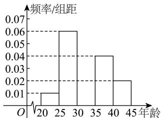

<!-- question-source:start -->
【92】（24-25 高二下·全国·课后作业）第十四届全国人民代表大会第一次会议于 2023 年 3 月 5 日上午召开. 某社区为了调查社区居民对该会议的关注度, 随机抽取了 60 名社区居民进行调查, 并将结果绘制成如图所示的频率分布直方图.

（1）以频率估计概率, 若社区计划从 60 名社区居民中, 再次随机抽取三人进行回访, 求至少有两人的年龄在区间 $[30,35)$ 内的概率;

(2) 若 $[20,25)$ 和 $[40,45]$ 年龄段的所有居民对该会议的关注度都很高, 社区准备从中抽取 3 人谈谈对该会议的感受, 设 $\xi$ 表示年龄段在 $[20,25)$ 的人数, 求 $\xi$ 的分布列及 $D(7\xi+3)$ .
<!-- question-source:end -->

![[Q00015613A1]]
